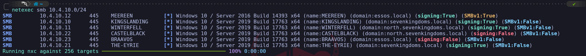
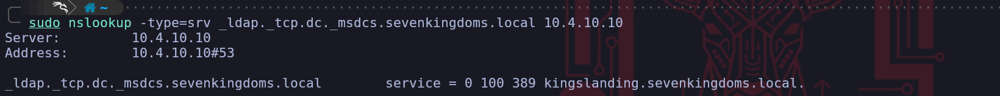
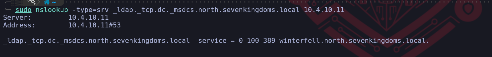
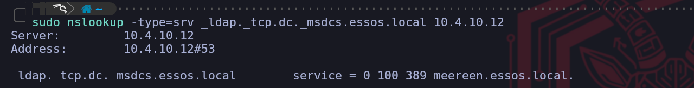
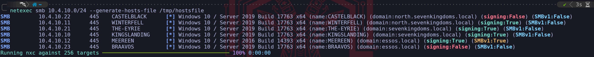
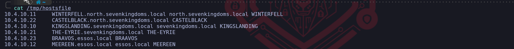
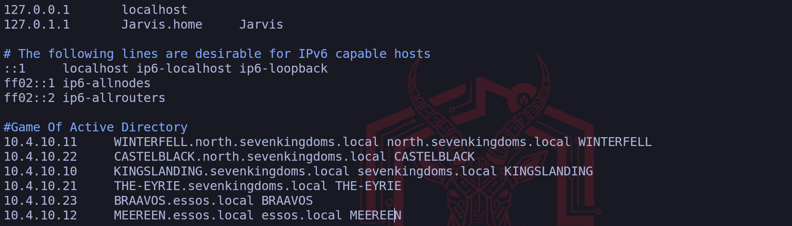
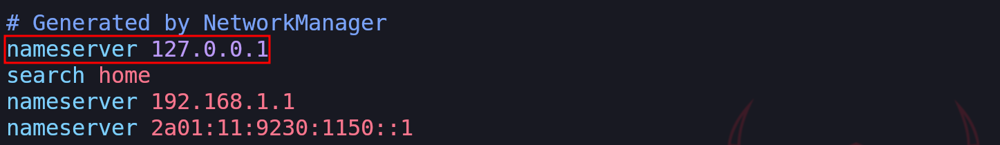
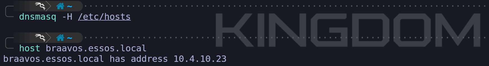
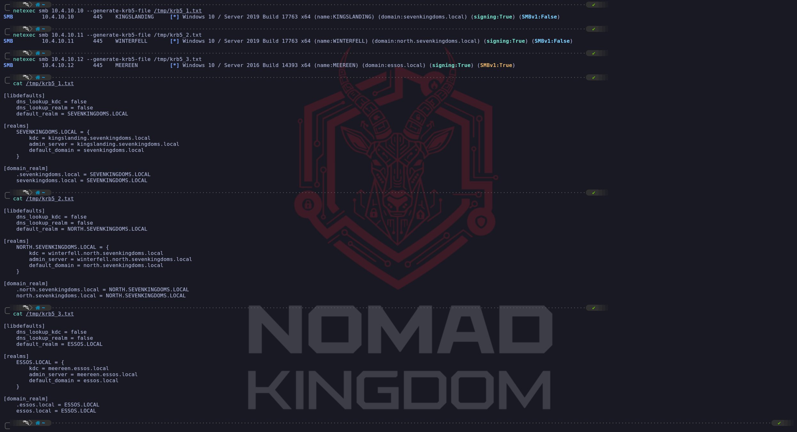

# GOAD Part 1 - Reconnaissance and Scan

## **Network Reconnaissance and Infrastructure Fingerprinting**

We commence our engagement by establishing immediate situational awareness of the network topography. Before we can target specific accounts or vulnerabilities, we must map the live infrastructure to understand the forest architecture we are facing. To achieve this without interacting with potentially monitored LDAP or DNS services just yet, we utilize **NetExec** to perform a broad sweep of the SMB protocol against the provided subnet range `10.4.10.0/24`. This allows us to fingerprint the operating systems, hostnames, and domain membership of every responsive Windows host on the wire.

`netexec smb 10.4.10.0/24`



When we analyze the output returned by the NetExec, we are presented with a wealth of structural intelligence that shapes our entire campaign strategy. We immediately identify the presence of three distinct naming contexts: **sevenkingdoms.local**, **north.sevenkingdoms.local**, and **essos.local**. This nomenclature suggests a complex architecture involving a Forest Root, a Child Domain, and a separate Forest, likely linked by a Trust Relationship. 
This confirms we are not dealing with a simple flat network, but a hierarchy where pivoting and cross-domain escalation will be key components of our operational path.

Furthermore, we can perform immediate role identification by analyzing the **SMB Signing** status of each host. In a default Active Directory environment, Microsoft mandates that Domain Controllers require SMB Signing to prevent Man-in-the-Middle attacks against the directory's integrity. Therefore, we can infer that **Kingslanding**, **Winterfell**, and **Meereen **all showing `signing:True`,are the Domain Controllers for their respective domains. 
Conversely, **Castelblack**, **Braavos**, and **The-Eyrie** report `signing:False`. This is a critical finding for us, as it flags these machines as vulnerable candidates for **NTLM Relaying** attacks, a vector we will aggressively exploit later in our campaign.

## **Finding DC IPs**

Active Directory relies on the `Domain Name System` to help computers locate essential services. When a server is promoted to a Domain Controller, it automatically registers several Service records in DNS to announce its presence and the services it provides.

It’s possible to enumerate the Domain Controllers by querying the DNS with `nslookup`.

`sudo nslookup -type=srv _ldap._tcp.dc._msdcs.sevenkingdoms.local 10.4.10.10`



`sudo nslookup -type=srv _ldap._tcp.dc._msdcs.north.sevenkingdoms.local 10.4.10.11`



`sudo nslookup -type=srv _ldap._tcp.dc._msdcs.essos.local 10.4.10.12`



The specific query asks for a service record under a very precise naming convention. The part that reads `_ldap._tcp.dc._msdcs` indicates a request for the LDAP service running on a machine that holds the Domain Controller role. Because Microsoft reserves the `_msdcs` subdomain specifically for Active Directory infrastructure, any hostname returned for this query is guaranteed to be a Domain Controller.

By specifying the target domain at the end of that string, you are telling the DNS server to look through the service records for that specific network. For example, the output shows `meereen.essos.local` as the result, which confirms that this specific machine is the one handling authentication and directory requests. This method is effective because it uses the internal logic of the network against itself to reveal the most important servers without needing to guess or scan every IP address.

We’ve just found out that **`KINGSLANDING`** is the Domain Controller for domain `sevenkingdoms.local`.

We’ve just found out that **`WINTERFELL`** is the Domain Controller for domain `north.sevenkingdoms.local`.

We’ve just found out that **`MEEREEN`** is the Domain Controller for domain `essos.local`.

OK, right now we have discovered the Domain Controllers for each of the domains.

## **Setting Up FQDN & Kerberos**

We perform this configuration because our Linux machine does not naturally understand the structure of the Active Directory network we are targeting. We need to bridge the gap between our operating system and the Windows environment so that our tools can function as intended. We use the `hosts` file and `dnsmasq` to create a manual map of the network because this allows us to use domain names instead of raw IP addresses. This is critical because many services and exploits we use will fail if we cannot resolve the correct hostnames for the domain controllers.

We need to setup a local DNS in linux by configuring **/etc/hosts**. We can do it manually, but instead of that, we can also use NetExec`--generate-hosts-file` flag to generate this hosts file for us.

`netexec smb 10.4.10.0/24 --generate-hosts-file /tmp/hostsfile`





Now we can simply copy/paste the info from `/tmp/hostsfile` int `/etc/hosts` file as we can see the screenshot below.

`vim /etc/hosts`



# Setting up FQDN

We define a Fully Qualified Domain Name as the complete domain name for a specific computer or host on a network. It provides the exact location of a device within the hierarchy of the Domain Name System by including all domain levels. When we look at an example like `meereen.essos.local,` we can see that it combines the individual host name with the full domain name to create a unique identifier that points to one specific machine.

We use these names because they act like a full mailing address for a server which ensures there is no confusion about which resource we are trying to access. In our setup, having the complete name is essential because it allows our tools to distinguish between different servers that might have similar labels in different parts of the network. By specifying every part of the path from the local host up to the top level domain, we provide our system with the precise information it needs to route our traffic correctly during our assessment.

### Why do we configure an FQDN?

FQDNs are **easier to remember than IP addresses and are needed to configure the DNS and IP address of a device on the internet**. 
For example, when trying to reach Google, it's much easier to type google.com in the browser, instead of finding and typing its numerical IP address. Getting an SSL certificate.

# DNSMASQ

We utilize `dnsmasq` as a lightweight tool that functions primarily as a DNS forwarder and a DHCP server for small networks. In our particular scenario, we rely on it to act as a local DNS resolver that pulls information directly from our custom hosts file. This is incredibly helpful because it simplifies the process of making our system recognize the domain names of our targets without the complexity of managing a full DNS server.

We configure this tool to listen for any name resolution requests coming from our attacking machine and provide the correct IP address based on the mappings we created. By pointing our system DNS settings to our own local address, we make sure that dnsmasq is the first place our computer looks when it needs to find a server. This approach ensures that we have a reliable and fast way to resolve the hostnames of the domain controllers and other critical machines throughout our assessment.

First we start by installing dnsmasq
`sudo apt install -y dnsmasq`

We will then make `dnsmasq` to use `/etc/hosts` file to read the machines configured on the file for the translation by editing the `/etc/resolv.conf` file and add `nameserver 127.0.0.1` configuration on it.
Make sure that you put this configuration on top.

`sudo vim /etc/resolv.conf`



Last but not least we need to start our `dnsmasq` and make it read the `/etc/hosts` file and we are ready to go.

`dnsmasq -H /etc/hosts`

It’s all set, you can now test it by using host and the name of the servers and it will be translate it to the real IPs.

`host braavos.essos.local`



Host `braavos.essos.local` should be pointing to the IP `10.4.0.23`.

### Configuring Kerberos Client

We also configure the Kerberos client because it is the fundamental protocol for authentication in a Windows domain. We must tell our system which server handles the ticket requests for our target domain by editing the krb5.conf file. Without this specific step we would be unable to perform attacks like roasting or requesting service tickets because our machine would not know where to send the authentication requests. We finish by pointing our DNS settings to our own local machine so that we force the system to use our custom mappings. By doing all of this we are essentially teaching our Linux machine how to speak the language of the target network which is necessary for us to move forward with our assessment.

We must install the Linux Kerberos Client. During the configuration you can ignore everything question by simply hitting `Enter`, we will do the configuration using NetExec. 

`sudo apt install krb5-user`

We can use NetExec also to generate the krb5 configs, then we combine it all together in one single file.

`netexec smb 10.4.10.10 --generate-krb5-file /tmp/krb5_1.txt`

`netexec smb 10.4.10.11 --generate-krb5-file /tmp/krb5_2.txt`

`netexec smb 10.4.10.12 --generate-krb5-file /tmp/krb5_3.txt`



We combine All-in-One and add the configure to **`/etc/krb5.conf`** file like this:

`vim /etc/krb5.conf`

```bash
[libdefaults]
    dns_lookup_kdc = false
    dns_lookup_realm = false
    default_realm = ESSOS.LOCAL

[realms]
    SEVENKINGDOMS.LOCAL = {
        kdc = kingslanding.sevenkingdoms.local
        admin_server = kingslanding.sevenkingdoms.local
        default_domain = sevenkingdoms.local
    }
    NORTH.SEVENKINGDOMS.LOCAL = {
        kdc = winterfell.north.sevenkingdoms.local
        admin_server = winterfell.north.sevenkingdoms.local
        default_domain = north.sevenkingdoms.local
    }
    ESSOS.LOCAL = {
        kdc = meereen.essos.local
        admin_server = meereen.essos.local
        default_domain = essos.local
    }

[domain_realm]
    .sevenkingdoms.local = SEVENKINGDOMS.LOCAL
    sevenkingdoms.local = SEVENKINGDOMS.LOCAL
    .north.sevenkingdoms.local = NORTH.SEVENKINGDOMS.LOCAL
    north.sevenkingdoms.local = NORTH.SEVENKINGDOMS.LOCAL
    .essos.local = ESSOS.LOCAL
    essos.local = ESSOS.LOCAL
```

Now that we do have Kerberos Client installed and well configured, lets move on.

## **Network Scanning - Nmap**

We use Nmap during the reconnaissance phase because it is an indispensable tool for active service discovery, which complements our previous enumeration techniques. While our DNS queries told us *where* the domain controllers are, Nmap tells us *what* services they are actually running and offering to the network. It allows us to build a comprehensive blueprint of the target's attack surface.

Each open port we discover represents a potential entry point or a service we can interact with.

We use specific flags to make our scan more effective. The `-sV` flag is crucial for version enumeration, as knowing the exact software version allows us to search for specific public exploits. The `-sC` flag automatically runs default reconnaissance scripts, which can uncover useful information, like the potentially risky HTTP methods found in the example. Finally, we use `-Pn` to tell Nmap not to bother with a ping test before scanning. We do this because many secure networks block pings, and without this flag, Nmap would mistakenly think the host is offline and skip it entirely, causing us to miss valuable targets.

In short, Nmap takes the abstract list of server names we've found and transforms it into a concrete, actionable map of running services and potential weaknesses. It is the bridge between knowing a target exists and understanding how we might attack it.

`nmap -Pn -p- -sC -sV -oA full_scan_goad 10.4.0.10-12,21,22-23
`

Let’s analyze this command :

- `Pn` don’t do ping scan and scan all ip
- `-p-` scan the 65535 ports instead of the default nmap 1000 top ports by default
- `sC` play the default script for reconnaissance
- `sV` enumerate the version
- `oA` write results in the 3 available format (nmap classic, grep format, xml format)
## **Network Scanning - RustScan**

We combine [Rustscan](https://github.com/bee-san/RustScan/releases) with Nmap to create a highly efficient, two-stage scanning process that leverages the core strength of each tool. We think of this as a strategic division of labor where each tool does what it does best.

Rustscan's sole purpose is raw speed. It acts as our advance scout, rapidly checking all 65,535 possible TCP ports on our targets to find which ones are open. It accomplishes this much faster than Nmap because it was built specifically for this task, using asynchronous techniques to manage thousands of connections at once. However, Rustscan's job ends there, it tells us that a door is open, but it doesn't tell us anything about what's behind it.

Once Rustscan has its list of open ports, its job is done. It then automatically hands that specific list over to Nmap. This is where Nmap, our deep analysis expert, takes over. We no longer need Nmap to waste time checking tens of thousands of closed or filtered ports. Instead, we direct its powerful scripting (`-sC`) and version enumeration (`-sV`) engines only at the confirmed open ports. Nmap can then perform its detailed investigation to identify the exact service, version, and potential misconfigurations for each open port.

This synergy is the key. We leverage Rustscan's incredible speed for the brute-force discovery phase and Nmap's unmatched analytical depth for the crucial intelligence-gathering phase. The result is a much faster path from initial scan to actionable intelligence, allowing us to move forward with our attack plan more quickly.

To use Rustscan against all of our GOAD lab targets at once, we can simply list the IP addresses one after another, separated by spaces. Rustscan is designed to accept multiple targets in this way, allowing us to scan them all in a single command.

However, we need to adjust our Nmap output flag. The original command `-oN Full_TCP_Scan` would cause a problem because Nmap would overwrite that same file for each target it scans, leaving us with only the results from the very last IP. To solve this, we will tell Nmap to create a unique output file for each host it scans by using a special placeholder in the filename.

We can combine all of our targets and adjust the output with the following command:

```powershell
echo "10.4.0.10
10.4.0.11
10.4.0.12
10.4.0.21
10.4.0.22
10.4.0.23" > goad_targets.txt
```

`rustscan -a goad_targets.txt --ulimit 5000 -- -sC -sV -Pn -oN GOAD_scan_%A`


By providing the IP addresses as a list, we instruct Rustscan to perform its initial fast port scan on every machine. Then, for each target, it will pass the discovered open ports to Nmap. 
We've changed the output flag to `-oN GOAD_scan_%A`. 
The `%A` is a format specifier that Nmap replaces with the target's IP address, so it will automatically generate separate, clearly named report files like `GOAD_scan_10.4.10.10`, `GOAD_scan_10.4.10.11`, and so on. 
This ensures we capture all the results in an organized way.


---

*Back to [GOAD Overview](../README.md)*
