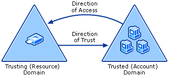
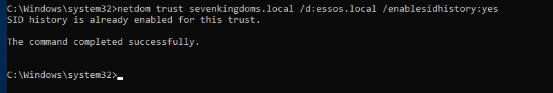
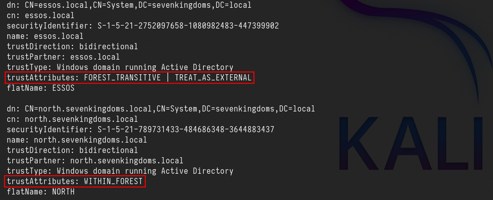
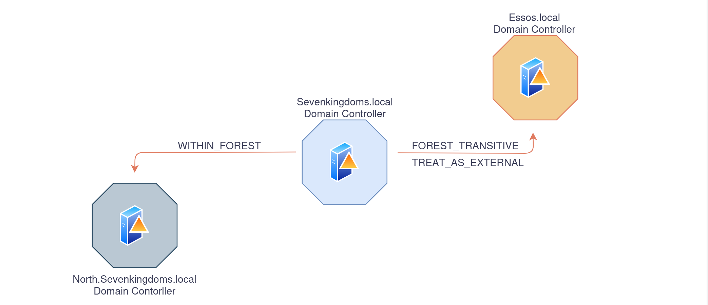
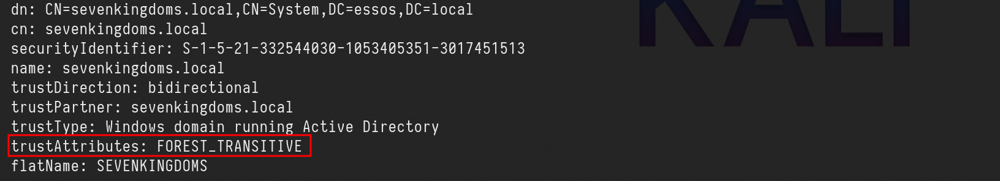
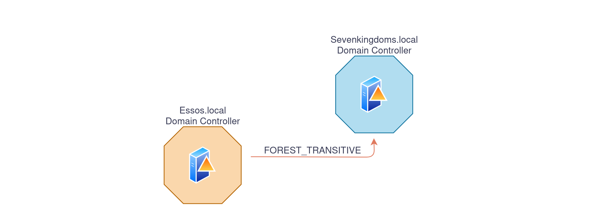
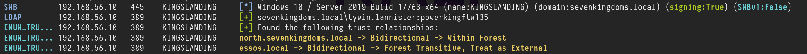
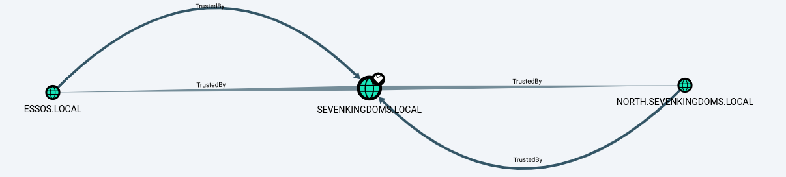

# GOAD Part 11 - Abusing Trusts

An Active Directory trust (AD trust) is **a method of connecting two distinct Active Directory domains (or forests) to allow users in one domain to authenticate against resources in the other**.
D**omain trust** establishes the ability for users in one domain to authenticate to resources or act as a security principal in another domain.

The information below has been taken and summarized from this amazing post by **[HarmjOy](https://harmj0y.medium.com/a-guide-to-attacking-domain-trusts-ef5f8992bb9d)**** ** and many otther resources like Microsoft as well.

As described by Microsoft, **“*****Most organizations that have more than one domain have a legitimate need for users to access shared resources located in a different domain*****“**, and trusts allow organizations with multiple domains to grant users in separate domains access to shared resources.
Essentially, all a trust does is link up the authentication systems of two domains and allows authentication traffic to flow between them through a system of referrals. If a user requests access to a service principal name (SPN) of a resource that resides outside of the domain they’re current in, their domain controller will return a special referral ticket that points to the key distribution center (KDC, in the Windows case the domain controller) of the foreign domain.

The purpose of establishing a trust is to allow users from one domain to access resources (like the local Administrators group on a server), to be nested in groups, or to otherwise be used as security principals in another domain (e.g. for AD object ACLs). One exception to this is intra-forest trusts (domain trusts that exist within the same Active Directory forest)- any domain created within a forest retains an implicit two-way, transitive trust relationship with every other domain in the forest. This has numerous implications which will be covered later in this post.

There are several types of trusts, some of which have various offensive implications, covered in a bit:


- **Parent/Child** — Part of the same forest — a child domain retains an implicit two-way transitive trust with its parent. 
This is probably the most common type of trust that you’ll encounter.
- **Cross-link** (shortcut)— aka a “shortcut trust” between child domains to improve referral times. Normally referrals in a complex forest have to filter up to the forest root and then back down to the target domain, so for a geographically spread out scenario, cross-links can make sense to cut down on authentication times. (used to speed up authentication).
- **External (inter-forest)**— an implicitly non-transitive trust created between disparate domains.** “*****External trusts provide access to resources in a domain outside of the forest that is not already joined by a forest trust.*****”** External trusts enforce SID filtering.
- **Tree-root (intra-forest)**— an implicit two-way transitive trust between the forest root domain and the new tree root you’re adding. I haven’t encountered tree-root trusts too often, but from the [Microsoft documentation](https://technet.microsoft.com/en-us/library/cc773178(v=ws.10).aspx), they’re created when you when you create a new domain tree in a forest. These are intra-forest trusts, and they [preserve two-way transitivity](https://technet.microsoft.com/en-us/library/cc757352(v=ws.10).aspx) while allowing the tree to have a separate domain name (instead of child.parent.com).
- **Forest** — a transitive trust between one forest root domain and another forest root domain. Forest trusts also enforce SID filtering.
- **MIT** — a trust with a non-Windows [RFC4120-compliant](https://tools.ietf.org/html/rfc4120) Kerberos domain.
[TrustType](https://msdn.microsoft.com/en-us/library/cc223771.aspx):

- **DOWNLEVEL** (0x00000001) — A trusted Windows domain that IS NOT running Active Directory. This is output as **WINDOWS_NON_ACTIVE_DIRECTORY** in PowerView for those not as familiar with the terminology.
- **UPLEVEL** (0x00000002) — A trusted Windows domain that IS running Active Directory.This is output as **WINDOWS_ACTIVE_DIRECTORY** in PowerView for those not as familiar with the terminology.
- **MIT** (0x00000003) — a trusted domain that is running a non-Windows (*nix), RFC4120-compliant Kerberos distribution. This is labeled as MIT due to, well, MIT publishing RFC4120.
[TrustAttributes](https://msdn.microsoft.com/en-us/library/cc223779.aspx):

- **NON_TRANSITIVE** (0x00000001) — The trust cannot be used transitively. That is, if DomainA trusts DomainB and DomainB trusts DomainC, then DomainA does not automatically trust DomainC. Also, if a trust is non-transitive, then you will not be able to query any Active Directory information from trusts up the chain from the non-transitive point. External trusts are implicitly non-transitive.
- **UPLEVEL_ONLY** (0x00000002) — only Windows 2000 operating system and newer clients can use the trust.
- **QUARANTINED_DOMAIN **(0x00000004) — SID filtering is enabled (more on this later). Output as **FILTER_SIDS** with PowerView for simplicity.
- **FOREST_TRANSITIVE** (0x00000008) — cross-forest trust between the root of two domain forests running at least domain functional level 2003 or above.
- **CROSS_ORGANIZATION** (0x00000010) — the trust is to a domain or forest that is not part of the organization, which adds the OTHER_ORGANIZATION SID. This is a bit of a weird one. 
According [to this post](https://imav8n.wordpress.com/2008/07/30/trust-attribute-cross_organization-and-selective-auth/) it means that the selective authentication security protection is enabled. For more information, check out [this MSDN doc](https://technet.microsoft.com/en-us/library/cc755321(v=ws.10).aspx#w2k3tr_trust_security_zyzk).
- **WITHIN_FOREST** (0x00000020) — the trusted domain is within the same forest, meaning a parent->child or cross-link relationship
- **TREAT_AS_EXTERNAL **(0x00000040) — the trust is to be treated as external for trust boundary purposes. According [to the documentation](https://msdn.microsoft.com/en-us/library/cc223779.aspx), “*If this bit is set, then a cross-forest trust to a domain is to be treated as an external trust for the purposes of SID Filtering. ****Cross-forest trusts are more stringently filtered than external trusts****. This attribute relaxes those cross-forest trusts to be equivalent to external trusts.*” This sounds enticing, and I’m not 100% sure on the security implications of this statement ¯\_(ツ)_/¯ but I will update this post if anything new surfaces.
- **USES_RC4_ENCRYPTION **(0x00000080) — if the TrustType is MIT, specifies that the trust that supports RC4 keys.
- **USES_AES_KEYS** (0x00000100) — not listed in the linked Microsoft documentation, but according to [some documentation](http://krbdev.mit.edu/rt/Ticket/Display.html?id=5477) I’ve been able to [find online](https://retep998.github.io/doc/winapi/ntsecapi/constant.TRUST_ATTRIBUTE_TRUST_USES_AES_KEYS.html), it specifies that AES keys are used to encrypt KRB TGTs.
- **CROSS_ORGANIZATION_NO_TGT_DELEGATION** (0x00000200) — “*[If this bit is set, tickets granted under this trust MUST NOT be trusted for delegation.](https://msdn.microsoft.com/en-us/library/cc223779.aspx)*” This is described more in [[MS-KILE] 3.3.5.7.5](https://msdn.microsoft.com/en-us/library/cc233949.aspx) (Cross-Domain Trust and Referrals.)
- **PIM_TRUST** (0x00000400) — “*[If this bit and the TATE (treat as external) bit are set, then a cross-forest trust to a domain is to be treated as Privileged Identity Management trust for the purposes of SID Filtering.](https://msdn.microsoft.com/en-us/library/cc223779.aspx)*” According to[ [MS-PAC] 4.1.2.2](https://msdn.microsoft.com/en-us/library/cc237940.aspx) (SID Filtering and Claims Transformation), “*[A domain can be externally managed by a domain that is outside the forest. 
The trusting domain allows SIDs that are local to its forest to come over a PrivilegedIdentityManagement trust.](https://msdn.microsoft.com/en-us/library/cc237940.aspx)*”
Trusts can be one-way or two-way. A bidirectional (two-way) trust is actually just two one-way trusts. A one-way trust means users and computers in a *trusted domain* can potentially access resources in another *trusting domain*. A one-way trust is in one direction only, hence the name. Users and computers in the *trusting* domain can not access resources in the *trusted* domain. 

**One-Way Trust**

A one-way trust is a unidirectional authentication path created between two domains (trust flows in one direction, and access flows in the other). 
This means that in a one-way trust between a trusted domain and a trusting domain, users or computers in the trusted domain can access resources in the trusting domain. However, users in the trusting  domain cannot access resources in the trusted domain. Some one-way trusts can be either nontransitive or transitive, depending on the type of trust being created.

**Two-Way Trust**

A two-way trust can be thought of as a combination of two, opposite-facing one-way trusts, so that, the trusting and trusted domains both trust each other (trust and access flow in both 
directions). This means that authentication requests can be passed between the two domains in both directions. Some two-way relationships can be either nontransitive or transitive depending on the type of trust being created. All domain trusts in an Active Directory forest are two-way, transitive trusts. When a new child domain is created, a two-way, transitive trust is automatically created between the new child domain and the parent domain.

**Trust Transitivity**

Transitivity determines whether a trust can be extended beyond the two domains between which it was formed. A transitive trust extends trust relationships to other domains, a nontransitive trust does not 
extend trust relationships to other domains. Each time you create a new domain in a forest, a two-way, transitive trust relationship is automatically created between the new domain and its parent domain. If child domains are added to the new domain, the trust path flows upward through the domain hierarchy, extending the initial trust path created between the new domain and its parent.

Transitive trust relationships thus flow upward through a domain tree as it is formed, creating transitive trusts between all domains in the domain tree. A domain tree can therefore be defined as a hierarchical structure of one or more domains, connected by transitive, bidirectional trusts, that forms a contiguous namespace. Multiple domain trees can belong to a single forest.

Authentication requests follow these extended trust paths, so accounts from any domain in the forest can be authenticated by any other domain in the forest. Consequently, with a single logon process, 
accounts with the proper permissions can access resources in any domain in the forest.

With a nontransitive trust, the flow is restricted to the two domains in the trust relationship and does not extend to any other domains in the forest. A nontransitive trust can be either a two-way trust or a 
one-way trust.



What we care about is the *direction of access*, not the *direction of the trust*. With a one-way trust where **A -trusts-> B**, if the trust is enumerated from A, the trust is marked as *outbound*, while if the same trust is enumerated from B the trust is marked as *inbound*, while the potential access is from **B** to **A**.

# Practice 

We can change the configurations for the lab this way, so we can practice how to **“Abuse Trusts”**

```javascript
cd ansible/
# A new group DragonRider on sevenkingdoms.local
sudo ansible-playbook -i ../ad/GOAD/data/inventory -i ../ad/GOAD/providers/virtualbox/inventory main.yml -l dc01

# Change group AcrossTheNarrowSea acl to add genericAll on dc01 (kingslanding)
sudo ansible-playbook -i ../ad/GOAD/data/inventory -i ../ad/GOAD/providers/virtualbox/inventory ad-acl.yml -l dc01

# Add builtin administrator user member on dc01 for dragonRider
sudo ansible-playbook -i ../ad/GOAD/data/inventory -i ../ad/GOAD/providers/virtualbox/inventory ad-relations.yml -l dc01

# Add sidhistory on the sevenkingdoms trust link to essos by default
sudo ansible-playbook -i ../ad/GOAD/data/inventory -i ../ad/GOAD/providers/virtualbox/inventory** **vulnerabilities.yml -l dc01
```

Last but not least, let’s establish a trust relationship between sevenkingdoms.local and essos.local, and that you want to enable the Sid History feature for this trust relationship.
The Sid History feature allows us to maintain a history of SIDs (Security Identifiers) that have been assigned to users and computers in the other domain, which can be useful in certain scenarios, such as when you need to troubleshoot issues related to user or computer accounts that have been moved between domains.
`netdom trust sevenkingdoms.local /d:essos.local /enablesidhistory:yes`



As it is well described on this amazing post by **HarmjOy** **[HERE](https://harmj0y.medium.com/a-guide-to-attacking-domain-trusts-ef5f8992bb9d)**. It’s always good to have a great **Trust Attack Strategy** when dealing with Trust Links.
When he talks about **Trust Attack Strategy** in his blogpost, what he means is a way to laterally move from the domain in which your access currently resides into another domain you’re targeting.

**(1)** - The first step is to enumerate all trusts your current domain has, along with any trusts *those* domains have, and so on. Basically, you want to produce a mapping of all the domains you can reach from your current context through the linking of trust referrals. This will allow you to determine the domains you need to hop through to get to your target and what techniques you can execute to (possibly) achieve this. Any domains in the mapped “mesh” that are in the same forest (e.g. parent->child relationships) are of particular interest due to the SIDhistory-trust-hopping technique developed by [Sean Metcalf](https://twitter.com/pyrotek3) and [Benjamin Delpy](https://twitter.com/gentilkiwi), also covered in the **The Trustpocalypse** section.

**(2)** - The next step is to enumerate any users/groups/computers (security principals) in one domain that either (1) have access to resources in another domain (i.e. membership in local administrator groups, or DACL/ACE entries), or (2) are in groups or (if a group) have users from another domain. The point here is to find relationships that cross the mapped trust boundaries in some way, and therefore might provide a type of “access bridge” from one domain to another in the mesh. While a cross-domain nested relationship is not guaranteed to facilitate access, trusts are normally implemented for a reason, meaning more often than not some type of cross-domain user/group/resource “nesting” probably exists, and in many organizations these relationships are misconfigured.
 Another subnote- as mentioned, Kerberoasting across trusts **may** be another vector to hop a trust boundary. Check out the **Another Sidenote: Kerberoasting Across Domain Trusts** section for more information.

**(3)** - Now that you have mapped out the trust mesh, types, and cross-domain nested relationships, you have a map of what accounts you need to compromise to pivot from your current domain into your target. By performing targeted account compromise, and utilizing SID-history-hopping for domain trusts within a forest, we have been able to pivot through up to 7+ domains in the field to reach our objective.

Remember that if a domain trusts you, i.e. if the trust is bidirectional or if one-way and inbound, then you can query any Active Directory information from the *trusting* domain. And remember 
that all parent->child (intra-forest domain trusts) retain an implicit two way transitive trust with each other. Also, due to how child domains are added, the “Enterprise Admins” group is automatically added to Administrators domain local group in each domain in the forest.
This means that trust “flows down” from the forest root, making it our objective to move from child to forest root at any appropriate step in the attack chain.

# **Enumerate Trusts**

## ldeep

Let’s start first by enumerating trusts since we do have access to an account already. To achieve that we can use **[LDEEP](https://github.com/franc-pentest/ldeep)**.
We will enumerate the trust trust link configuration between  **sevenkingdoms.local** and **essos.local** domains.

Enumerating the domain trusts link configured on **sevenkingdoms.local **Domain Controller.
`ldeep ldap -u tywin.lannister -p 'powerkingftw135' -d sevenkingdoms.local -s ldap://10.4.10.10 trusts`



Above we can see that **sevenkingdoms.local** to **essos.local** trust link is `FOREST_TRANSITIVE | TREAT_AS_EXTERNAL` because we have enabled the SID history.

- **`FOREST_TRANSITIVE`** (0x00000008) — Cross-forest trust between the root of two domain forests running at least domain functional level 2003 or above.
- **`TREAT_AS_EXTERNAL`**** **(0x00000040) — The trust is to be treated as external for trust boundary purposes. According [to the documentation](https://msdn.microsoft.com/en-us/library/cc223779.aspx), “*If this bit is set, then a cross-forest trust to a domain is to be treated as an external trust for the purposes of SID Filtering. ****Cross-forest trusts are more stringently filtered than external trusts****. This attribute relaxes those cross-forest trusts to be equivalent to external trusts.*” This sounds enticing.
- **`WITHIN_FOREST`** (0x00000020) — the trusted domain is within the same forest, meaning a parent->child or cross-link relationship


Enumerating the domain trusts links configured on **essos.local **domain Controller.

`ldeep ldap -u 'tywin.lannister' -p 'powerkingftw135' -d sevenkingdoms.local -s ldap://10.4.10.12 trusts`



We can see the trust link between essos.local to sevenkingdoms.local is `FOREST_TRANSITIVE` 

- **`FOREST_TRANSITIVE`** (0x00000008) — Cross-forest trust between the root of two domain forests running at least domain functional level 2003 or above.


## Netexec

Another option we have to enumerate domain trust links is using [NetExec](https://www.netexec.wiki/ldap-protocol/enumerate-trusts) with the following command.
`netexec ldap 10.4.10.10 -u 'tywin.lannister' -p 'powerkingftw135' -M enum_trusts`



We can see above that, sevenkingdoms.local domain has a **Parent/Child (bidirectional)** domain trust link with north.sevenkingdoms.local doman, and also an **External(Inter-Forest) bidirectional** domain trust link with essos.local domain

## Bloodhound

BloodHound can also be used to get a better overview of the domain trust links.

To enumerate with bloodhound UNIX-like we can use the following command and after that we just need to open bloodhound and upload the whole information.
`bloodhound-python -c all -u 'tywin.lannister' -p 'powerkingftw135' -d 'sevenkingdoms.local' -ns '10.4.10.10' -dc kingslanding.sevenkingdoms.local`

After uploading the whole information we can use the following filter to get the domain trust links map.
`MATCH p=(n:Domain)-->(m:Domain) RETURN p`




---

*Back to [GOAD Overview](../README.md)*
